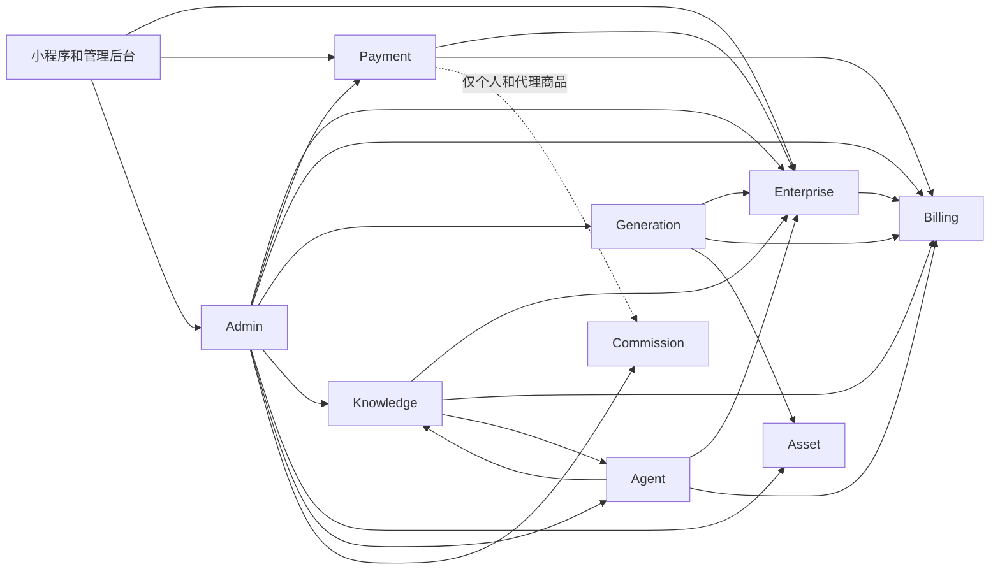

# Enterprise V1 领域边界

> 状态：FROZEN
>
> 目标：规定 Enterprise V1 的单一事实源、调用方向和写入权限，避免在企业中心、支付、生成和管理后台再次形成平行模型。

## 1. 总体原则

1. 每张业务主表只有一个写入领域；其他领域只能通过领域接口调用或只读投影查询。
2. `tenant_id` 是服务端派生的隔离键，不是客户端授权凭据。
3. 企业接口以当前用户上下文、有效成员关系和权限为准；不能信任请求头、路径或请求体中的 tenantId。
4. 前端不能提交或决定 `billing_subject_type`、`billing_account_id`、金额、compute units、赠送额度、佣金资格。
5. Enterprise 不维护订单；Billing 不维护成员关系；Generation 不直接决定佣金；Commission 不参与企业额度包购买或企业 AI 消费。
6. 管理后台不是业务事实源，只能调用领域服务和读取领域投影。
7. 表归属表示“唯一写入责任”，不表示只有该领域可以读取。

## 2. 领域调用图



企业购买和企业 AI 消费路径上不存在到 Commission 的调用边。

## 3. 领域总览

| 领域 | 主要职责 | 核心事实源 | 可以调用 | 禁止直接写入 |
| --- | --- | --- | --- | --- |
| Enterprise | 企业、成员、组织、上下文、企业 RBAC、服务状态 | `xz_tenants`、`xz_tenant_members` 等 | Billing、Payment 查询/命令 | 订单、支付、钱包、lot、ledger、佣金 |
| Billing | 计费主体解析后的额度账户、lot、账本、用量和计费生命周期 | `xz_tenant_wallets`、Compute Ledger、Model Usage | Enterprise 授权读取、Asset/Generation 关联读取 | 成员、订单支付状态、佣金 |
| Payment | 商品、价格、报价、订单、支付、履约编排 | Price Plan V2、`xz_orders`、支付与履约表 | Enterprise 授权、Billing 发放、Commission 仅非企业商品 | 企业成员、AI 消费账本、个人钱包直写 |
| Generation | 生图、改图、视频、PPT 任务生命周期和模型调用 | `xz_generation_tasks` | Enterprise 授权、Billing 扣费、Asset 落产物 | 佣金、企业成员、订单、钱包表 |
| Knowledge | 知识库、文档、向量检索、RAG 运行 | `xz_knowledge_*`、`xz_rag_*` | Enterprise 授权、Billing 用量、Agent 配置读取 | 订单、钱包、佣金、企业成员 |
| Asset | 文件、作品、可见性和存储生命周期 | `xz_assets`、文件中心表 | Enterprise 授权读取、Generation/Knowledge 业务引用 | 钱包、订单、佣金、成员 |
| Agent | AI Agent 定义、知识绑定、会话编排 | `xz_ai_agents`、Agent 会话/绑定表 | Enterprise、Knowledge、Generation/Billing | 订单、钱包、佣金、知识文档内容 |
| Commission | 非企业交易佣金规则、记录、钱包和结算 | `xz_commission_*` | Payment/Billing 的非企业结算事件 | 企业钱包、企业账本、订单履约、成员 |
| Admin | 平台管理命令、审计与跨域只读投影 | 管理请求与审计表 | 所有领域的管理接口 | 直接修改任何领域事实表 |

## 4. Enterprise 领域

### 4.1 负责什么

- 企业主体、认证、组织树、成员、邀请、加入请求。
- 当前 `PERSONAL` / `ENTERPRISE` 上下文及企业角色、权限。
- 企业服务状态、AI 使用资格、Connector 企业归属和成员绑定资格。
- 为 Payment、Billing、Generation、Knowledge、Agent 返回服务端可信的 `EnterpriseAccess`。
- 判定 `ENTERPRISE_ADMIN`、`FINANCE` 是否拥有购买和订单/消费读取权限。

### 4.2 不负责什么

- 不维护商品、报价、订单、支付或履约。
- 不计算价格，不发放额度，不直接改钱包。
- 不执行模型扣费或佣金结算。
- 不把企业中心页面状态当作当前企业上下文事实源。

### 4.3 拥有的表

- `xz_tenants`
- `xz_organizations`
- `xz_tenant_members`
- `xz_tenant_invitations`
- `xz_tenant_join_requests`
- `xz_user_role_context`
- `xz_user_roles`
- `xz_role_permissions`
- `xz_tenant_certifications`
- `xz_tenant_subscriptions`（企业订阅/服务资格，不承载额度包订单）
- `xz_tenant_service_states`
- `xz_tenant_audit_logs`
- `enterprise_connectors`
- `connector_user_bindings`

`connector_messages` 和 `connector_ai_tasks` 属于 Enterprise Connector 运行投影，由 Connector 服务写入；在本 V1 领域列表中归入 Enterprise，但不得由企业 CRUD 控制器直接写。

### 4.4 可以调用哪些领域

- Billing：读取企业余额摘要、消费摘要。
- Payment：读取当前企业订单投影、发起购买命令。
- Admin：仅通过平台管理命令被调用，不反向依赖 Admin UI。

### 4.5 禁止直接写哪些表

- `xz_orders`、`xz_payment_records`、`xz_order_price_quotes`、`xz_fulfillment_records`
- `xz_tenant_wallets`、`xz_compute_credit_lots`、`xz_compute_ledger_entries`、`xz_model_usage_records`
- `xz_point_accounts`
- `xz_commissions`、`xz_commission_records`、`xz_commission_wallet_ledger`

## 5. Billing 领域

### 5.1 负责什么

- 接收服务端已鉴权的计费主体，不接受客户端自行选择主体。
- 企业钱包余额、Credit Lot FEFO 消耗、CREDIT/DEBIT/REVERSAL 主账。
- 个人钱包原链路兼容，但 Enterprise V1 不重构个人钱包。
- 模型用量、计费生命周期、任务与账本关联、企业消费查询。
- 企业额度发放的原子账务命令，供 `GrantOrderEntitlements` 调用。
- 企业余额不足硬失败；失败冲正；账本和 lot 幂等。

### 5.2 不负责什么

- 不维护企业成员、角色或当前上下文。
- 不维护商品价格、订单支付状态或微信通知。
- 不选择某个代理是否应获得企业消费佣金；企业计费主体一律不向 Commission 发事件。
- 不创建 AI 任务或作品。

### 5.3 拥有的表

- `xz_tenant_wallets`
- `xz_compute_credit_lots`
- `xz_compute_ledger_entries`
- `xz_model_usage_records`
- `xz_billing_rule_versions`
- `xz_billing_lifecycle_events`
- `xz_billing_events`（兼容投影）
- `xz_point_accounts` 及个人钱包账本（既有语义保持）
- `xz_tenant_point_transactions`（仅人工调整兼容投影，不是 AI 消费事实源）

### 5.4 可以调用哪些领域

- Enterprise：校验企业、成员、组织、服务状态和权限。
- Generation、Knowledge、Agent、Asset：只读关联任务、模型、成员展示字段，不直接修改其事实。

### 5.5 禁止直接写哪些表

- 企业成员与角色表。
- `xz_orders`、`xz_payment_records`、Price Plan V2 表。
- `xz_generation_tasks`、知识库、Agent 和 Asset 表。
- 任意 Commission 表。

## 6. Payment 领域

### 6.1 负责什么

- Price Plan V2 商品版本、价格、微信商品绑定、报价快照。
- `xz_orders` 的企业购买人和受益主体语义。
- 微信虚拟支付签名、通知验签、官方查单、支付状态机。
- 履约编排与 `xz_fulfillment_records`。
- 企业额度商品支付成功后调用统一 `GrantOrderEntitlements`，再由 Billing 原子发放额度。
- 保证金额、环境、微信商品和权益快照均来自服务端。

### 6.2 不负责什么

- 不维护企业成员关系或把 `X-Tenant-Id` 当作授权。
- 不直接实现另一套企业钱包、订单或额度账本。
- 不在微信回调控制器内散写钱包、lot 或 ledger。
- 不从当前 Price Plan 配置重建历史权益。
- Enterprise V1 不启用统一 Payment Center 的 `enterprise_plan` handler。

### 6.3 拥有的表

- `xz_plans`
- `xz_plan_versions`
- `xz_price_plans`
- `xz_wechat_virtual_goods`
- `xz_price_plan_payment_bindings`
- `xz_price_plan_user_whitelist`
- `xz_order_price_quotes`
- `xz_orders`
- `xz_payment_records`
- `xz_fulfillment_records`
- 既有微信虚拟支付通知、商品映射和支付请求表

`xz_payment_products`、`xz_product_prices` 归统一 Payment Center 所有，但 Enterprise V1 不把企业额度商品接入该主链。

### 6.4 可以调用哪些领域

- Enterprise：解析当前企业、成员和购买权限。
- Billing：执行企业额度 grant 命令、读取到账摘要。
- Commission：仅个人/会员/代理且明确允许佣金的商品；`ENTERPRISE_QUOTA` 禁止调用。

### 6.5 禁止直接写哪些表

- 企业成员、组织、当前上下文表。
- `xz_tenant_wallets`、lot、Compute Ledger、Model Usage；必须经 Billing 命令写。
- `xz_generation_tasks`、知识、Agent、Asset 表。
- 企业额度商品对应的任何 Commission 表。

## 7. Generation 领域

### 7.1 负责什么

- 生图、改图、视频、PPT 的任务状态、模型路由、调用和失败处理。
- 模型调用前向 Enterprise 请求授权，向 Billing 请求扣费。
- 调用成功写模型用量，失败请求 Billing 冲正。
- 将结果交给 Asset；Connector 复用同一任务和扣费链。
- 将服务端解析的 `billing_account_type/id` 固化到任务快照，供完成和失败阶段复用。

### 7.2 不负责什么

- 不根据推荐关系或用户角色决定佣金。
- 不创建企业订单、支付或额度包。
- 不直接更新个人或企业钱包、lot、ledger。
- 不接受前端提供的 `billing_subject_type` 作为可信字段。

### 7.3 拥有的表

- `xz_generation_tasks`
- 生成任务的 provider request、任务错误和状态投影
- PPT 任务运行数据（现有持久化实现）
- Connector AI 任务的生成侧状态；Connector 外部消息状态仍归 Enterprise Connector

### 7.4 可以调用哪些领域

- Enterprise：模型调用授权、企业服务状态。
- Billing：报价、扣减、冲正、Model Usage。
- Asset：保存作品和私有文件引用。
- Knowledge/Agent：仅作为上层编排调用或被调用，不跨表写入。

### 7.5 禁止直接写哪些表

- 所有 Commission 表。
- 企业成员、企业钱包、lot、ledger、订单、支付、履约表。
- 知识文档和 Agent 定义表。

## 8. Knowledge 领域

### 8.1 负责什么

- 知识库、文档、版本、分块、向量、检索、引用和 RAG 运行。
- RAG 对话开始前向 Enterprise 授权，向 Billing 扣费并记录 Model Usage。
- 保证 tenant、组织、ACL、Agent 绑定一致。

### 8.2 不负责什么

- 不维护企业成员、订单、钱包或佣金。
- 不把 JSON/memory fallback 当作企业生产计费事实源。
- 不负责 Agent 商品化或企业额度商品。

### 8.3 拥有的表

- `xz_knowledge_bases`
- `xz_knowledge_categories`、`xz_knowledge_tags`、ACL 和 share 表
- `xz_knowledge_documents`、document versions、chunks、ingestion jobs/steps
- `xz_knowledge_vector_*`、embedding/retrieval/rerank profiles
- `xz_rag_runs`、`xz_rag_retrieval_hits`、`xz_rag_citations`、`xz_rag_run_events`

### 8.4 可以调用哪些领域

- Enterprise：tenant、成员、组织和权限。
- Agent：读取 Agent 配置与知识绑定。
- Billing：企业扣费、冲正、Model Usage。
- Asset：文档源文件和生成产物引用。

### 8.5 禁止直接写哪些表

- 企业钱包、lot、ledger、订单、支付、佣金。
- Agent 主定义；绑定写入必须通过 Agent 领域接口。
- `xz_generation_tasks`，除非明确通过 Generation 服务创建任务。

## 9. Asset 领域

### 9.1 负责什么

- 文件对象、作品、媒体元数据、可见性、租户/用户归属、签名访问和回收。
- 保存生成、知识和 Connector 产物的稳定引用。
- 保障企业作品查询按服务端 tenant scope 隔离。

### 9.2 不负责什么

- 不计费、不发额度、不结佣、不维护订单。
- 不从文件元数据推断企业成员资格。

### 9.3 拥有的表

- `xz_assets`
- 文件中心/对象存储的文件、引用、回收和配额元数据表

### 9.4 可以调用哪些领域

- Enterprise：访问主体与 tenant scope。
- Generation、Knowledge、Agent：读取业务引用和展示信息。
- Billing：仅当存储配额计费未来正式建模时通过接口调用；本 V1 不新增。

### 9.5 禁止直接写哪些表

- 钱包、lot、ledger、订单、支付、佣金、成员、AI 任务状态表。

## 10. Agent 领域

### 10.1 负责什么

- AI Agent/AI 员工定义、所有者、启停、能力配置、知识绑定和会话编排。
- Knowledge Agent 运行时调用 Knowledge RAG，并继承 Enterprise + Billing 的授权扣费。
- 新的独立 Agent Run 若未来出现，必须先接入统一企业计费契约。

### 10.2 不负责什么

- 不维护知识文档、向量索引、订单、钱包或佣金。
- 不把 Agent 所属企业 ID 直接当作调用者的有效企业权限。
- 不创建独立额度或 Agent 钱包。

### 10.3 拥有的表

- `xz_ai_agents`
- `xz_agent_knowledge_bindings`
- `xz_ai_agent_conversations`
- `xz_ai_agent_messages`
- AI 员工配置和运行编排投影

### 10.4 可以调用哪些领域

- Enterprise：Agent 所属企业和调用者权限。
- Knowledge：RAG、知识绑定有效性。
- Generation：需要模型/多媒体任务时通过服务调用。
- Billing：付费运行的扣费、冲正和用量。
- Asset：Agent 产物。

### 10.5 禁止直接写哪些表

- 知识文档/向量、企业钱包/lot/ledger、订单/支付/履约、佣金、成员。

## 11. Commission 领域

### 11.1 负责什么

- 仅对明确允许佣金的个人/会员/代理交易解析规则、创建佣金记录、钱包流水和结算。
- 保持既有代理/运营中心体系兼容。
- 对入站结算事件执行产品类型与 `billing_account_type` 双重白名单。

### 11.2 不负责什么

- 不参与 `ENTERPRISE_QUOTA` 商品购买。
- 不参与 `billing_account_type = ENTERPRISE` 的任何 AI 消费。
- 不从 Generation 任务字段自行推断企业是否可以分佣。
- 不更改订单、钱包或履约状态。

### 11.3 拥有的表

- `xz_commission_rules`
- `xz_commission_records`
- `xz_commission_wallet_accounts`
- `xz_commission_wallet_ledger`
- `xz_commission_payout_batches`
- `xz_commission_payout_details`
- `xz_commissions`、`xz_withdrawals`（兼容投影）

### 11.4 可以调用哪些领域

- Payment：读取非企业订单的不可变佣金快照。
- Billing：读取非企业结算事件和金额；企业事件必须拒绝。
- Enterprise：仅在未来企业项目佣金另立版本时读取，本 V1 无调用。

### 11.5 禁止直接写哪些表

- 企业钱包、Compute Ledger、Model Usage、订单、支付、履约、成员、生成任务。

## 12. Admin 领域

### 12.1 负责什么

- 平台 RBAC、管理命令编排、审计、搜索和跨领域只读投影。
- 企业订单、支付、履约、Compute Ledger、Model Usage、佣金零记录的运营视图。
- 使用已有履约重试服务，不自行补发权益。

### 12.2 不负责什么

- 不拥有企业、订单、钱包、额度、生成、知识、资产或佣金事实。
- 不在 Vue 页面或通用 controller 中执行跨领域 SQL 写入。
- 不把 `xz_tenant_point_transactions` 当作企业 AI 消费事实源。

### 12.3 拥有的表

- `xz_admin_enterprise_requests`
- `xz_audit_logs`
- `xz_operation_logs`
- 平台管理操作的幂等、审计和导出任务表

### 12.4 可以调用哪些领域

- Enterprise、Billing、Payment、Generation、Knowledge、Asset、Agent、Commission 的管理接口和只读查询。

### 12.5 禁止直接写哪些表

- 除 Admin 自有审计/请求表外的所有领域事实表。
- 既有人工企业充值/调整必须封装为 Billing 管理命令；不得扩展页面直写 SQL。

## 13. 跨域数据契约

### 13.1 可信计费主体

```text
BillingSubject {
  type: PERSONAL | ENTERPRISE
  accountId: server-derived
  tenantId: server-derived
  organizationId: server-derived
  actorUserId: authenticated user
  permissions: server-derived
}
```

禁止客户端提交 `type`、`accountId` 或 `tenantId` 以改变扣费。客户端只能读取该投影用于显示。

### 13.2 企业购买主体

```text
EnterprisePurchaseSubject {
  buyerUserId: authenticated user
  beneficiaryTenantId: current enterprise context
  billingSubjectType: ENTERPRISE
  permission: enterprise.quota.purchase
}
```

`xz_orders.user_id` 在 Enterprise V1 保持为购买人兼容字段；授权与展示分别使用 `buyer_user_id` 和 `tenant_id`，不能再把 `user_id` 解释为企业受益主体。

### 13.3 单一写入规则

| 命令 | 唯一执行领域 | 必须同事务写入 |
| --- | --- | --- |
| 企业额度履约编排 | Payment 的 `GrantOrderEntitlements` | 在同一事务中锁订单/fulfillment，调用 Billing grant；Payment 只写订单/fulfillment，Billing 只写 wallet、base/bonus lots、CREDIT ledger |
| 企业额度财务发放 | Billing | wallet、base/bonus lots、CREDIT ledger；不得直接写订单或 fulfillment |
| 企业 AI 扣减 | Billing | wallet、lot remaining/status、DEBIT ledger、任务计费快照 |
| 企业 AI 失败冲正 | Billing | reversal lot、wallet、REVERSAL ledger、任务失败状态协同 |
| 企业报价/订单 | Payment | quote/order/payment request 和不可变快照 |
| 企业成员变更 | Enterprise | membership、role/context、audit |
| 佣金创建 | Commission | 佣金记录和佣金钱包流水；企业事件必须无操作 |
