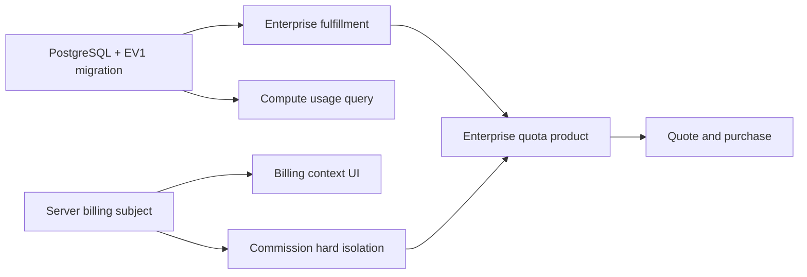

# Enterprise V1 功能开关与错误契约

> 任务：EV1-0002  
> 状态：FROZEN（设计契约，不代表代码已实现）  
> 基线分支：`codex/channel-ecosystem-v132-phase3`  
> 基线 HEAD：`054a8fcaf4754ca9b3fd5492265685998924835c`  
> 约束：本任务不进入 EV1-0101，不创建或占用 migration/rollback 编号。

## 1. 目标与适用范围

本文冻结 Enterprise V1 的功能开关、稳定错误码、API 行为以及发布和回滚边界。后续独立 worktree 的数据库、后端、小程序、管理后台和测试实现必须遵循本文；若需改变安全语义，必须新增 ADR，不得在实现中静默调整。

本文只覆盖 Enterprise V1：

- `ENTERPRISE_QUOTA` 商品查询、报价、购买和履约。
- 企业 Compute Ledger / Model Usage 查询。
- 企业 AI 真实计费主体展示。
- 企业 AI 消费佣金硬隔离。
- 通用对话和独立 Agent Run 在尚未接入统一企业计费前的禁用边界。

唯一购买主链保持：

```text
Price Plan V2 -> 微信虚拟支付 -> GrantOrderEntitlements
```

统一 Payment Center 预留的 `enterprise_plan` 在 V1 继续保持无 handler、不可配置、不可发布。

## 2. 总体契约

### 2.1 配置命名与加载

沿用项目现有环境变量风格，冻结以下服务端配置名：

```text
ENTERPRISE_QUOTA_PRODUCT_ENABLED
ENTERPRISE_QUOTA_FULFILLMENT_ENABLED
ENTERPRISE_COMPUTE_USAGE_ENABLED
ENTERPRISE_BILLING_CONTEXT_UI_ENABLED
ENTERPRISE_COMMISSION_ISOLATION_ENABLED
ENTERPRISE_PAID_CHAT_ENABLED
ENTERPRISE_PAID_AGENT_RUN_ENABLED
```

Go 配置字段建议采用：

```text
EnterpriseQuotaProductEnabled
EnterpriseQuotaFulfillmentEnabled
EnterpriseComputeUsageEnabled
EnterpriseBillingContextUIEnabled
EnterpriseCommissionIsolationEnabled
EnterprisePaidChatEnabled
EnterprisePaidAgentRunEnabled
```

所有开关遵循现有 `boolEnv` 行为：只有 `1/true/yes/y/on`（忽略大小写和首尾空格）表示开启；未配置、空值、拼写错误或其他值均为 `false`。

生产灰度允许使用服务端配置 `ENTERPRISE_V1_TENANT_ALLOWLIST` 作为辅助范围控制。它不是第八个业务开关，不得由客户端提交或覆盖。生产环境在全量发布前，开关的有效值按以下规则计算：

```text
effective_enabled = master_flag
                 && environment_allowed
                 && prerequisites_healthy
                 && tenant_in_server_allowlist
```

平台完成全量发布审批后，才可通过受控配置取消 tenant allowlist 限制。企业接口中的 `tenantId`、`X-Tenant-Id` 或请求体字段均不能改变灰度归属。

### 2.2 默认和失败策略

- 七个开关全部默认 `false`。
- 七个开关全部是 fail-closed；配置缺失、配置非法、依赖不健康或灰度主体不匹配时均按关闭处理。
- 功能开关是服务端授权条件，不是前端展示偏好。前端隐藏不能替代后端拒绝。
- 客户端只能读取服务端投影的有效 capability，不能上传、覆盖或缓存后反向决定有效状态。
- 安全开关关闭不能触发兼容回退：不得改扣个人钱包、不得进入旧佣金逻辑、不得切换到统一 Payment Center 的 `enterprise_plan`。
- 已成功履约的额度、已写入的 lot/ledger/usage 不因开关关闭而删除或改写。

### 2.3 服务端 capability 投影

企业上下文、企业概览或专用 capability API 可以返回经过权限和灰度计算后的投影，例如：

```json
{
  "enterpriseQuotaProduct": {
    "enabled": false,
    "canView": false,
    "canPurchase": false
  },
  "enterpriseComputeUsage": {
    "enabled": false,
    "canRead": false
  },
  "enterpriseBillingContextUI": {
    "enabled": false
  },
  "enterprisePaidChat": {
    "enabled": false
  },
  "enterprisePaidAgentRun": {
    "enabled": false
  }
}
```

不得向企业用户返回原始环境变量、租户白名单、履约开关、佣金隔离内部状态或生产配置细节。履约/佣金隔离异常只返回稳定业务错误码和可行动文案。

## 3. 功能开关冻结

### 3.1 总表

| 环境变量 | 默认 | 灰度 | 失败模式 | 生产可开 | 企业侧可见角色 |
| --- | --- | --- | --- | --- | --- |
| `ENTERPRISE_QUOTA_PRODUCT_ENABLED` | false | 是，按 tenant allowlist | fail-closed | 满足购买链全部门禁后 | `ENTERPRISE_ADMIN`、`FINANCE` |
| `ENTERPRISE_QUOTA_FULFILLMENT_ENABLED` | false | 是，但范围必须覆盖所有可购买租户和既有 PAID 订单 | fail-closed | migration、handler、幂等和对账通过后 | 不直接展示；订单状态对 Admin/Finance 可见 |
| `ENTERPRISE_COMPUTE_USAGE_ENABLED` | false | 是，按 tenant allowlist | fail-closed | 查询 API、索引和隔离通过后 | 拥有 `enterprise.compute.usage.read` 的 Admin/Finance |
| `ENTERPRISE_BILLING_CONTEXT_UI_ENABLED` | false | 是，按 tenant/user capability | fail-closed | 服务端真实主体接口稳定后 | 拥有 `enterprise.ai.use` 的企业角色 |
| `ENTERPRISE_COMMISSION_ISOLATION_ENABLED` | false | 是，但只能“允许已完成硬隔离的租户”，关闭时必须阻断消费 | fail-closed | 全链路零佣金测试通过后 | 仅平台运维/健康检查可见 |
| `ENTERPRISE_PAID_CHAT_ENABLED` | false | 否，V1 全环境禁止 | fail-closed | **V1 禁止开启** | 企业 AI 使用者只看到“不支持”状态 |
| `ENTERPRISE_PAID_AGENT_RUN_ENABLED` | false | 否，V1 全环境禁止 | fail-closed | **V1 禁止开启** | 企业 AI 使用者只看到“不支持”状态 |

### 3.2 `ENTERPRISE_QUOTA_PRODUCT_ENABLED`

**控制范围**

- 企业额度商品可见性。
- 创建企业额度报价。
- 消费报价创建企业受益订单。
- 不控制历史订单、支付状态和履约状态的只读查询。

**开启前置条件**

1. EV1 migration 已执行且 schema health 通过。
2. Price Plan V2 已支持 `ENTERPRISE_QUOTA` 和不可变 compute-unit 快照。
3. 微信虚拟商品、价格、环境、offer/product 绑定验证通过。
4. `ENTERPRISE_QUOTA_FULFILLMENT_ENABLED=true` 对同一灰度租户有效。
5. `ENTERPRISE_COMMISSION_ISOLATION_ENABLED=true` 对同一灰度租户有效。
6. 当前用户处于服务端确认的企业上下文，并拥有 `enterprise.quota.purchase`。
7. 统一 Payment Center 的 `enterprise_plan` 仍无 handler、无企业商品配置。

生产环境若 product=true 但 fulfillment 或 commission isolation 不满足，配置校验必须拒绝启动，或至少令 product 的 effective value 为 false；不得带病开放报价/下单。

**关闭后的行为**

- 企业商品查询返回 `200` 和空列表，并返回 capability `enabled=false`，避免向无资格用户泄露商品。
- 显式报价或下单请求返回 `ENTERPRISE_QUOTA_PRODUCT_DISABLED`。
- 已存在订单仍可查询、支付同步和履约补偿；不得因关闭商品开关拒绝 PAID 订单履约。

**环境与角色**

- local/dev/test/staging：可开启，建议固定测试 tenant。
- production：仅在全部门禁通过且初始 tenant allowlist 非空时开启。
- 企业侧仅 `ENTERPRISE_ADMIN`、`FINANCE` 可见和购买；`AI_ADMIN`、`ENTERPRISE_MEMBER`、`CUSTOMER_SERVICE`、代理/运营中心不可见、不可购买。

### 3.3 `ENTERPRISE_QUOTA_FULFILLMENT_ENABLED`

**控制范围**

- `GrantOrderEntitlements` 是否允许执行 `ENTERPRISE_QUOTA` 企业分支。
- 不影响 MEMBER/AGENT 现有履约分支。
- 不允许切换到统一 Payment Center 的 `enterprise_plan`。

**开启前置条件**

1. EV1 migration 已执行，`xz_fulfillment_records` 主体字段可用。
2. 企业钱包、lot、ledger 表和 PostgreSQL 事务路径健康。
3. `GrantOrderEntitlements` 能校验 PAID、snapshot V2、buyer、beneficiary tenant、billing subject 和 product type。
4. 回调、主动查单、人工补偿均复用同一服务，并通过重复调用幂等测试。
5. wallet/lot/ledger/fulfillment/order 对账通过。

**关闭后的行为**

- 新的企业商品必须不可购买；product effective value 自动为 false。
- 已支付企业订单保持 `PAID`，fulfillment 写为或保持 `FAILED`，失败码为 `ENTERPRISE_QUOTA_FULFILLMENT_DISABLED`。
- 不退款、不删订单、不发额度、不改个人钱包。
- 重试只能在开关恢复后通过回调、查单或人工补偿重新进入同一个 `GrantOrderEntitlements`。

**灰度、环境与角色**

- 可按 tenant 灰度，但 fulfillment 灰度集合必须是 product 灰度集合的超集。
- 已允许购买的 tenant 在存在 `PENDING/PROCESSING/FAILED` 企业履约时不得从 fulfillment allowlist 移除，除非进入事故处置并明确接受待履约积压。
- production 可开启；只对平台运维、Billing 管理员展示原始开关。企业 Admin/Finance 只看到订单履约状态和稳定错误文案。

### 3.4 `ENTERPRISE_COMPUTE_USAGE_ENABLED`

**控制范围**

- 企业消费汇总、Compute Ledger 和 Model Usage 查询 API。
- 小程序企业消费明细页面。
- 管理后台可有独立平台权限，但若使用同一查询服务，也必须遵循数据源和 tenant 过滤契约。
- 不控制实际扣费；关闭查询不能改变钱包或生成任务。

**开启前置条件**

1. PostgreSQL 必须可用，禁止 JSON/memory/mock 回退。
2. 查询必须读取 `xz_compute_ledger_entries` 和 `xz_model_usage_records`。
3. tenant、成员、时间、模块/模型查询索引和分页契约稳定。
4. `enterprise.compute.usage.read` 已按冻结角色映射授权。
5. 跨租户和禁用成员隔离测试通过。

**关闭后的行为**

- capability 返回 `enabled=false`。
- 消费页面隐藏或显示“企业消费明细暂未开放”。
- 直接调用明细 API 返回 `ENTERPRISE_COMPUTE_USAGE_DISABLED`。
- 历史 ledger/usage 保持不变，不得切回 `xz_tenant_point_transactions` 或客户端缓存。

**灰度、环境与角色**

- 可独立按 tenant 灰度，属于只读能力。
- local/dev/test/staging/production 均可在前置条件满足后开启。
- 默认 `ENTERPRISE_ADMIN`、`FINANCE` 可见；其他角色只有后续显式获得 `enterprise.compute.usage.read` 才可见。

### 3.5 `ENTERPRISE_BILLING_CONTEXT_UI_ENABLED`

**控制范围**

- AI 创作页显示服务端解析的 `billingSubjectType`、企业名称和企业额度主体。
- 只控制新 UI，不决定实际扣费主体。

**开启前置条件**

1. `GET /api/v1/billing-subject` 或等价服务端投影已上线。
2. Generation/PPT/RAG/Connector 等已返回或持久化同一服务端计费主体。
3. 页面不允许选择、上传或覆盖 `billingSubjectType`/`tenantId`。
4. 主体切换、缓存清理和页面回归通过。

**关闭后的行为**

- 页面不展示 Enterprise V1 主体组件，但后端仍必须自行解析并校验计费主体。
- 不允许回退为显示个人积分并暗示个人扣费；若旧页面会造成误导，企业付费入口应同时禁用。
- 直接 AI 调用仍受后端企业扣费和佣金隔离守卫约束。

**灰度、环境与角色**

- 可按 tenant/user capability 独立灰度。
- 所有环境可在主体 API 稳定后开启。
- 对当前企业上下文且拥有 `enterprise.ai.use` 的 `ENTERPRISE_ADMIN`、`AI_ADMIN`、`FINANCE`（若可使用 AI）和 `ENTERPRISE_MEMBER` 可见。

### 3.6 `ENTERPRISE_COMMISSION_ISOLATION_ENABLED`

**控制范围**

- 所有 `billing_subject_type=ENTERPRISE` 的 AI 消费在进入 Commission 前的硬隔离门禁。
- 适用于生图、改图、视频、PPT、RAG、Connector 及已接入统一计费的 Agent 能力。
- 企业额度商品购买本身无条件 `commissionEligible=false`，不得依赖本开关来决定是否分佣。

**开启前置条件**

1. 每条已开放企业 AI 链路都由服务端形成不可篡改的 billing subject。
2. Commission 入口对 ENTERPRISE 主体硬拒绝，且不创建零金额兼容记录、正式记录或佣金钱包流水。
3. 全链路测试证明企业消费所有 Commission 表零增量。
4. 个人、会员、代理消费佣金回归通过。
5. 监控能发现任何企业 ledger reference 对应的佣金记录。

**关闭后的行为**

- 对企业付费 AI 调用返回 `ENTERPRISE_COMMISSION_ISOLATION_REQUIRED`，在钱包扣减和模型调用前终止。
- 不得回退旧佣金逻辑，不得把佣金比例设为 0 后继续创建记录，不得改扣个人钱包。
- 个人/会员/代理原有消费不受影响。

**灰度、环境与角色**

- 可以按 tenant 灰度，但语义是“哪些 tenant 已完成硬隔离并允许企业付费调用”，不是“哪些 tenant 可以走旧佣金”。
- local/dev/test/staging 可用于集成验证；production 必须在零佣金门禁通过后，先按 tenant allowlist 开启。
- 原始状态仅平台超级管理员、Billing/Commission 运维可见；企业用户只接收稳定可行动错误。

### 3.7 `ENTERPRISE_PAID_CHAT_ENABLED`

**控制范围**

- 独立通用对话入口在企业上下文中是否允许使用企业额度。
- 不包含已明确接入 RAG/Knowledge Agent 企业账单链路的受控能力。

**V1 冻结决策**

- 默认 false。
- Enterprise V1 的 local/dev/test/staging/production 部署均禁止开启；误设为 true 时配置校验必须拒绝启动或强制 effective=false。
- 未来只有通过新版本范围和 ADR 接入统一企业主体、扣减/冲正、Model Usage 与佣金隔离后，才能重新定义该开关；不在 V1 内以临时灰度方式解锁。

**关闭后的行为**

- 前端隐藏或禁用企业付费通用对话入口。
- 后端在模型调用和扣费前返回 `ENTERPRISE_PAID_CHAT_NOT_AVAILABLE`。
- 不回退个人钱包，不自动切换到个人上下文。

**角色**

- 任何企业角色均不能绕过此开关；拥有 `enterprise.ai.use` 也不代表 V1 可使用通用付费对话。

### 3.8 `ENTERPRISE_PAID_AGENT_RUN_ENABLED`

**控制范围**

- 独立、通用 Agent Run 在企业上下文中是否允许使用企业额度。
- 不把 Knowledge Agent、Connector 受控任务自动等同于通用 Agent Run。

**V1 冻结决策**

- 默认 false。
- Enterprise V1 的 local/dev/test/staging/production 部署均禁止开启；误配置必须拒绝启动或强制 effective=false。
- 未来只有通过新版本范围和 ADR 将 Agent Run 全生命周期接入统一企业计费、幂等、失败冲正、Model Usage 和佣金隔离后，才能重新定义该开关；不在 V1 内临时开放。

**关闭后的行为**

- 前端隐藏或禁用企业付费独立 Agent Run。
- 后端在创建 run、扣费和模型调用前返回 `ENTERPRISE_PAID_AGENT_NOT_AVAILABLE`。
- 不回退个人钱包，不允许前端把 run 伪装成其他已开放能力。

**角色**

- 所有企业角色均受此开关约束，包括 `ENTERPRISE_ADMIN` 和 `AI_ADMIN`。

## 4. 开关依赖与生产配置校验

### 4.1 依赖关系



### 4.2 必须拒绝的生产配置

以下任一情况必须让生产启动校验失败，或使相关 effective flag 为 false 并产生健康检查告警：

- product=true 且 fulfillment=false。
- product=true 且 commission isolation=false。
- product=true 但微信虚拟支付、Price Plan V2 或企业 schema health 不通过。
- fulfillment=true 但 PostgreSQL、EV1 migration 或 `GrantOrderEntitlements` 企业 handler 不可用。
- usage=true 但 PostgreSQL/ledger/usage 表或 tenant-safe 查询不可用。
- billing context UI=true 但服务端 billing subject capability 不可用。
- paid chat=true 或 paid agent run=true（Enterprise V1 任一部署环境）。
- 统一 Payment Center 注册了 `enterprise_plan` handler 或出现第二条企业额度购买入口。

## 5. 错误响应总契约

### 5.1 响应格式

沿用项目 `BusinessCode()` + `writeError` 契约。非 2xx 响应至少包含：

```json
{
  "code": "ENTERPRISE_QUOTA_PRODUCT_DISABLED",
  "message": "企业额度购买暂未开放",
  "error": "企业额度购买暂未开放"
}
```

- `code` 是稳定机器码，必须大写下划线，不随文案变化。
- `message`/`error` 可以本地化，但不得泄露 tenant、订单归属、余额、密钥、内部 SQL 或配置值。
- HTTP 状态和业务码必须同时正确；不得用 HTTP 200 包装失败。
- 所有写接口和安全拒绝应保留现有 request ID/trace ID 关联能力。
- 小程序共享 API Client 必须在非 2xx 和 2xx envelope 两种路径都保留 `payload.code` 到 `ApiClientError.apiCode`。当前实现对非 2xx 的 apiCode 透传不足，后续实现任务必须补齐。
- 客户端可以按 code 映射本地文案，但不得覆盖服务端授权结论、HTTP 状态、重试语义或 billing subject。

### 5.2 错误码表

| 错误码 | HTTP | 服务端触发条件 | 前端展示文案 | 重试 | 联系管理员 | 安全审计 | 客户端覆盖 |
| --- | ---: | --- | --- | --- | --- | --- | --- |
| `ENTERPRISE_CONTEXT_REQUIRED` | 409 | 企业专用 API/付费能力请求时，当前服务端上下文不是有效 ENTERPRISE | 请先切换到有效的企业空间后重试 | 切换上下文后可重试 | 否；无可用企业时联系企业管理员 | 变更类请求记录，纯查询可只记访问日志 | 否 |
| `ENTERPRISE_QUOTA_PURCHASE_FORBIDDEN` | 403 | 当前成员无 `enterprise.quota.purchase`，或角色不是有效 Admin/Finance | 你没有购买企业额度的权限，请联系企业管理员 | 权限变更前不可重试 | 是，企业管理员 | 是，尤其是报价/下单拒绝 | 否 |
| `ENTERPRISE_QUOTA_PRODUCT_DISABLED` | 404 | 商品总开关/灰度未生效，或显式报价/下单访问被关闭的企业商品 | 企业额度购买暂未开放 | 不建议立即重试 | 需要时联系平台或企业管理员 | 否，记录运营日志 | 否 |
| `ENTERPRISE_QUOTA_INSUFFICIENT` | 402 | 企业钱包余额或可消费有效 lot 小于本次所需额度 | 企业可用额度不足，请联系管理员购买额度 | 额度到账后可重试；原调用不得自动重试模型 | 是，企业 Admin/Finance | 否，记录计费拒绝事件 | 否 |
| `ENTERPRISE_QUOTA_FULFILLMENT_DISABLED` | 503 | PAID 企业订单进入履约时，履约开关或依赖门禁关闭 | 支付已确认，额度发放暂不可用，系统将在恢复后重试 | 允许系统/人工通过同一服务重试；禁止重复支付 | 持续失败时联系平台管理员 | 否；必须持久化 fulfillment 失败记录 | 否 |
| `ENTERPRISE_QUOTA_FULFILLMENT_FAILED` | 503 | `GrantOrderEntitlements` 企业事务失败、对账不一致或幂等状态不可完成 | 支付已确认，额度发放失败，请稍后查询到账状态 | 允许查单/补偿重试；客户端不得重新创建支付 | 是，持续失败时联系平台管理员 | 视根因；主体/幂等异常必须审计 | 否 |
| `ENTERPRISE_QUOTA_ORDER_TENANT_MISMATCH` | 403 | 当前企业、订单 tenant 或受益主体不一致 | 无权访问或处理该企业订单 | 不可重试同一请求 | 是，若确认订单应属于当前企业 | 是，强制记录且不泄露实际 tenant | 否 |
| `ENTERPRISE_QUOTA_QUOTE_TENANT_MISMATCH` | 403 | 报价所属 tenant 与当前服务端企业上下文不一致 | 该报价不适用于当前企业，请重新获取报价 | 仅可在正确企业重新报价 | 通常否 | 是，记录跨租户 quote 使用 | 否 |
| `ENTERPRISE_QUOTA_PRODUCT_UNSUPPORTED` | 422 | product/plan/version/snapshot 不是受支持的 `ENTERPRISE_QUOTA`，或权益快照结构不兼容 | 当前企业额度商品配置不可用 | 配置修复前不可重试 | 是，平台管理员 | 非安全；若请求篡改 product type 则审计 | 否 |
| `ENTERPRISE_COMPUTE_USAGE_FORBIDDEN` | 403 | 当前成员无 `enterprise.compute.usage.read` 或被禁用 | 你没有查看企业消费明细的权限 | 权限变更前不可重试 | 是，企业管理员 | 是，记录越权查询 | 否 |
| `ENTERPRISE_COMPUTE_USAGE_DISABLED` | 404 | 消费查询开关、灰度或只读依赖未生效 | 企业消费明细暂未开放 | 不建议立即重试 | 需要时联系平台管理员 | 否，记录运营日志 | 否 |
| `ENTERPRISE_BILLING_SUBJECT_MISMATCH` | 409 | 服务端当前上下文、任务、报价/订单或持久化 billing subject 不一致；客户端尝试选择主体 | 当前计费主体已变化，请刷新页面后重试 | 刷新上下文后可创建新请求；原请求不可自动改主体 | 持续出现时联系管理员 | 是，必须记录请求主体与服务端主体摘要 | 否 |
| `ENTERPRISE_PAID_CHAT_NOT_AVAILABLE` | 403 | 企业上下文调用 V1 未开放的通用付费对话 | 企业空间暂不支持通用付费对话 | V1 不重试 | 否 | 否，记录能力拒绝指标 | 否 |
| `ENTERPRISE_PAID_AGENT_NOT_AVAILABLE` | 403 | 企业上下文创建 V1 未开放的独立通用 Agent Run | 企业空间暂不支持该 Agent 运行方式 | V1 不重试 | 否 | 否，记录能力拒绝指标 | 否 |
| `ENTERPRISE_POSTGRES_REQUIRED` | 503 | 企业购买、履约、消费或付费 AI 仅有 memory/JSON 路径，或 PostgreSQL schema health 不通过 | 企业计费服务暂不可用，请稍后重试 | 运维恢复后可重试 | 是，平台管理员 | 否，记录高优先级运维告警 | 否 |
| `ENTERPRISE_COMMISSION_ISOLATION_REQUIRED` | 503 | 企业付费 AI 调用时佣金隔离开关关闭、灰度不匹配、守卫缺失或健康检查失败 | 企业计费安全校验暂不可用，请稍后重试 | 隔离恢复后可创建新调用；不得自动回退 | 是，平台管理员 | 是，必须记录被阻断链路和 billing subject | 否 |

### 5.3 错误优先级

同一请求同时命中多个条件时，按以下顺序返回，避免泄露跨租户资源：

1. 认证失败使用既有 `AUTH_REQUIRED/UNAUTHORIZED`。
2. 企业上下文无效：`ENTERPRISE_CONTEXT_REQUIRED`。
3. tenant/subject 不一致：tenant mismatch 或 billing subject mismatch。
4. 角色/权限不足：purchase/usage forbidden。
5. 功能未开放：product/usage/chat/agent disabled/not available。
6. 基础设施/安全门禁：Postgres/commission isolation/fulfillment disabled。
7. 业务状态：unsupported、insufficient、fulfillment failed。

跨租户 mismatch 不得降级为“资源不存在后再尝试其他 tenant”，也不得返回实际资源所属企业。

## 6. API 行为冻结

### 6.1 企业商品查询

适用接口：

- `GET /api/v1/enterprise/quota-products`
- 复用的 `GET /api/v1/payment/products` 企业投影

冻结行为：

1. 服务端先从认证用户的当前角色上下文解析 enterprise tenant，再检查 active membership 和 `enterprise.quota.purchase`。
2. 请求体、query、path 中不得接受可选择的 tenantId。`X-Tenant-Id` 只允许作为与服务端当前上下文的一致性校验，不是租户来源。
3. 非企业上下文、无购买权限角色和未进入灰度的用户不能看到企业额度商品。
4. product 开关关闭时，列表返回 `200`、空数组和 capability disabled；显式访问某企业商品、报价或下单返回 `ENTERPRISE_QUOTA_PRODUCT_DISABLED`。
5. 只返回可购买投影和服务端计算价格，不返回可由客户端回传修改的 compute units、赠送额度、佣金或权益快照配置。
6. `ENTERPRISE_ADMIN`、`FINANCE` 可查询；普通成员、AI Admin、客服、代理和运营中心默认不可查询购买目录。

### 6.2 企业报价

适用接口：`POST /api/v1/enterprise/quota-price-quotes` 或复用的 Price Plan V2 报价服务。

冻结行为：

1. 请求只允许提交稳定商品入口标识或 `pricePlanId`；金额、compute units、bonus、tenant、subject、commission 字段一律拒绝或忽略后由服务端重建。
2. 报价必须固化：认证 buyer、当前 beneficiary tenant、`billing_subject_type=ENTERPRISE`、plan/version/price/binding、微信价格、权益快照和 `commissionEligible=false`。
3. 报价 token 只能由同一 buyer 在同一当前企业上下文消费。
4. 切换企业后必须清理前端报价缓存；服务端无论缓存是否清理都必须返回 `ENTERPRISE_QUOTA_QUOTE_TENANT_MISMATCH`。
5. 报价过期、已消费、商品退役或权限撤销必须 fail-closed，不能回读当前商品配置修补旧报价。

### 6.3 企业订单

适用接口：`POST /api/v1/payment/wechat-virtual/orders` 及企业订单查询/状态接口。

冻结字段语义：

```text
buyer_user_id       = 当前认证付款人
user_id             = 当前认证付款人（保留现有兼容语义）
tenant_id           = 服务端当前企业，即额度受益企业
billing_subject_type= ENTERPRISE
product_type        = ENTERPRISE_QUOTA
```

冻结行为：

1. 下单时必须重新验证当前企业、membership、购买权限、quote buyer/tenant/subject 和商品状态。
2. 客户端不能指定受益企业或把个人/其他企业报价转换成企业订单。
3. 订单查询按服务端 current tenant + permission 过滤；平台管理端另走平台 RBAC。
4. 历史订单、PAID 状态和 fulfillment 状态不受 product 开关关闭影响。
5. 企业订单和企业额度商品购买不生成佣金快照、佣金记录或佣金钱包流水。

### 6.4 企业额度不足

1. 当服务端计费主体为 ENTERPRISE 时，只检查并扣减当前企业钱包和有效 lot。
2. 不足时在模型调用前返回 HTTP 402 + `ENTERPRISE_QUOTA_INSUFFICIENT`。
3. 禁止读取或扣减个人钱包，禁止自动切换 PERSONAL，禁止提示员工用个人余额继续。
4. 原任务不得在额度到账后后台自动调用模型；用户应显式重新发起，避免重复生成。

### 6.5 支付成功但履约失败

1. 支付事实保持 `PAID`，不得回写 PENDING/UNPAID。
2. `xz_fulfillment_records` 标记 `FAILED`，持久化稳定失败码、可审计错误摘要和 retry count；订单 entitlement/fulfillment 状态保持可补偿。
3. 回调、主动查单和后台人工补偿必须共用 `GrantOrderEntitlements(orderNo)`。
4. 重试必须锁同一订单并复用 order/lot/ledger/fulfillment 幂等键；重复十次仍只发放一次。
5. 客户端只能查询状态或触发既有 sync；不得再次支付、提交发放数量或直接补钱包。
6. fulfillment 开关关闭时仍要记录失败状态；恢复后补偿，不得删除失败记录。

### 6.6 企业消费与佣金

1. 所有 `billing_subject_type=ENTERPRISE` 的 AI 消费禁止进入 Commission。
2. 不创建零金额佣金兼容记录，不创建正式佣金记录，不写佣金钱包流水。
3. `ENTERPRISE_COMMISSION_ISOLATION_ENABLED=false` 或守卫不健康时，企业付费调用必须在扣费和模型调用前返回 `ENTERPRISE_COMMISSION_ISOLATION_REQUIRED`。
4. 开关关闭绝不允许退回旧逻辑；这条规则优先于兼容性和可用性。
5. 企业额度包购买同样完全不参与佣金，且不由该开关反向控制。

### 6.7 企业消费查询

适用接口：

- `GET /api/v1/enterprise/compute-account`
- `GET /api/v1/enterprise/compute-ledger`
- `GET /api/v1/enterprise/model-usage`

冻结行为：

1. 数据主源是 Compute Ledger 和 Model Usage；禁止用旧人工调整表伪装真实 AI 消费。
2. tenant 只能来自服务端 current context，查询参数仅允许时间、类型、模块、成员、模型、任务和游标。
3. 无 `enterprise.compute.usage.read` 返回 `ENTERPRISE_COMPUTE_USAGE_FORBIDDEN`。
4. 开关关闭返回 `ENTERPRISE_COMPUTE_USAGE_DISABLED`；不回退 mock、memory、JSON 或客户端缓存。
5. 平台管理端可以使用路径 enterpriseId，但必须经过平台 RBAC，不得复用企业成员接口的信任边界。

### 6.8 AI 计费主体

适用接口：`GET /api/v1/billing-subject` 及生成任务返回字段。

冻结行为：

1. 客户端不得提交、选择或决定 `billingSubjectType`。
2. 服务端根据认证用户、当前上下文、active membership、角色权限和能力支持解析主体。
3. UI 显示值必须来自服务端；页面缓存主体与请求时主体不一致则返回 `ENTERPRISE_BILLING_SUBJECT_MISMATCH` 并刷新。
4. UI 开关只控制展示，不能改变后端扣费。

### 6.9 通用对话和独立 Agent Run

1. Enterprise V1 所有部署环境中两个开关固定为 false，不属于 V1 企业付费能力。
2. 前端隐藏或禁用入口，并显示对应“不支持”状态。
3. 后端必须在任务创建、钱包扣减和模型调用前分别返回 `ENTERPRISE_PAID_CHAT_NOT_AVAILABLE` 或 `ENTERPRISE_PAID_AGENT_NOT_AVAILABLE`。
4. 不得仅依赖前端，不得自动切换个人付费，不得把请求改写为 RAG、Connector 或其他已开放模块绕过门禁。

## 7. 发布顺序与上线边界

### 7.1 数据库发布顺序

1. EV1-0101 开始时重新扫描 migration/rollback，动态选择下一个安全编号；本文不固定或占用编号。
2. 在隔离环境执行前向迁移、schema contract、历史 MEMBER/AGENT 兼容和 rollback 演练。
3. 生产迁移先于识别新字段的后端代码发布，且必须是 additive、旧代码可忽略的结构。
4. 迁移后立即验证 Price Plan、order/quote/fulfillment、wallet/lot/ledger/usage 和权限映射 health。
5. 任何 Enterprise Quote/Order/Fulfillment 数据产生后，不执行会删除这些业务数据或字段的 rollback。

### 7.2 后端发布顺序

1. 发布包含七个开关、稳定错误码和 production validation 的后端，所有开关保持 false。
2. 发布 Enterprise Quota schema/类型/快照/权限实现，但 product=false。
3. 发布企业履约、查询、billing subject 和佣金硬隔离实现，仍保持所有开关 false。
4. 验证统一 Payment Center 的 `enterprise_plan` 仍无 handler。
5. 在测试 tenant 开启 commission isolation，证明企业消费零佣金且个人/代理回归不变。
6. 开启同一 tenant 的 fulfillment，并完成重复回调/查单/补偿幂等验证。
7. 可独立开启 compute usage 和 billing context UI。
8. 最后开启 product，允许首个真实企业报价和购买。
9. paid chat、paid agent run 在 V1 production 始终保持 false。

### 7.3 管理后台配置顺序

1. 创建/导入 `ENTERPRISE_QUOTA` plan version，保持 DRAFT。
2. 配置基础和赠送 compute units、永久 lot、`commissionEligible=false`。
3. 创建 Price Plan 和微信商品绑定，保持不可见/不可购买。
4. 核对 CNY 整数分价格、环境、offerId、productId、微信后台价格和验证证据。
5. 发布 plan version、price plan、binding，但 product master flag 仍关闭。
6. 确认 fulfillment/commission health 和 tenant allowlist 后，才打开 product master flag。
7. 管理后台不得提供统一 Payment Center `enterprise_plan` 的启用入口。

### 7.4 小程序发布和开关顺序

1. 先发布能够识别 capability 和全部稳定错误码的小程序版本，入口默认隐藏。
2. 后端 billing subject 稳定后，可灰度开启 billing context UI。
3. 查询 API 稳定后，可灰度开启 compute usage 页面。
4. fulfillment 与 commission isolation 已对同一 tenant 生效后，最后开启商品购买入口。
5. 通用对话和独立 Agent Run 企业付费入口持续隐藏/禁用。

### 7.5 可独立灰度能力

- `ENTERPRISE_COMPUTE_USAGE_ENABLED`：只读，可独立灰度。
- `ENTERPRISE_BILLING_CONTEXT_UI_ENABLED`：展示能力，可独立灰度，但不得展示错误主体。
- `ENTERPRISE_COMMISSION_ISOLATION_ENABLED`：可按 tenant 验证，但关闭租户必须阻断企业付费调用。
- fulfillment 和 product 可按 tenant 灰度，但必须满足 `fulfillment tenant set` 包含 `product tenant set`。
- paid chat、paid agent run 不属于 Enterprise V1 任一环境的灰度或发布范围。

## 8. 回滚和事故处置边界

### 8.1 停止新增购买

紧急停止购买时，按以下顺序：

1. 关闭 `ENTERPRISE_QUOTA_PRODUCT_ENABLED`，立即停止商品展示、报价和新订单。
2. 保持订单、支付、履约和历史查询 API 可用。
3. 保持 `ENTERPRISE_QUOTA_FULFILLMENT_ENABLED=true`，继续处理关闭前已经 PAID 的订单。
4. 保持 `ENTERPRISE_COMPUTE_USAGE_ENABLED=true`，便于企业和平台对账；若查询本身存在安全事故才单独关闭。
5. product 关闭不得影响个人会员、代理或其他既有商品。

### 8.2 PAID 但未履约订单

- 保持订单 `PAID`，fulfillment 为 `PENDING/FAILED`，不得降级成未支付。
- 通过同一 `GrantOrderEntitlements` 继续自动查单补偿或受控人工重试。
- 若 fulfillment 因事故必须关闭，先停止 product，再记录待处理订单清单、失败码和对账快照。
- 恢复后按订单号幂等重试；禁止直接 SQL 改钱包、直接补 lot 或新建替代订单。

### 8.3 已成功发放额度

- 不能通过应用回滚、migration rollback 或开关关闭删除企业额度。
- 不删除或更新已写 lot/ledger；纠错只能通过现有审计明确的追加调整/冲正机制。
- 已发额度可继续用于已批准的企业 AI 能力；若 commission isolation 关闭，则企业付费 AI 调用被阻断，但余额仍保留。

### 8.4 佣金隔离回滚

- 不存在“关闭隔离后回退旧逻辑”的回滚路径。
- 关闭 `ENTERPRISE_COMMISSION_ISOLATION_ENABLED` 的唯一效果是阻断企业付费 AI 调用。
- 如果新佣金隔离代码需要回滚，必须先停止企业付费调用；个人/代理链路可按原逻辑继续。

### 8.5 应用和数据库回滚

- 后端回滚前先关闭 product，确认没有正在创建的新 quote/order。
- 只允许回滚到能忽略新增可空字段、不会误处理 `ENTERPRISE_QUOTA` 的版本。
- 已存在企业业务数据后保留 additive migration；不得为了应用回滚删除订单主体、fulfillment、lot、ledger 或 usage 数据。
- 回滚前后保存订单、支付、fulfillment、wallet、lot、ledger、usage、commission 对账快照。

## 9. 实施验收契约

后续 EV1-0002 代码实现完成时，至少需要证明：

1. 七个环境变量未配置时全部为 false。
2. 生产非法依赖组合 fail-closed，paid chat/agent run 无法误开启。
3. product 关闭时目录不可见、报价和下单后端拒绝，历史订单仍可查询。
4. fulfillment 关闭时 PAID 保留、FAILED 持久化、恢复后可幂等补偿。
5. commission isolation 关闭时企业付费调用被阻断，个人钱包和 Commission 表均无变化。
6. 企业额度不足返回 402，个人钱包无变化，模型未调用。
7. quote/order 跨 tenant 使用返回稳定 mismatch code 并记录安全审计。
8. usage 关闭或无权限分别返回 disabled/forbidden，不回退旧表或 mock。
9. UI 开关不影响后端 billing subject；客户端不能提交主体。
10. 通用付费对话和独立 Agent Run 前后端均拒绝企业付费。
11. API Client 在非 2xx 响应中保留业务 `code`，页面可以可靠区分无权限、未开放、额度不足和履约失败。
12. 统一 Payment Center 的 `enterprise_plan` 仍未注册 handler。

本任务只冻结契约，不代表上述实现或测试已经完成。

## 10. EV1-0101 状态

EV1-0101 仍为 **BLOCKED / No-Go**：

- 当前工作区仍有大量未提交修改，并新增了其他视频提示词优化并发任务文件。
- `101` migration/rollback 仍由灵感模板任务占用。
- 本文和其他 Enterprise 冻结文档仍未进入当前 HEAD；后续必须在团队确认的可追溯基线和干净独立 worktree 中实施。
- EV1-0002 只完成契约文档冻结；EV1-0003 docs-only 基线提交尚未完成，EV1-0003A 配置字段、production validation、BusinessCode、API Client 映射和自动化验证尚未实现。
- 按实施任务依赖，EV1-0101 只能在 EV1-0003 docs-only 基线提交、EV1-0003A 实现验证、EV1-0003B 双主链门禁完成并重新扫描迁移号后开始。

## 11. 本任务边界确认

- 未修改代码或现有 Enterprise 文档。
- 未创建 migration/rollback，未占用任何迁移编号。
- 未运行测试、格式化、数据库迁移或发布。
- 未执行 `git reset`、`git checkout`、`git stash`。
- 未提交、未推送。
- 唯一写入为新增本文件。
