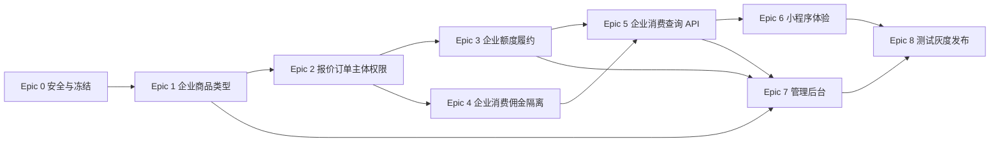

# Enterprise V1 Implementation Plan

> **For agentic workers:** REQUIRED SUB-SKILL: Use superpowers:subagent-driven-development (recommended) or superpowers:executing-plans to implement this plan task-by-task. Steps use checkbox (`- [ ]`) syntax for tracking.

**Goal:** 基于现有 Enterprise Center、Price Plan V2、微信虚拟支付和企业 Compute 账本，交付可购买、可发放、可消费、无企业佣金、可查询和可回滚的 Enterprise V1 商业闭环。

**Architecture:** 企业商品只走 Price Plan V2，订单继续使用 `xz_orders`，微信支付成功统一进入 `GrantOrderEntitlements`，由 Billing 在一个事务内写企业钱包、lot、ledger 和 fulfillment。AI 计费主体只由服务端当前上下文解析；企业消费读取 Compute Ledger + Model Usage，并在 Commission 前硬隔离。

**Tech Stack:** Go + Gin + PostgreSQL；Vue 3 + TypeScript + uni-app 小程序；Vue 3 + Pinia + Axios + Element Plus 管理后台；微信虚拟支付。

## Global Constraints

- 只扩展 `ENTERPRISE_QUOTA`；不新增企业订单或钱包。
- 唯一购买主链是 `Price Plan V2 -> 微信虚拟支付 -> GrantOrderEntitlements`。
- 统一 Payment Center 的 `enterprise_plan` 本阶段保持禁用。
- 前端不能决定金额、权益、tenantId、`billing_subject_type` 或 `billing_account_id`。
- 企业额度不足不回退个人钱包。
- 企业额度包购买和企业 AI 消费完全不参与代理佣金。
- V1 使用立即扣减 + 失败冲正，不实现真实 Reservation。
- 企业消费主数据来自 Compute Ledger 和 Model Usage。
- 实施时重新扫描 migration 与 rollback 的所有已跟踪/未跟踪文件，再分配下一个可用迁移编号；禁止预占当前 `101`。
- 保留工作区既有未提交修改；不执行 `git reset/checkout/stash`。
- 生产迁移、部署、微信商品发布和流量切换需要独立授权。

---

## 1. 文件结构与责任冻结

### 数据库

- 一份实施时动态编号的 Enterprise Quota V1 前向迁移：扩展业务类型、主体字段、快照约束、权限和查询索引。
- 一份同编号 rollback：只回滚可安全删除的约束/索引/可空字段；不删除已产生订单、lot、ledger 或 fulfillment 数据。

### 后端

- `backend-go/internal/httpserver/price_plan_quote_v2.go`：企业商品解析、不可变报价和快照。
- `backend-go/internal/httpserver/price_plan_order_v2.go`：购买人/受益企业订单语义和二次校验。
- `backend-go/internal/httpserver/wechat_virtual_payment.go`：企业产品列表、当前企业 subject resolver 和支付结果摘要。
- `backend-go/internal/httpserver/wechat_virtual_entitlements.go`：统一企业额度权益编排。
- `backend-go/internal/httpserver/enterprise_runtime.go`：企业 grant/debit/reversal、ledger/usage 查询。
- `backend-go/internal/httpserver/postgres_store.go`：Generation/PPT 企业佣金隔离和任务账单快照。
- `backend-go/internal/httpserver/enterprise_postgres_store.go`、`server.go`：企业购买、订单、消费 API。
- `backend-go/internal/httpserver/admin_enterprise_operations_postgres.go`：管理后台真实企业消费投影。
- `backend-go/internal/app/payment/fulfillment.go`：只保留 `enterprise_plan` 禁用状态，不实现 handler。

### 小程序

- `apps/user-uni/src/features/enterprise/api.ts`、`types.ts`、`stores/enterprise.ts`：企业商品、订单、billing subject、ledger 和 usage 数据。
- `apps/user-uni/src/components/enterprise/EnterpriseCenterScreen.vue`：企业余额、购买、订单和消费视图。
- `apps/user-uni/src/pages/AiCreationPage.vue`：真实计费主体。
- `apps/user-uni/src/features/payment/*` 和支付结果页：企业订单支付/履约展示。

### 管理后台

- `admin-vue/src/types/pricePlanAdmin.ts`、`api/pricePlanAdmin.ts`、`stores/pricePlanAdmin.ts`、`domain/pricePlanAdmin.ts`：企业额度商品类型和治理。
- `admin-vue/src/components/billing/price-plan-admin/*`：企业额度商品/价格/微信商品绑定。
- `admin-vue/src/components/enterprise/EnterpriseManagement.vue`：真实 ledger、usage、订单和履约。

### 测试

- 后端沿用并扩展 Price Plan V2、微信支付、企业 P0、生成计费、知识和 Connector 集成测试。
- 根目录 `tests/*.test.mjs` 增加小程序与管理端静态契约测试。
- 发布阶段增加数据库对账 SQL 和灰度清单，但不在业务代码中维护第二套统计。

## Epic 0：安全与冻结

### 目标

建立实施基线、迁移号安全、功能开关、验收矩阵和禁止双主链的自动门禁，使后续 Epic 在不污染当前脏工作区的前提下开发。

### 前置条件

- 本目录四份冻结文档已评审通过。
- 明确开发使用独立 worktree 或窄范围分支；不搬运当前用户未提交改动。
- 生产操作仍未授权。

### 涉及文件

- `docs/enterprise/*.md`
- `.env.example`、`.env.production.example`
- `backend-go/internal/config/config.go`
- `backend-go/internal/httpserver/pricing_health_postgres.go`
- `tests/price-plan-production-gate-contract.test.mjs`
- 实施时动态编号的 migration/rollback 文件

### 数据库变更

- 本 Epic 不提交业务 DDL。
- 实施会话开始时只读扫描 `database/migrations` 与 `database/rollbacks`，记录下一个可用编号；编号分配动作与 Epic 1 的迁移提交串行。
- 定义迁移前后核查 SQL：现有业务类型、订单主体字段、重复 order/fulfillment、wallet/lot/ledger 基线。

### 后端变更

- 增加默认关闭的 Enterprise Quota 商品可见、报价、下单和履约开关。
- Pricing health 明确报告 `ENTERPRISE_QUOTA` 配置是否完整、是否误启用了统一 Payment Center `enterprise_plan`。
- 定义统一错误码：非企业上下文、购买无权限、企业额度不足、企业快照不兼容、企业履约失败。

### 前端变更

- 小程序和管理后台仅在后端 capability/feature flag 开启时显示入口。
- 不通过前端隐藏替代后端权限或开关。

### 测试

- 配置默认关闭测试。
- `enterprise_plan` 无 handler/无企业商品配置门禁测试。
- 当前存在未跟踪 `101` 时，迁移号扫描不得选择 101 的流程检查。

### 验收标准

- 默认部署不出现企业购买入口，不改变现有支付行为。
- 可从 health/capability 读出各阶段开关与阻塞原因。
- 实施日志记录实际分配的迁移编号，且与 migration/rollback 全目录无冲突。

### 风险

- 开关只加在页面而未加在后端。
- 多 worktree 同时分配迁移号。
- 误把 `enterprise_plan` 注册为可用履约类型。

### 回滚方式

- 关闭所有 Enterprise Quota 开关。
- 回退 capability 展示；无业务数据需要回滚。

### 是否可以并行

- 配置/门禁测试可与 UI 设计准备并行。
- 迁移编号分配必须与所有创建迁移的任务串行。

### 禁止并发修改的文件

- `backend-go/internal/config/config.go`
- `.env.example`
- `.env.production.example`
- `backend-go/internal/httpserver/pricing_health_postgres.go`
- `database/migrations/*` 和 `database/rollbacks/*` 的编号分配

## Epic 1：企业商品类型

### 目标

让 Price Plan V2 可以创建、验证、发布和展示 `ENTERPRISE_QUOTA` 商品，并生成只含企业 compute units 的不可变权益快照。

### 前置条件

- Epic 0 完成迁移号分配和默认关闭开关。
- ADR-004、ADR-009 已接受。

### 涉及文件

- 实施时动态编号的 Enterprise Quota V1 migration/rollback
- `backend-go/internal/httpserver/price_plan_admin_*.go`
- `backend-go/internal/httpserver/price_plan_quote_v2.go`
- `backend-go/internal/httpserver/price_plan_order_v2.go`
- `backend-go/internal/httpserver/wechat_virtual_payment.go`
- `backend-go/internal/httpserver/pricing_health_postgres.go`
- `admin-vue/src/types/pricePlanAdmin.ts`
- `admin-vue/src/domain/pricePlanAdmin.ts`
- `admin-vue/src/components/billing/price-plan-admin/BusinessPlanList.vue`
- `admin-vue/src/components/billing/price-plan-admin/PricePlanGovernance.vue`

### 数据库变更

- 扩展 `xz_plan_versions.business_type` 允许 `ENTERPRISE_QUOTA`。
- 增加独立整数企业额度配置字段，例如 plan version 的基础 compute units 和 price plan 的 bonus compute units；不复用 token/points 字段。
- 为企业版本增加正数、会员/代理字段为空、永久 lot、`commissionEligible=false` 的约束或发布校验。
- 增加企业商品解析索引。
- 迁移只加字段/约束/索引，不回写历史 MEMBER/AGENT 快照。

### 后端变更

- Go 类型与管理 API 接受 `ENTERPRISE_QUOTA`。
- 报价生成时将基础/赠送额度合并到 versioned `rights_snapshot`。
- 企业额度商品必须是微信虚拟支付、CNY、整数分、非 TEST 默认商品或显式白名单测试商品。
- `commission_snapshot` 固定为空且快照声明不参与佣金。
- 商品列表只能在服务端确认企业购买资格后返回。

### 前端变更

- 管理后台筛选、标签、编辑表单和详情支持“企业额度包”。
- 企业商品编辑器使用“基础算力/赠送算力/永久有效”，不显示会员等级、代理等级或 Token。
- 发布校验展示微信商品绑定、金额一致和无佣金状态。

### 测试

- 迁移约束：允许企业类型、拒绝负数/零基础额度、拒绝会员/代理混合字段。
- Price Plan 管理 API round-trip。
- rights snapshot 精确整数和不可变测试。
- MEMBER/AGENT 现有商品回归。

### 验收标准

- 管理后台能创建 DRAFT 企业额度版本和价格方案。
- 发布前校验能阻止金额/微信商品/权益/佣金错误。
- 现有会员和代理商品列表、报价和订单不变。

### 风险

- 复用 `token_amount` 导致企业额度进入个人权益。
- 业务类型扩展遗漏 SQL 查询或 TypeScript union。
- 已发布版本被原地修改。

### 回滚方式

- 禁用/退役企业商品和价格方案。
- 关闭商品开关；不删除已创建快照。
- 仅在没有企业类型数据时才执行结构 rollback。

### 是否可以并行

- 后端类型/校验与管理端只读展示可在数据库契约冻结后并行。
- 报价快照实现必须等待数据库字段和 JSON schema 冻结。

### 禁止并发修改的文件

- 实施时动态编号的 migration/rollback
- `backend-go/internal/httpserver/price_plan_quote_v2.go`
- `backend-go/internal/httpserver/price_plan_order_v2.go`
- `admin-vue/src/types/pricePlanAdmin.ts`

## Epic 2：企业报价、订单主体与权限

### 目标

让企业管理员/财务以本人付款、当前企业受益的方式创建报价和订单，同时关闭客户端 tenant/subject 伪造面。

### 前置条件

- Epic 1 的企业商品和快照契约完成。
- 企业上下文和成员 RBAC 可用。

### 涉及文件

- 动态编号 migration/rollback
- `backend-go/internal/httpserver/user_rbac.go`
- `backend-go/internal/httpserver/enterprise_postgres_store.go`
- `backend-go/internal/httpserver/enterprise_runtime.go`
- `backend-go/internal/httpserver/wechat_virtual_payment.go`
- `backend-go/internal/httpserver/price_plan_quote_v2.go`
- `backend-go/internal/httpserver/price_plan_order_v2.go`
- `backend-go/internal/httpserver/server.go`
- `apps/user-uni/src/features/enterprise/api.ts`

### 数据库变更

- 给 `xz_order_price_quotes`、`xz_orders`、`xz_fulfillment_records` 增加 `billing_subject_type`；企业值为 `ENTERPRISE`。
- `xz_fulfillment_records` 增加受益 `tenant_id`；`user_id` 继续表示购买人。
- 订单 `tenant_id` 为受益企业，`buyer_user_id` 为购买人；为企业订单增加非空/一致性约束。
- 增加 `enterprise.quota.purchase`、`enterprise.order.read`、`enterprise.compute.usage.read` 及角色映射。
- 增加企业订单 tenant/product/status/time 索引。

### 后端变更

- 新建统一 server-side Enterprise Purchase Subject resolver：认证用户 -> 当前企业 context -> active member -> role/permission -> tenant。
- `X-Tenant-Id` 只做一致性校验；不允许请求体传 tenantId 或 subject。
- 企业商品报价绑定 buyer + beneficiary tenant + subject；订单消费报价时再次校验。
- V2 订单写 `buyer_user_id = authenticated user`、`tenant_id = current enterprise`、`user_id = buyer`。
- 企业商品列表、报价、订单查询按权限隔离。

### 前端变更

- 企业 API client 不发送可选择的 billing subject。
- 仅从当前上下文请求企业商品/报价；切换企业后清理商品、报价和订单缓存。
- 购买按钮仅按服务端权限投影显示。

### 测试

- Admin/Finance 成功；AI Admin/Member 403。
- 伪造 header、body tenantId、复用其他企业 quote token 均失败。
- 同一用户属于两个企业时，订单只绑定当前 context。
- quote 过期、已消费、商品退役和权限撤销的失败用例。
- 个人 MEMBER/AGENT 报价和订单回归。

### 验收标准

- 任一企业订单都能明确回答“谁购买、哪个企业受益、什么主体付费”。
- 客户端无法通过参数改变受益企业。
- 角色权限与企业订单查询无越权。

### 风险

- 继续沿用 `resolveTenant` 的请求头优先逻辑。
- `user_id`/`buyer_user_id`/`tenant_id` 在查询中混用。
- 报价时验证权限、下单时未重新验证。

### 回滚方式

- 关闭企业报价和订单开关。
- 保留已创建订单只读和支付同步。
- 新字段为可兼容字段，不改历史订单。

### 是否可以并行

- RBAC 迁移与 subject resolver 测试可并行准备。
- 报价和订单写入共享 V2 文件，必须串行。

### 禁止并发修改的文件

- `backend-go/internal/httpserver/wechat_virtual_payment.go`
- `backend-go/internal/httpserver/price_plan_quote_v2.go`
- `backend-go/internal/httpserver/price_plan_order_v2.go`
- `backend-go/internal/httpserver/server.go`
- 动态编号 migration/rollback

## Epic 3：企业额度履约

### 目标

支付成功后，通过唯一 `GrantOrderEntitlements` 入口幂等、原子地向受益企业发放基础和赠送 compute units。

### 前置条件

- Epic 1 企业权益快照、Epic 2 企业订单主体完成。
- 企业钱包、lot、ledger 已存在。

### 涉及文件

- `backend-go/internal/httpserver/wechat_virtual_entitlements.go`
- `backend-go/internal/httpserver/wechat_virtual_payment.go`
- `backend-go/internal/httpserver/enterprise_runtime.go`
- `backend-go/internal/httpserver/postgres_store.go`
- `backend-go/internal/httpserver/server.go`
- `backend-go/internal/app/payment/fulfillment.go`（只加禁用回归测试，禁止注册 handler）
- `backend-go/internal/httpserver/wechat_virtual_payment_postgres_test.go`
- `backend-go/internal/httpserver/price_plan_v2_postgres_test.go`

### 数据库变更

- 使用 Epic 2 已增加的 fulfillment 主体字段。
- 如现有唯一约束不足，增加 order + fulfillment_type 唯一约束和 lot/ledger order idempotency 索引。
- 不新建 grant ledger；Compute Ledger 即发放主账。

### 后端变更

- 在 `GrantOrderEntitlements` 增加 `ENTERPRISE_QUOTA` 分支。
- 严格解析订单 `rights_snapshot`，拒绝缺失、负数、非整数、非永久 lot 或 `commissionEligible != false`。
- Billing grant 事务锁定订单/fulfillment/tenant wallet，写 base/bonus lots、wallet CREDIT、Compute Ledger CREDIT、fulfillment SUCCESS。
- 重复调用返回已完成结果；中途失败整事务回滚。
- callback、sync、人工 retry 均复用该入口。
- status API 返回企业到账前后余额、基础/赠送额度、ledger/fulfillment 标识。

### 前端变更

- 支付结果页根据 subject 显示企业到账，不再读取个人余额证明成功。
- 履约失败显示“已支付，额度发放处理中/失败”，允许触发既有 sync，不允许输入补发数量。

### 测试

- 首次履约精确写 wallet、2 个可选 lot、1 个 CREDIT ledger、1 个 fulfillment。
- bonus 为 0 时不创建零 lot。
- 重复 callback/sync/retry 十次仍只发一次。
- 并发两个回调只成功一次。
- 事务故障注入后余额、lot、ledger 均无部分写入，重试可成功。
- 快照篡改、金额不匹配、跨 tenant、非永久 lot 拒绝。
- `enterprise_plan` 仍 unsupported。

### 验收标准

- wallet 增量 = base + bonus = lot 原始增量 = ledger CREDIT。
- fulfillment 可追踪 buyer、tenant、order、错误和重试次数。
- 支付成功但履约失败可恢复且不重复发放。

### 风险

- 先更新订单再写钱包导致部分成功。
- 复用个人 token grant。
- 幂等键只按用户而不是订单。

### 回滚方式

- 关闭新企业履约开关，停止新增购买。
- 已成功发放数据不可删除；错误发放通过受审计的追加调整处理。
- 已支付失败订单保留并进入人工队列。

### 是否可以并行

- 前端结果态可在 status API 契约冻结后并行。
- grant 事务和 callback/sync/retry 适配必须串行审查。

### 禁止并发修改的文件

- `backend-go/internal/httpserver/wechat_virtual_entitlements.go`
- `backend-go/internal/httpserver/enterprise_runtime.go`
- `backend-go/internal/httpserver/wechat_virtual_payment.go`

## Epic 4：企业消费佣金隔离

### 目标

确保企业额度包购买和所有企业 AI 消费不会产生任何代理佣金副作用，同时不改变个人/会员/代理既有佣金。

### 前置条件

- 企业任务/订单有服务端可信的 `billing_account_type` / `billing_subject_type`。
- Commission 现有记录和钱包表可用于零增量断言。

### 涉及文件

- `backend-go/internal/httpserver/postgres_store.go`
- `backend-go/internal/httpserver/enterprise_runtime.go`
- `backend-go/internal/httpserver/wechat_virtual_entitlements.go`
- `backend-go/internal/httpserver/commission_*.go`
- `backend-go/internal/httpserver/generation_billing_test.go`
- `backend-go/internal/httpserver/commission_postgres_test.go`
- `backend-go/internal/httpserver/connector_api_test.go`
- `backend-go/internal/httpserver/knowledge_api_test.go`

### 数据库变更

- 原则上无新佣金表。
- 如 Commission 输入记录有资格字段，增加 `commission_eligible` 或 subject 索引/约束；禁止以“零金额佣金记录”代替无记录。

### 后端变更

- `generationBillingArtifactsForTx` 在企业主体时不调用 `commissionArtifactsForUserTx`。
- PPT 企业账单路径同样短路。
- RAG、Connector、Knowledge Agent 验证不绕过共享守卫。
- Enterprise Quota 报价/订单快照不捕获推荐关系，不调用购买佣金。
- Commission 服务对企业 subject 或企业商品执行第二道拒绝。

### 前端变更

- 管理后台企业订单和消费显示“佣金：不参与”，不展示 0 元待结算记录。
- 代理端不出现企业额度购买或企业消费记录。

### 测试

- 为有直接代理、上级代理和运营中心关系的企业员工执行生图、视频、PPT、RAG、Agent、Connector。
- 断言兼容佣金表、正式 Commission 记录、钱包流水均零增量。
- 企业额度包购买也断言零增量。
- 同样用户切回 PERSONAL 后个人生成/个人商品佣金保持既有行为。

### 验收标准

- 企业订单和企业消费全矩阵零佣金。
- 个人/代理回归无变化。
- 佣金隔离由后端主体字段保证，不依赖空配置或 UI。

### 风险

- 只修 Generation，遗漏 PPT 直接调用。
- Connector 走独立路径绕过守卫。
- 仍创建 0 金额记录污染统计。

### 回滚方式

- 若隔离引发个人佣金回归，关闭企业 AI/购买开关后回滚应用。
- 已错误产生佣金不能删除，必须走 Commission 冲正流程。

### 是否可以并行

- 购买佣金隔离与 AI 消费佣金隔离可在不同测试文件并行。
- `postgres_store.go` 的共享结算函数修改必须单人串行。

### 禁止并发修改的文件

- `backend-go/internal/httpserver/postgres_store.go`
- `backend-go/internal/httpserver/commission_postgres_test.go`
- `backend-go/internal/httpserver/generation_billing_test.go`

## Epic 5：企业消费查询 API

### 目标

以 Compute Ledger 和 Model Usage 提供企业端、管理端可分页、可筛选、可对账的消费查询，不再以人工调整表代表 AI 消费。

### 前置条件

- Epic 2 的读取权限完成。
- Epic 3/4 的 ledger、usage 和主体字段稳定。

### 涉及文件

- 动态编号 migration/rollback
- `backend-go/internal/httpserver/enterprise_runtime.go`
- `backend-go/internal/httpserver/enterprise_postgres_store.go`
- `backend-go/internal/httpserver/enterprise_types.go`
- `backend-go/internal/httpserver/admin_enterprise_operations_postgres.go`
- `backend-go/internal/httpserver/server.go`
- `backend-go/internal/httpserver/enterprise_api_test.go`
- `backend-go/internal/httpserver/admin_enterprise_api_test.go`

### 数据库变更

- Compute Ledger：tenant + created_at + id、tenant + actor + created_at、tenant + reference 索引。
- Model Usage：tenant + created_at + id、tenant + user/org + created_at、tenant + module/model + created_at 索引。
- Orders/Fulfillment：tenant + product/status/time 索引。
- 不复制 ledger/usage 到新消费表。

### 后端变更

- `GET /enterprise/compute-account` 返回 wallet 与有效 lot 合计，暴露不一致告警但不在查询中改账。
- 新增 `GET /enterprise/compute-ledger` 和 `GET /enterprise/model-usage`，使用稳定游标分页。
- 企业端 tenant 从当前上下文解析，支持权限和字段脱敏。
- 管理端 compute/transactions/orders 改读真实事实源并返回 fulfillment。
- 提供按订单/任务/reference 关联的对账字段。

### 前端变更

- 本 Epic 只冻结 API contract/types，不实现具体页面；页面在 Epic 6/7。

### 测试

- 跨租户隔离、普通成员 403/受限摘要、Admin/Finance 全量。
- 时间、成员、组织、模块、模型、entry type、reference 筛选。
- 同 timestamp 下游标稳定、不重复不遗漏。
- 人工充值、企业购买、AI DEBIT、失败 REVERSAL 均可见且不重复。
- wallet、有效 lot、ledger running balance 对账。

### 验收标准

- 企业端和管理端对同一 tenant/time filter 返回一致 totals。
- AI 消费能关联任务、成员、模块、模型；额度发放能关联订单和 fulfillment。
- `xz_tenant_point_transactions` 不参与 AI 消费 totals。

### 风险

- offset 分页在并发写入时重复/遗漏。
- join Model Usage 导致 ledger 重复行。
- 为展示方便在查询中“修复”余额。

### 回滚方式

- 页面回退到只读 summary/维护态，不回退到旧人工调整表宣称真实消费。
- 新索引可安全保留；接口开关可关闭。

### 是否可以并行

- 企业端 ledger API 与管理端投影可并行，但必须共用已冻结的 repository/query contract。
- 索引迁移与查询实现可并行准备，合并前用同一查询计划验收。

### 禁止并发修改的文件

- `backend-go/internal/httpserver/enterprise_runtime.go`
- `backend-go/internal/httpserver/admin_enterprise_operations_postgres.go`
- `backend-go/internal/httpserver/server.go`
- 动态编号 migration/rollback

## Epic 6：小程序企业计费体验

### 目标

在现有 Enterprise Center 页面栈完成企业额度购买、订单/履约、真实计费主体和消费明细体验。

### 前置条件

- Epic 2 报价/订单 API、Epic 3 status、Epic 5 查询 API 稳定。
- 小程序继续使用统一 API Client；不得直接写 `uni.request` 或引入 Axios。

### 涉及文件

- `apps/user-uni/src/features/enterprise/api.ts`
- `apps/user-uni/src/features/enterprise/types.ts`
- `apps/user-uni/src/stores/enterprise.ts`
- `apps/user-uni/src/components/enterprise/EnterpriseCenterScreen.vue`
- `apps/user-uni/src/pages/enterprise/EnterpriseBillingPage.vue`
- `apps/user-uni/src/pages/enterprise/EnterpriseUsagePage.vue`
- `apps/user-uni/src/pages/AiCreationPage.vue`
- `apps/user-uni/src/features/payment/api.ts`
- `apps/user-uni/src/features/payment/types.ts`
- `apps/user-uni/src/pages/user/UserOrderResultPage.vue`
- `apps/user-uni/src/styles/enterprise-center.css`

### 数据库变更

- 无。

### 后端变更

- 本 Epic 只允许 API contract 小修，不在前端任务中修改后端业务实现。

### 前端变更

- 企业算力页展示余额、可购包、购买权限、订单和履约。
- 调用统一 payment API 获取报价和微信签名，金额/权益只读。
- 消费页提供 ledger/usage 两视图和筛选/分页。
- AI 创作页使用服务端 Billing Subject；切换 context 后强制刷新并清旧缓存。
- 普通员工展示“由企业 X 承担”，无余额读取权限时不泄露余额。
- 企业额度不足显示企业充值/联系管理员，不跳个人钱包。
- 支付结果页显示受益企业和企业到账，不显示个人点数。

### 测试

- TypeScript 类型检查、H5/小程序构建、静态 API contract。
- Admin/Finance/Member 不同权限页面。
- PERSONAL/ENTERPRISE 切换后主体和余额无缓存串线。
- 支付取消、支付成功履约中、履约失败、同步成功。
- 企业不足但个人充足时不引导自动个人扣费。

### 验收标准

- 页面显示主体与任务/订单服务端快照一致。
- 无页面直接调用 `uni.request`；金额和权益不可编辑。
- 企业消费页显示真实数据，不再为空态占位。

### 风险

- 把 `X-Tenant-Id` 当成前端主体选择。
- 切换企业后复用旧 quote token。
- 支付成功只刷新个人 `points.account`。

### 回滚方式

- 关闭企业购买和消费页入口。
- AI 创作页在企业上下文若无法获取 subject，阻止提交并显示维护态；不得回退显示个人余额。

### 是否可以并行

- 企业购买页、消费页、AI 主体组件可分 worktree 并行，但共享 types/store/API 文件必须先冻结契约并指定唯一集成人。
- 支付结果页可独立并行。

### 禁止并发修改的文件

- `apps/user-uni/src/features/enterprise/api.ts`
- `apps/user-uni/src/features/enterprise/types.ts`
- `apps/user-uni/src/stores/enterprise.ts`
- `apps/user-uni/src/components/enterprise/EnterpriseCenterScreen.vue`
- `apps/user-uni/src/pages/AiCreationPage.vue`

## Epic 7：管理后台企业消费与履约

### 目标

让平台运营/财务在管理后台治理企业额度商品，并查看真实企业订单、履约、额度流水、模型用量和对账状态。

### 前置条件

- Epic 1 管理 API、Epic 3 fulfillment、Epic 5 管理查询 API 稳定。
- 后台继续使用 Vue 3 + Pinia + Axios + Element Plus，统一请求层。

### 涉及文件

- `admin-vue/src/types/pricePlanAdmin.ts`
- `admin-vue/src/api/pricePlanAdmin.ts`
- `admin-vue/src/stores/pricePlanAdmin.ts`
- `admin-vue/src/domain/pricePlanAdmin.ts`
- `admin-vue/src/components/billing/price-plan-admin/*`
- `admin-vue/src/components/enterprise/EnterpriseManagement.vue`
- `admin-vue/src/api/enterprise.ts` 或现有企业 API 模块
- `admin-vue/src/App.vue`（仅路由/模块注册确有需要时）

### 数据库变更

- 无新增业务表；使用 Epic 5 索引。

### 后端变更

- 管理 API 返回商品、订单、fulfillment、ledger、usage 和 reconciliation 状态。
- 人工履约重试只接受 fulfillment/order 标识并调用统一服务。
- 管理端不得暴露直接钱包 SQL 修改接口。

### 前端变更

- Price Plan Governance 支持企业额度类型和快照事实展示。
- Enterprise Management 的 compute/transactions 改为真实 ledger/usage。
- Orders 展示 buyer、beneficiary tenant、subject、支付、履约和错误。
- Billing 履约页可筛选企业失败记录并触发统一 retry。
- 显示 wallet、有效 lot、ledger 不一致告警；不在页面自动修账。

### 测试

- TypeScript、管理端构建、API contract。
- 平台 RBAC：只读、商品管理、支付/履约管理权限分离。
- 企业详情 totals 与后端对账一致。
- retry 成功、重复 retry 幂等、无权限 retry 403。
- MEMBER/AGENT Price Plan 管理回归。

### 验收标准

- 管理后台能从订单追到支付、fulfillment、lot、ledger。
- 能从 DEBIT/REVERSAL 追到成员、任务、模型。
- 页面不再用人工调整表命名为“企业消费”。

### 风险

- 管理端一次拉取全部明细导致性能问题。
- `EnterpriseManagement.vue` 大文件并发冲突。
- 后台重试绕过统一 service。

### 回滚方式

- 关闭新管理模块，保留只读订单/health。
- 商品设为不可见/退役，禁止新增订单。
- 已有履约记录与账本不回滚删除。

### 是否可以并行

- Price Plan 管理 UI 与 Enterprise Management 消费 UI 可分 worktree 并行。
- `EnterpriseManagement.vue` 只能由一个任务在同一时间修改。

### 禁止并发修改的文件

- `admin-vue/src/components/enterprise/EnterpriseManagement.vue`
- `admin-vue/src/types/pricePlanAdmin.ts`
- `admin-vue/src/stores/pricePlanAdmin.ts`
- `admin-vue/src/domain/pricePlanAdmin.ts`

## Epic 8：测试、对账、灰度与发布

### 目标

用数据库、后端、小程序、管理后台和真实灰度证据证明闭环成立，并提供可停止、可补偿、不可改写历史账的发布与回滚路径。

### 前置条件

- Epic 0–7 代码审查完成。
- 生产发布、微信商品配置和迁移执行取得独立授权。

### 涉及文件

- `backend-go/internal/httpserver/*_test.go` 相关测试
- `tests/enterprise-*.test.mjs`、现有 price plan contract 测试
- `docs/enterprise/enterprise-v1-release-runbook.md`（实施阶段新增，非本轮文档范围）
- `docs/enterprise/enterprise-v1-reconciliation.sql` 或受控 runbook 内只读 SQL（实施阶段新增）
- 部署配置与监控仪表（仅获授权后）

### 数据库变更

- 先在临时 PostgreSQL 做全量迁移 rehearsal 和 rollback compatibility。
- 生产前备份；迁移后验证约束、索引、旧订单、企业钱包/lot/ledger 基线。
- 发布后只读对账：
  - wallet 与 ledger running balance
  - wallet 与有效 lot
  - paid enterprise orders 与 successful/failed fulfillment
  - enterprise orders/consumption 与 Commission 零记录

### 后端变更

- 补齐所有集成、并发、故障注入和回归测试。
- 增加指标：企业报价/下单/支付/履约成功率、重复回调、wallet-lot mismatch、企业不足、reversal、企业佣金拒绝。
- 灰度开关支持按 tenant 白名单启用。

### 前端变更

- 小程序与管理后台完成构建、权限和状态矩阵验收。
- 灰度企业看到入口，非灰度企业无入口且后端也拒绝。

### 测试

- 数据库迁移/回滚兼容。
- 单元、集成、并发、故障注入、跨租户、权限、佣金零增量。
- AI 场景矩阵：生图、改图、视频、PPT、RAG、Knowledge Agent、Connector。
- 证明独立通用对话/Agent Run 在 Enterprise V1 全环境均未开放企业付费入口。
- 个人会员、个人充值、代理加入、个人 AI、代理佣金回归。
- 微信 sandbox 实单：支付、重复通知、主动查单、履约失败重试。

### 验收标准

- 冻结文档第 10 节全部通过并有证据。
- 对账差异为 0，或差异均有订单/ledger/冲正解释和批准处理单。
- 灰度期间无跨租户、重复发放、个人钱包回退和企业佣金。
- 回滚演练能停止新增购买且保留已付订单补偿能力。

### 风险

- 本地测试被误写成生产验收。
- 微信支付成功但未验证最终 entitlement。
- 灰度只控制前端，不控制 API。
- 回滚应用后无法处理已支付失败订单。

### 回滚方式

- 第一优先：关闭企业商品可见、报价、下单；保留支付同步和履约补偿。
- 第二优先：关闭企业 AI 灰度；已发额度保留。
- 应用回滚不删除订单、fulfillment、lot、ledger、usage、commission 冲正证据。
- 数据迁移 rollback 仅在无新业务数据且演练证明安全时执行。

### 是否可以并行

- 后端测试、小程序验收、管理端验收和对账脚本可并行。
- 生产迁移、配置、灰度、全量发布必须按 runbook 串行并逐门禁确认。

### 禁止并发修改的文件

- 实际 release runbook
- 生产环境配置
- 动态编号 migration/rollback
- Price Plan 生产商品和微信商品映射
- 灰度白名单与功能开关

## 2. Epic 依赖与建议顺序

严格主序列：`Epic 0 -> Epic 1 -> Epic 2 -> Epic 3 -> Epic 4 -> Epic 5 -> Epic 6/7 -> Epic 8`。

可控并行：

- Epic 3 完成主体契约后，Epic 4 的佣金隔离测试可并行推进。
- Epic 5 API contract 冻结后，小程序消费页与管理后台消费页可分 worktree 并行。
- Epic 6 的支付结果页与 AI 主体组件可并行，但共享 enterprise store/API 由唯一集成人维护。

## 3. 全局完成定义

- [ ] Enterprise Quota 只存在一条购买主链。
- [ ] 企业订单购买人、受益企业和计费主体可明确查询。
- [ ] 支付成功通过统一权益服务幂等发放。
- [ ] 企业不足无个人 fallback。
- [ ] 企业购买和消费 Commission 零增量。
- [ ] 已发布企业 AI 场景完成主体/扣费/冲正/用量/无佣金矩阵。
- [ ] 小程序与管理后台显示真实主体、消费和履约。
- [ ] 个人/会员/代理回归通过。
- [ ] 数据库、应用、微信和灰度均有独立证据。
- [ ] 生产行为仅在取得授权后执行。
