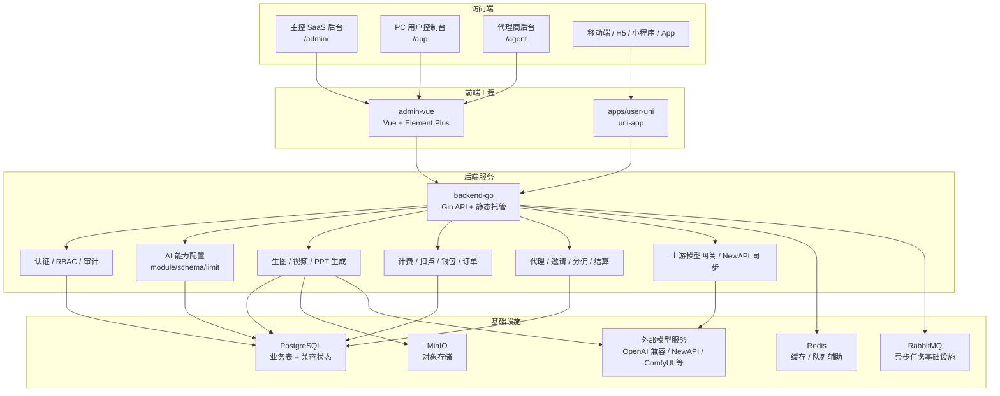
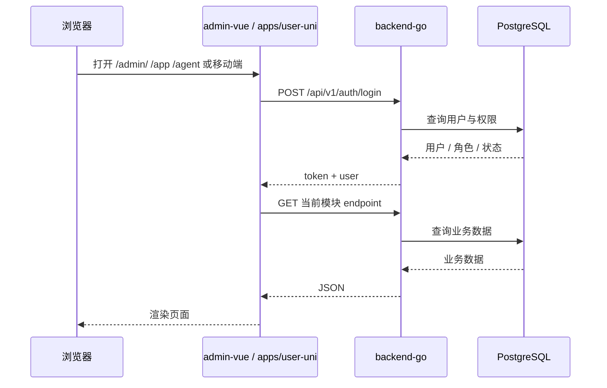
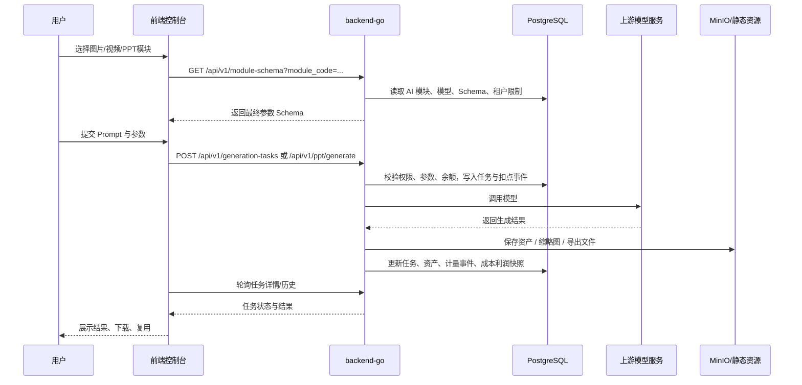
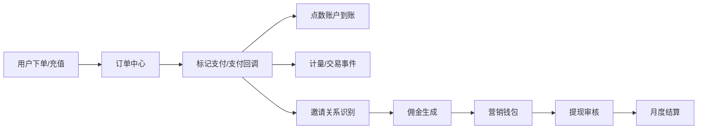
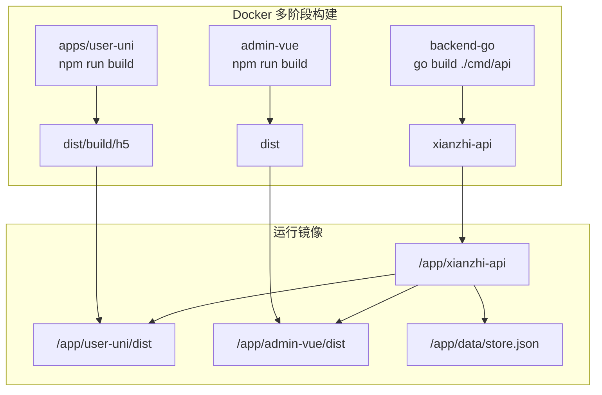

# 先知 AI 项目功能板块与架构说明

更新时间：2026-07-04

## 1. 项目定位

先知 AI 是一站式内容生产与代理商运营平台，当前按三层主线演进：

- PC 管理与控制台：`admin-vue`
- 移动端 / H5 / 小程序 / App：`apps/user-uni`
- 后端 API 与静态托管：`backend-go`

旧 `frontend`、`backend`、`admin-web` 目录已移除；当前开发入口统一为 `apps/user-uni`、`admin-vue`、`backend-go`。

## 2. 代码目录与运行入口

| 目录 | 当前角色 | 主要技术 | 运行入口 | 说明 |
| --- | --- | --- | --- | --- |
| `admin-vue` | PC 主控后台、PC 用户控制台、代理商后台 | Vue 3、Vite、Element Plus、Pinia、Axios | `/admin/`、`/app`、`/agent` | Docker 构建为 `/app/admin-vue/dist`，由 Go 服务托管 |
| `apps/user-uni` | 移动端 / H5 / 小程序 / App 用户端 | uni-app、Vue 3、Pinia、TypeScript | H5 静态站、小程序、App Plus、Harmony | Docker H5 构建产物为 `/app/user-uni/dist` |
| `backend-go` | 业务 API、鉴权、计费、生成任务、静态托管 | Go 1.25、Gin、PostgreSQL、Redis | `backend-go/cmd/api` | 当前真实后端 |
| `database` | schema 与迁移 | SQL | `database/schema.sql`、`database/migrations/*.sql` | Docker `migrate` 服务启动时执行 |
| `docs` | 产品、架构、迁移、计费等文档 | Markdown | - | 项目知识沉淀 |

## 3. 总体架构图



## 4. 前端板块

### 4.1 主控 SaaS 后台：`admin-vue` `/admin/`

面向平台运营、管理员、财务、技术治理人员。

主要模块：

- 首页 / 分析页 / 工作台 / 数据中心：平台经营指标、任务概览、快捷入口。
- 客户中心：客户账号、套餐、点数、状态、模型路由、NewAPI 同步。
- 产品中心 / 套餐中心：AI 产品、套餐价格、权益点数、并发、有效期。
- 订单中心：充值订单、订阅订单、收款标记、续费。
- 用量中心：生成任务、模型消耗、计量事件统计。
- AI 能力中心：一级目录，下设能力模块、模型管理、参数 Schema、租户限制、上游通道、调用日志，管理 `image_generation`、`video_generation`、`ppt_generation` 的能力边界。
- API 设置：上游模型渠道、协议、Base URL、API Key、模型拉取、客户分组与网关配置。
- 计费中心：计费驾驶舱、客户计费、套餐产品、订阅、计量指标、计费规则、费用、钱包、优惠券、账单、贷项、付款请求、支付催收。
- 营销端：代理等级、邀请记录、分佣规则、升级方案、营销钱包、钱包流水、月度结算单。
- 分润中心：佣金、提现、审核与结算。
- 系统中心 / 权限管理：品牌、支付、系统配置、部门、用户、菜单权限。

入口文件重点：

- `admin-vue/src/App.vue`：PC 控制台主壳、菜单、页面组合。
- `admin-vue/src/stores/admin.ts`：模块注册、接口端点、数据加载。
- `admin-vue/src/api/client.ts`：Axios 请求封装，统一 `/api/v1`。

### 4.2 PC 用户控制台：`admin-vue` `/app`

面向终端用户在 PC 浏览器中使用创作与账户能力。

主要模块：

- 用户首页：账户概览、快捷创作入口。
- AI 生图：Prompt、参考图、模型参数、生成记录、收藏、下载、复用。
- 无线画布：承载 Infinite Canvas 类工作区与画布项目能力。
- 视频生成：文生视频、图生视频、模型参数、生成记录。
- PPT 文档生成：主题输入、提纲生成、页面编辑、配图、导出 PPTX/PDF。
- 作品中心：生成资产、缩略图、下载与编辑。
- 充值 / 订阅：点数充值、订阅购买。
- 使用记录 / 订单明细：扣点流水、交易记录。
- API 设置：用户侧模型/API 配置查看。

`/app/*` 当前由 `backend-go` 托管 `admin-vue/dist`，用户模块切换在前端壳内维护路径状态。

### 4.3 代理商后台：`admin-vue` `/agent`

面向代理商和渠道角色。

主要模块：

- 代理商看板：客户、订单、佣金、推广表现。
- 客户管理：邀请码绑定客户、状态、消费。
- 订单管理：名下客户订单、待支付、成交、续费。
- 消费明细：按客户、任务、模型、扣点查看。
- 佣金结算：分佣明细、提现状态、结算金额。
- 推广渠道：邀请码、下级代理、渠道转化。
- 素材中心：推广海报、话术、专属链接。
- 账户设置：代理资料、收款信息、通知偏好。

### 4.4 移动端用户端：`apps/user-uni`

面向 H5、小程序和 App Plus，多端共用 uni-app。

主要职责：

- 移动端登录、账户、创作入口。
- 调用 `/api/v1` 接口，与 PC 用户控制台共享后端业务能力。
- 通过 `uni.request` 封装请求，以兼容 H5、微信小程序、App。

构建目标：

- H5：`apps/user-uni/dist/build/h5`
- 微信小程序：`apps/user-uni/dist/build/mp-weixin`
- App Plus：`apps/user-uni/dist/build/app-plus`
- Harmony App：`apps/user-uni/dist/build/app-harmony`
- Harmony 小程序：`apps/user-uni/dist/build/mp-harmony`

## 5. 后端板块：`backend-go`

`backend-go` 是当前真实后端，负责 API、业务事务、静态资源托管、外部模型调用和数据持久化。

### 5.1 认证与权限

- 登录、登出、当前用户信息：`/api/v1/auth/*`
- 用户角色区分：管理员、普通用户、代理商。
- PostgreSQL 模式下可启用 RBAC 中间件。
- 审计日志、操作日志、角色权限、备份记录用于生产治理。

### 5.2 静态资源托管

Go 服务同时托管前端产物：

- `/admin/` -> `admin-vue/dist`
- `/app`、`/app/*` -> `admin-vue/dist`
- `/agent`、`/agent/*` -> `admin-vue/dist`
- 移动端 H5 静态资源 -> `apps/user-uni/dist/build/h5`
- `/api/v1/*` -> 业务 API

### 5.3 AI 能力配置

核心目标是将不同 AI 产品能力统一抽象为模块：

- `image_generation`
- `video_generation`
- `ppt_generation`

主要配置：

- AI 模块：开关、开放套餐、开放租户、绑定模型、默认 Schema。
- AI 模型：模型名、类型、上游、能力编码、所属模块、fallback。
- 参数 Schema：模型支持的参数字段、类型、默认值、选项、是否可见、是否用户可编辑。
- 租户限制：按租户 / 套餐 / 代理限制可用模型与参数范围。
- 调用日志：任务参数、最终 Schema、限制快照、上游成本、平台利润、分佣快照。

计费规则仍归属计费中心维护，AI 能力中心只维护能力与参数边界。

### 5.4 生成任务

覆盖图片、视频、PPT。

通用流程：

1. 前端请求模块 Schema。
2. 用户提交生成参数。
3. 后端校验模块权限、模型归属、参数 Schema、租户限制。
4. 后端计算点数 / 费用并锁定或扣减账户。
5. 路由到上游模型或本地 mock provider。
6. 写入生成任务、素材资产、计量事件、审计数据。
7. 前端轮询任务状态并展示结果。

### 5.5 PPT 文档生成

主要能力：

- 主题生成 PPT 任务。
- 提纲生成与保存。
- 幻灯片内容生成。
- 单页重写 / 图片生成 / 图片搜索。
- PPTX / PDF 导出。
- 文本模型与图片模型列表。
- 与计费事件、扣点、历史记录联动。

相关接口位于 `/api/v1/ppt/*` 和兼容 `/api/ppt/*`。

### 5.6 API 设置与模型网关

主要能力：

- 管理上游 provider channel。
- 支持 OpenAI 兼容、NewAPI、ModelScope、ComfyUI 等协议形态。
- 配置 Base URL、API Key env、模型列表、优先级、状态。
- 测试上游可用性、拉取模型。
- 管理 API Key、客户分组、模型倍率。
- 支持 NewAPI 用户与 Key 同步。

### 5.7 计费中心

计费中心是唯一计费规则配置归属。

主要能力：

- 计费驾驶舱：MRR、按量收入、待开票、逾期、流程状态。
- 客户计费：订阅、预付余额、开票资料、付款方式。
- 套餐产品：可收费产品、指标、权益。
- 订阅管理：试用、活跃、欠费、暂停、取消、续费。
- 计量事件：图片、视频、PPT、API、Agent 等可审计事件。
- 计量指标 / 计费规则：按 count、sum、volume、package、graduated 等模型扩展。
- 费用、钱包、优惠券、账单、贷项、付款请求、支付催收。

### 5.8 渠道与营销

主要能力：

- L0-L5 代理等级模型。
- 邀请关系、邀请码、升级路径、保级条件。
- 直推、间推、运营中心奖励等分佣规则。
- 佣金钱包、钱包流水、提现冻结、月度结算。
- 代理商客户、订单、用量、佣金视图。

### 5.9 数据与基础设施

Docker 环境包含：

- PostgreSQL：核心业务数据、治理表、迁移表。
- Redis：缓存与运行时辅助。
- RabbitMQ：异步任务基础设施。
- MinIO：对象存储。
- postgres-backup：周期性数据库备份。
- migrate：启动时执行 SQL 迁移。

当前后端优先使用 PostgreSQL 业务表，`platform_state` / `data/store.json` 作为历史兼容和本地 fallback。

## 6. 核心数据流图

### 6.1 登录与页面加载



### 6.2 AI 生成链路



### 6.3 订单、充值与分佣链路



## 7. 部署构建图



## 8. 常用开发命令

```powershell
# 启动 Go API
npm.cmd start

# 启动 PC 管理后台 / 用户 PC 控制台开发服务
npm.cmd run dev:admin

# 启动 uni-app H5 开发服务
npm.cmd run dev:uni

# 构建
npm.cmd run build:admin
npm.cmd run build:uni
npm.cmd run build:mp-weixin
npm.cmd run build:app-plus

# 后端测试
npm.cmd test

# Docker 本地全栈
npm.cmd run docker:up
npm.cmd run docker:ps
npm.cmd run docker:logs
```

## 9. 判断改哪里

| 问题类型 | 优先修改目录 |
| --- | --- |
| `/admin/` 主控后台页面、菜单、表格、弹窗、布局 | `admin-vue` |
| `/app` PC 用户控制台页面、AI 生图、视频、PPT、订阅页面 | `admin-vue` |
| `/agent` 代理商后台页面 | `admin-vue` |
| 移动端 H5、小程序、App 页面 | `apps/user-uni` |
| 登录、权限、接口、扣点、计费、生成任务、数据库 | `backend-go` |
| 数据表、迁移、索引、初始化数据 | `database` |
| 旧逻辑参考 | 已移除；如需恢复可从 Git 历史或备份分支找回 |

## 10. 当前边界约定

- 计费规则归属于计费中心，不在 AI 能力中心重复配置。
- AI 能力中心是主控 SaaS 后台一级目录，不挂在 API 设置或技术治理下面；其二级模块是能力模块、模型管理、参数 Schema、租户限制、上游通道、调用日志。
- AI 能力中心只负责模块、模型、参数 Schema、租户参数限制和调用日志。
- PC 用户控制台 `/app` 与主控后台 `/admin/` 共用 `admin-vue`，但根据路径和角色展示不同模块。
- 移动端多端能力由 `apps/user-uni` 承载。
- 所有前端都以 `/api/v1` 为稳定后端契约。
- Docker 当前只构建 `admin-vue`、`apps/user-uni`、`backend-go`；旧 legacy 目录已移除。
