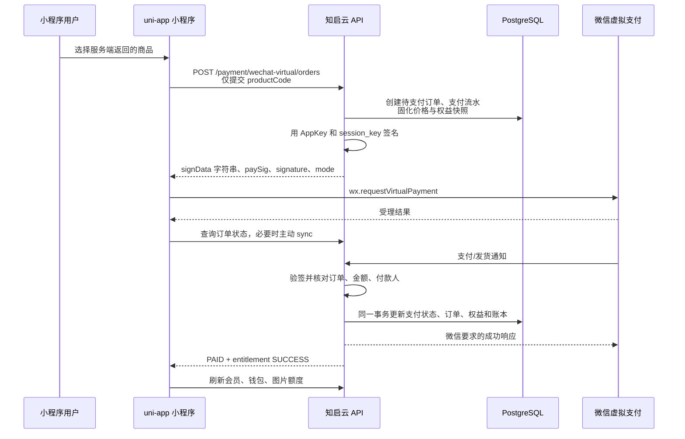

# 微信小程序虚拟支付接入说明

本文描述知启云 AI 微信小程序虚拟支付实现。实现以当前 Go + Gin + PostgreSQL + Redis + uni-app 技术栈和微信官方文档为准；`ai-marketing` 仅用于理解业务流程，没有复制其 Java/若依代码、常量或密钥。

官方依据：

- [微信虚拟支付能力](https://developers.weixin.qq.com/miniprogram/dev/platform-capabilities/business-capabilities/virtual-payment.html)
- [wx.requestVirtualPayment](https://developers.weixin.qq.com/miniprogram/dev/api/payment/wx.requestVirtualPayment.html)
- [虚拟支付对账接口](https://developers.weixin.qq.com/miniprogram/dev/server/API/VirtualPayment/api_start_download_order.html)

## 1. 业务流程



客户端支付成功只表示微信 API 已受理。最终到账必须以后端订单为 `PAID` 且权益状态为 `SUCCESS` 为准，客户端不会自行增加任何权益。

## 2. 商品与权益规则

| 商品编码 | 商品 | 金额（分） | 服务端权益 |
| --- | --- | ---: | --- |
| `TOKEN_CUSTOM_1YUAN` | 自定义金额充值单位 | 每份 10 | 每份增加 10 Token；购买 1～5000 份，金额按 0.1 元递增 |
| `TOKEN_TEST_1FEN` | 1 分支付联调商品 | 1 | 固定增加 1 Token；仅用于低金额真实支付联调 |
| `TOKEN_SMALL_2500` | 小额 Token 包 | 1990 | 增加 2500 Token |
| `TOKEN_STANDARD_15000` | 标准 Token 包 | 9900 | 增加 15000 Token |
| `TOKEN_10000` | 100 元 Token 包 | 10000 | 增加 10000 Token |
| `TOKEN_BUSINESS_50000` | 商业 Token 包 | 29900 | 增加 50000 Token |
| `TOKEN_40000` | 400 元 Token 包 | 40000 | 增加 40000 Token |
| `TOKEN_ENTERPRISE_200000` | 企业 Token 包 | 99900 | 增加 200000 Token |
| `MEMBER_YEAR_996` | 996 AI 创作会员包 | 99600 | 增加 40000 Token，并开通或顺延 PRO 会员 365 天 |
| `AGENT_JOIN_996` | 996 代理商开通包 | 99600 | 增加 20000 Token，并开通代理商身份 |
| `IMAGE_PACK_1000` | 1000 张图片生成额度 | 8000 | 图片可用数量增加 1000，长期有效，不可提现、不可转账 |

商品分为两种主类型：

- `TOKEN_ONLY`：只发放服务端商品配置的 Token。
- `TOKEN_UPGRADE`：在发放 Token 的同一事务内，同时开通会员或代理商身份。

`IMAGE_QUOTA_PACK` 是保留的独立图片额度商品，不属于上述 Token 商品首批模型。所有 Token 与额度均不可提现、转账或由客户端修改。

换算比例保存在 `xz_billing_config` 的 `CREDITS_PER_CNY_YUAN` 中，初始值为每 1 元 100 credits。商品配置在迁移时按 `400 × 配置比例` 生成 40000 credits，业务发放只读取订单中的不可变权益快照。

会员有效期规则：

- 当前会员未过期：从当前到期时间继续顺延 365 天。
- 当前会员已过期或无有效期：从支付成功时间开始计算 365 天。
- 会员延期和 40000 credits 必须在同一数据库事务内完成；任一环节失败则整体回滚。

创建固定套餐订单时，客户端只提交 `productCode`；自定义充值可额外提交购买单位数 `quantity`。价格、会员等级、会员天数、credits、图片数量、offerId、微信 productId、支付环境和 mode 全部从服务端配置读取并写入订单快照。后续修改商品或映射不会改变历史订单。

自定义充值是唯一允许额外提交 `quantity` 的商品。客户端提交的是“购买多少个 1 元单位”，不是单价、总金额或 Token 数量；服务端根据商品配置计算总金额和 Token 权益。固定套餐始终只允许 `quantity=1`。订单快照额外固化 `buyQuantity`、`unitPriceCents` 和 `unitCreditUnits`，微信回调必须同时匹配商品、数量和总金额。

## 3. 数据库模型

基础迁移为 `database/migrations/047-wechat-virtual-payment.sql`，首批 Token/代理商商品映射由 `database/migrations/049-wechat-virtual-agent-products.sql` 补充。

新建表：

- `xz_billing_config`：计费换算配置。
- `xz_wechat_virtual_product_mappings`：本地商品与微信商品在生产/沙箱环境下的映射。
- `xz_payment_records`：本地支付流水、微信订单号、请求/响应/回调和失败原因。
- `xz_image_quota_accounts`：租户和用户维度的图片额度账户。
- `xz_image_quota_ledger`：图片额度增减账本和幂等键。
- `xz_membership_entitlement_records`：会员生效、到期、来源订单和幂等键。
- `xz_refund_records`：第一阶段退款通知与审核记录。

扩展表：

- `xz_plans`：增加支付商品编码、商品类型，并固化两项商品配置。
- `xz_orders`：增加业务订单号、商品/支付字段、微信交易字段、权益状态、补偿锁和时间字段。
- `xz_token_records`：增加租户、变动前余额、来源订单号和幂等键，作为 credits 账本。
- `xz_payment_events`：增加事件类型、原始通知、处理状态、处理次数和错误信息。

所有金额均使用整数“分”，credits 和图片额度均使用整数。支付主链路不使用浮点数。

## 4. 用户接口

以下接口沿用 `/api/v1` 前缀。除微信通知 GET/POST 外，订单相关接口需要当前登录身份；服务端同时校验用户和租户归属。

### 获取商品

`GET /api/v1/payment/products`

需要当前登录身份。返回当前环境启用的商品，价格字段为 `amountCent`。微信 offerId 和 productId 不对客户端展示。

### 创建订单

`POST /api/v1/payment/wechat-virtual/orders`

```json
{
  "productCode": "MEMBER_YEAR_996",
  "quantity": 1
}
```

```json
{
  "orderNo": "ZQY...",
  "amountCent": 99600,
  "signData": "{\"offerId\":\"...\",...}",
  "paySig": "...",
  "signature": "...",
  "mode": "short_series_goods"
}
```

`signData` 必须作为微信签名时使用的原始 JSON 字符串原样传给 `wx.requestVirtualPayment`，不能由客户端重新序列化。

### 查询本人订单

- `GET /api/v1/payment/orders/:orderNo`
- `GET /api/v1/payment/orders/:orderNo/status`

状态返回订单状态、支付状态、独立权益状态及当前 credits、图片额度和会员信息。非本人或非当前租户订单统一按不存在处理。

### 主动同步微信订单

`POST /api/v1/payment/orders/:orderNo/sync`

后端调用微信服务端 `xpay/query_order`，不会只查询本地数据库。微信显示已支付而本地仍待支付时，后端调用统一 `GrantOrderEntitlements(orderNo)` 完成补偿。

### 微信通知

- `GET /api/v1/payment/wechat-virtual/notify`：微信回调地址验证。
- `POST /api/v1/payment/wechat-virtual/notify`：支付、发货或退款通知。

回调会进行通知签名校验、报文大小限制、事件类型检查、支付环境、订单快照和金额核对、付款 openid 哈希核对及数据库幂等处理。`attach` 中的用户和权益信息不作为可信依据。

## 5. 管理端预留接口

第一阶段已提供受现有管理员认证和 RBAC 保护的管理 API，前端菜单可在后续按现有 Element Plus 页面规范接入：

- `GET /api/v1/admin/payment/virtual/overview`
- `GET /api/v1/admin/payment/virtual/products`
- `PATCH /api/v1/admin/payment/virtual/mappings/:id`
- `GET /api/v1/admin/payment/virtual/orders`
- `GET /api/v1/admin/payment/virtual/records`
- `GET /api/v1/admin/payment/virtual/notifications`
- `GET /api/v1/admin/payment/virtual/memberships`
- `GET /api/v1/admin/payment/virtual/wallet-ledger`
- `GET /api/v1/admin/payment/virtual/failures`
- `POST /api/v1/admin/payment/virtual/orders/:orderNo/grant`
- `GET /api/v1/admin/payment/virtual/refunds`

概览接口只返回“是否已配置”，任何管理接口都不会返回完整 AppKey、沙箱 AppKey、session_key 或小程序 Secret。人工补发只调用统一权益服务，不能直接改余额。

## 6. 环境变量

```dotenv
WECHAT_MINI_PROGRAM_APPID=replace-with-mini-program-appid
WECHAT_MINI_PROGRAM_SECRET=replace-with-mini-program-secret
WECHAT_VIRTUAL_PAY_ENABLED=false
WECHAT_VIRTUAL_PAY_ENV=sandbox
WECHAT_VIRTUAL_PAY_OFFER_ID=replace-with-offer-id
WECHAT_VIRTUAL_PAY_APP_KEY=replace-with-production-app-key
WECHAT_VIRTUAL_PAY_SANDBOX_APP_KEY=replace-with-sandbox-app-key
WECHAT_VIRTUAL_PAY_NOTIFY_TOKEN=replace-with-notify-token
WECHAT_VIRTUAL_PAY_MODE=short_series_goods
```

规则：

- `WECHAT_VIRTUAL_PAY_ENV=sandbox` 或 `1` 使用沙箱 AppKey；生产环境使用生产 AppKey。
- 功能开关关闭时可以展示商品，但不能创建真实支付订单。
- 启用功能后，服务启动会校验 AppID、Secret、offerId、通知 Token 以及当前环境 AppKey。
- `.env.example` 和部署 YAML 只能保留占位符。真实值应由部署平台 Secret 或主机环境变量注入。
- 日志禁止记录 AppKey、session_key、完整 Secret、完整签名原文或敏感回调信息。

## 7. 微信后台配置清单

1. 确认小程序已开通微信虚拟支付能力，并取得当前环境的 offerId、AppKey 和商品 productId。
2. 在微信虚拟支付后台创建上表所需商品，并确保微信 productId 与 `xz_wechat_virtual_product_mappings.wechat_product_id` 一致、价格与服务端价格一致。
3. 将服务端外网 HTTPS 地址配置为通知地址：`https://<api-domain>/api/v1/payment/wechat-virtual/notify`。
4. 通知 Token 与 `WECHAT_VIRTUAL_PAY_NOTIFY_TOKEN` 保持一致。
5. 小程序合法请求域名加入 API 域名，基础库使用支持 `wx.requestVirtualPayment` 的版本。
6. 校验生产和沙箱各自的 offerId、productId、AppKey，禁止混用环境。

小程序按微信官方兼容规则处理基础库：版本不低于 `2.19.2` 时直接使用；更低版本仅在 `wx.canIUse('requestVirtualPayment')` 返回可用时调用。

## 8. 沙箱联调步骤

1. 在微信沙箱配置待测试的 Token、升级或图片商品及价格。
2. 将数据库 `xz_wechat_virtual_product_mappings` 中 `env=1` 的 productId 修改为微信沙箱商品 ID并启用。
3. 配置 AppID、Secret、沙箱 offerId、沙箱 AppKey、通知 Token，设置 `WECHAT_VIRTUAL_PAY_ENV=sandbox` 和 `WECHAT_VIRTUAL_PAY_ENABLED=true`。
4. 重新登录小程序，确保后端取得仍有效的 `session_key`；该值只保存在后端会话存储中。
5. 从“我的 → 充值/权益 → 微信虚拟支付”进入商品页，创建订单并拉起支付。
6. 支付完成后观察“支付结果确认中”，直到订单为 `PAID` 且权益为 `SUCCESS`。
7. 分别验证 Token、会员/代理身份或图片额度按商品快照到账，并确认每项权益对应账本只有一条。
8. 临时阻断通知后使用“查询支付结果”，验证服务端官方查单能够补偿到账。

没有真实微信配置时，只能运行签名固定向量、模拟微信查单和 PostgreSQL 集成测试，不能宣称正式支付成功。

## 9. 正式环境切换

1. 在正式微信后台创建并核对所有待上架商品及生产 productId；数据库中的业务编码只有在微信后台存在对应已发布商品时才能真实拉起支付。
   自定义充值需额外创建单价 100 分的 `TOKEN_CUSTOM_1YUAN` 道具；发布并验证生效后，再启用其 `env=0` 映射。
2. 更新 `env=0` 商品映射，先保持总开关关闭。
3. 通过 Secret 注入正式 AppID、Secret、offerId、AppKey 和通知 Token。
4. 设置 `WECHAT_VIRTUAL_PAY_ENV=production` 或 `0`，完成回调 HTTPS、域名、证书和防火墙验证。
5. 运行数据库迁移、后端测试、小程序类型检查与构建。
6. 用受控账号和最小商品完成一笔正式端到端验收，核对订单、支付流水、通知、权益和账本后再开放流量。
7. 开启 `WECHAT_VIRTUAL_PAY_ENABLED=true`，持续监控失败订单和补偿次数。

## 10. 查单与自动补偿

补偿任务仅在虚拟支付配置完整时启动：

- 小程序支付后轮询本地状态，并在指定轮次主动调用同步接口。
- 后端每两分钟扫描长时间待支付订单和已支付但权益失败的订单。
- 待支付订单调用微信官方 `query_order`；微信已支付时进入统一回调确认与权益发放链路。
- 已支付但权益为 `PENDING/FAILED` 的订单重试 `GrantOrderEntitlements`。
- 超时未支付订单自动关闭。
- 多实例通过 `compensation_locked_until` 数据库抢占，避免同一订单被多个实例同时补偿。

`api_start_download_order` 是财务对账下载接口，不是发起支付或实时查单接口。第一阶段只预留对账扩展位置，不阻塞支付主链路。

## 11. 常见错误

| 现象 | 处理 |
| --- | --- |
| 提示重新登录 | `session_key` 缺失、过期或微信返回会话失效；重新执行微信登录后再创建/同步订单 |
| 签名错误 | 检查环境、AppKey、签名 URI 和未经重排的 `signData` 原文 |
| 商品或价格不一致 | 核对微信商品 productId、商品价格、env 和本地映射；不得改历史订单快照 |
| 支付后长时间确认中 | 调用同步接口，检查微信查单响应、通知记录和 `entitlement_error` |
| 权益发放失败 | 在失败订单页确认根因后使用人工补发；禁止手工直接改钱包 |
| 用户看不到订单 | 核对登录用户和租户，订单接口禁止跨用户、跨租户访问 |
| 功能不可用 | 检查开关和六项必需配置，但不要在日志或工单中粘贴完整密钥 |

## 12. 密钥轮换

1. 在微信后台生成或轮换对应环境 AppKey/通知 Token。
2. 先把新值写入部署 Secret，不写入仓库。
3. 在低流量窗口滚动重启 API 实例；新创建订单立即使用新密钥。
4. 完成回调验证和一笔沙箱/受控正式交易后废止旧值。
5. 如果轮换小程序 Secret，应同时清理 access token 缓存并重新登录测试账号。
6. 轮换期间重点观察签名失败、回调验签失败和 session_key 失效指标。

## 13. 上线检查清单

- [ ] 迁移 047、049 已执行且首批商品价格、权益和环境映射正确。
- [ ] 真实密钥仅存在 Secret/环境变量，仓库与小程序包中无明文。
- [ ] 正式/沙箱 offerId、productId 和 AppKey 未混用。
- [ ] 通知 URL 可由微信通过 HTTPS 访问，GET 验证成功。
- [ ] 小程序已重新登录，订单创建不出现 session_key 失效。
- [ ] 服务端只接受 productCode，金额和权益来自服务器快照。
- [ ] `TOKEN_ONLY` 只增加服务端配置的 Token，重复通知不重复增加。
- [ ] `TOKEN_UPGRADE` 在同一事务内增加 Token 并升级会员或代理身份，失败时无半到账。
- [ ] 8000 分图片商品只增加 1000 张图片额度，重复通知不重复增加。
- [ ] 本人/租户鉴权、伪造金额、错误付款人和回调验签失败测试通过。
- [ ] 官方查单补偿、权益失败重试、多实例抢占和超时关闭已验证。
- [ ] 管理端不会返回完整密钥，可查看失败并通过统一服务人工补发。
- [ ] Go 测试/构建、小程序类型检查/构建和项目现有测试均通过。

## 14. 退款与对账第二阶段

第一阶段只保存幂等退款通知和退款状态，不开放用户自助退款，不自动制定退款金额或回收规则。管理员需人工审核。

第二阶段必须明确业务规则并实现：

- 关闭或缩短会员有效期。
- 回收剩余 credits，并定义已消费 credits 的处理规则。
- 回收剩余图片额度，并定义已消费图片额度的处理规则。
- 退款失败后的任务重试与人工补偿。
- 退款记录、微信账单、订单、会员记录和两类权益账本的逐笔核对。
- 使用 `start_download_order` 建设正式财务对账任务、差异单和告警。
