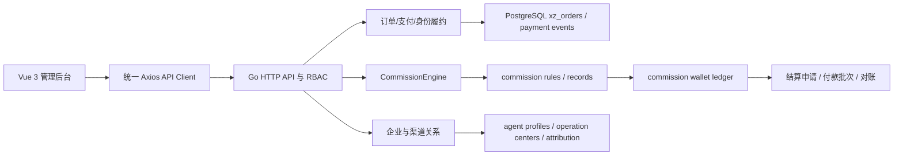

# 知启云AI渠道生态中心 V1.3.2 现有架构与实施分析

> 分析日期：2026-07-26  
> 业务依据：`知启云AI企业级渠道生态中心V1.3.2最终设计版.docx`。  
> 执行依据：`知启云AI渠道生态中心V1.3.2_Codex任务说明版.docx`。  
> 分析边界：本阶段只分析和设计，不修改 Go、Vue、SQL 迁移、运行配置或业务数据。

## 0. 文档一致性与最终口径

两份 V1.3.2 文档内容一致，没有规则冲突、修订标记、批注或隐藏表格。最终设计版定义业务规则，Codex 任务说明版定义本阶段执行边界。

V1.3.2 最终口径如下：

| 主题 | 最终口径 |
|---|---|
| 渠道关系 | 代理关系支持无限发展 |
| 订单收益 | 仅计算直属代理和该代理所属运营中心 |
| 上级代理 | 禁止递归计算直属代理以上层级的佣金 |
| 会员订单 | 默认 996 元；会员 Token 权益 400 元；直属代理 300 元；运营中心 200 元；平台剩余 96 元 |
| 代理订单 | 默认 996 元；新代理 Token 权益 200 元；直属代理 300 元；运营中心 200 元；平台剩余 296 元 |
| 运营中心 | 申请、支付技术服务费、审核、开通权限；5000 元仅为初始化配置 |
| 推荐奖励 | 运营中心推荐运营中心默认 3000 元；代理推荐运营中心默认代理 1000 元、所属运营中心 2000 元 |
| 推荐层级 | 推荐奖励独立于订单分润，不奖励推荐人的上级代理 |
| 配置 | 金额、比例、周期、权益和奖励全部后台配置，业务代码禁止硬编码 |
| 版本 | 历史订单使用历史规则，新订单使用当前已发布规则 |
| 模拟 | 支持不产生真实支付和资金流水的规则模拟 |
| 退款 | 必须覆盖佣金、推荐奖励和钱包的负向冲正 |

平台收益应使用“实付金额减去全部已配置权益和收益后的剩余金额”计算，不建议再配置一条可与其他金额冲突的固定平台收益。

## 1. 当前架构分析

### 1.1 总体架构

当前项目已经形成 Vue 管理后台、Go API/业务编排、PostgreSQL `xz_*` 数据模型和支付/账本基础，不需要新建独立渠道系统。

当前主要架构问题不是缺少底层表，而是商业规则存在多条运行路径：

| 运行路径 | 当前定位 | V1.3.2 处理方向 |
|---|---|---|
| 固定身份套餐结算 | 会员、代理和运营中心套餐的现有履约逻辑 | 保留兼容，逐步改为读取已发布商业规则集 |
| `xz_marketing_commission_rules` | 旧营销分润规则 | 停止承载 V1.3.2 新订单，进入只读兼容和迁移 |
| `CommissionEngine` + `xz_commission_rules` | 新版确定性分润能力 | 作为 V1.3.2 订单分润计算内核 |

### 1.2 用户与渠道身份体系

当前系统以 `xz_users` 作为唯一登录主体，并通过角色、代理档案、运营中心档案、企业租户成员和客户归属关系表达业务身份。这与 V1.3.2 相匹配。

现有代理档案中的 `parent_agent_id` 可以表达无限代理关系，`operation_center_id` 可以表达代理所属运营中心。该结构适合作为“当前有效关系投影”，但还缺少：

- 关系开始和结束时间。
- 关系变更原因、来源和审批记录。
- 防止代理关系形成循环的约束。
- 订单履约时的关系快照。
- 推荐运营中心时的推荐关系和受益人快照。

V1.3.2 的分润解析不得递归遍历 `parent_agent_id`。订单只读取购买人的直属代理，再读取该直属代理的运营中心。

### 1.3 订单与支付体系

当前订单、支付状态机、支付回调、微信虚拟支付和统一权益发放链路可继续作为交易权威来源。渠道中心不得新增平行订单或支付回调。

现有优势：

- 订单具有唯一身份、支付状态和价格快照能力。
- 支付回调已有幂等处理基础。
- 微信虚拟支付由服务端决定商品金额和权益。
- 会员、代理、运营中心开通已经具备现有入口。
- 支付成功可以进入统一订单履约。

当前差异：

- 套餐价格和 Token 权益仍有 Go 代码默认常量。
- 身份套餐结算与新版分润规则尚未完全统一。
- 订单没有完整保存商业规则集版本和渠道关系快照。
- 运营中心推荐奖励的触发事件尚未接入运营中心审核/激活生命周期。
- 退款没有统一调用订单佣金、推荐奖励、Token 权益和平台剩余冲正。

### 1.4 钱包体系

当前至少存在用户 Token 钱包、代理钱包、旧营销钱包、新版佣金钱包账户和佣金钱包账本。能力足够，但权威边界需要收敛。

建议：

| 资金类型 | 权威结构 |
|---|---|
| Token 权益 | 现有用户 Token 钱包及权益账本 |
| 订单佣金 | `xz_commission_records` + `xz_commission_wallet_ledger` |
| 推荐奖励 | 独立推荐奖励记录 + `xz_commission_wallet_ledger` |
| 冻结、可提现、结算中、已结算、追偿 | `xz_commission_wallet_accounts` |
| 旧代理钱包和旧营销钱包 | 兼容读模型，不再作为新增业务的独立写入源 |

推荐奖励“独立建模”是指业务规则和业务事实独立，不是新建另一套资金钱包。

### 1.5 提现与结算体系

当前佣金结算中心已经包含结算申请、申请明细、付款批次、付款明细、付款结果导入、回调和对账差异，可以同时承载代理和运营中心的可提现资金。

V1.3.2 应复用该体系：

- 到期订单佣金和推荐奖励都进入现有可提现余额。
- 结算明细增加资金来源类型和原业务记录编号。
- 退款发生在待提现阶段时，应冲减或锁定申请明细。
- 退款发生在付款处理中时，应阻断、拆分或进入异常处理。
- 已支付后退款时，应进入 recoverable/追偿余额并生成负向流水。

### 1.6 权限与管理后台体系

当前已有企业租户、角色、权限、财务分润规则权限、企业管理、客户归属和渠道增长页面。V1.3.2 不需要新建后台应用，应在现有 `admin-vue` 中增加“渠道生态中心”导航域。

现有权限可复用，但当前 `finance:commission-rule:view/manage` 粒度不足。规则编辑、发布、推荐奖励管理、关系调整和退款冲正应拆分权限，所有接口继续强制 tenant scope。

## 2. 可复用模块

| 模块 | 可复用内容 | 复用结论 |
|---|---|---|
| 用户 | `xz_users`、登录认证、用户状态 | 直接复用，禁止新建渠道用户表 |
| 角色权限 | 企业租户、角色、权限、财务权限 | 扩展权限代码，不重建 RBAC |
| 代理身份 | 代理档案、父代理、所属运营中心 | 作为当前关系投影复用 |
| 运营中心 | 运营中心档案、开通套餐、身份状态 | 扩展申请审核、推荐来源和规则版本 |
| 客户归属 | 直属代理、上级代理、运营中心查询与异常识别 | 扩展为渠道关系管理与历史查询 |
| 套餐 | 会员、代理、运营中心现有套餐 | 数据库配置化，停止依赖代码常量 |
| 订单 | `xz_orders`、订单状态、价格快照 | 增加商业规则和关系快照 |
| 支付 | 支付状态机、回调、微信虚拟支付 | 继续作为唯一支付入口 |
| 权益履约 | 统一 Token/会员/身份发放链路 | 增加规则集读取和快照写入 |
| 分润引擎 | `CommissionEngine` 固定金额、比例、阶梯、平台剩余 | 作为统一计算内核 |
| 分润规则 | `xz_commission_rules` | 关联整套规则版本，不新建平行订单分润规则表 |
| 佣金记录 | `xz_commission_records` 正向、冲正、调整和幂等 | 继续作为订单佣金事实 |
| 佣金钱包 | 佣金账户和完整账本 | 同时承载订单佣金、推荐奖励资金变化 |
| 提现结算 | 结算申请、付款批次、对账 | 直接复用 |
| 审计 | 财务审计、企业审计 | 扩展规则发布、奖励、关系和冲正动作 |
| 管理后台 | Vue 3、Pinia、Axios、Element Plus 和统一 API Client | 在现有应用内增加页面 |

## 3. 需要扩展和新增的模块

### 3.1 需要扩展

| 现有模块 | 扩展内容 |
|---|---|
| 套餐中心 | 套餐版本、价格、Token 权益、周期、测试配置和发布状态 |
| 分润规则 | 所属规则集、场景编码、整套发布、版本差异和已发布不可变 |
| 订单履约 | 选择规则版本、保存关系/规则快照、统一调用分润服务 |
| 客户归属 | 关系历史、生效期、防环、调整审批和订单影响提示 |
| 佣金钱包 | 推荐奖励业务类型、退款追偿和来源查询 |
| 提现中心 | 资金来源、冲正锁定、已支付追偿和对账 |
| 运营中心 | 申请、支付、审核、激活、推荐来源和权限开通状态机 |
| 权限中心 | 渠道规则、关系、奖励、模拟、退款和运营中心权限 |

### 3.2 需要新增

| 新模块 | 职责 |
|---|---|
| 商业规则集 | 将套餐、权益、订单分润、推荐奖励、周期和退款政策原子版本化 |
| 规则发布服务 | 草稿、校验、模拟、发布、停用、版本差异和审计 |
| 订单商业快照 | 保存历史订单使用的完整规则、权益、关系和计算结果 |
| 渠道关系历史 | 保存代理/会员关系的生效区间和调整审计 |
| 推荐关系与奖励 | 独立保存推荐事件、奖励规则、奖励事实和负向冲正 |
| 商业规则模拟器 | 无支付、无入账地模拟订单分润和推荐奖励 |
| 商业调整编排 | 统一编排退款、佣金冲正、奖励冲正、Token 回收和追偿 |
| 渠道数据看板 | GMV、权益成本、订单佣金、推荐奖励、平台剩余和退款 |

## 4. 数据库调整方案

### 4.1 设计原则

- 只做增量迁移，不删除现有订单、佣金、钱包和提现数据。
- 所有金额使用整数分，比例使用整数基点。
- 所有新增业务表包含 `tenant_id`、幂等键、状态和审计时间。
- 已发布规则不可原地修改，只能复制为新版本。
- 历史订单、历史奖励和负向记录不可物理删除。
- 新旧系统并行期明确权威写入源，旧表只做兼容读取。

### 4.2 新增商业规则集

建议新增 `xz_commercial_rule_sets`：

| 字段 | 说明 |
|---|---|
| `id`、`tenant_id` | 规则集和租户 |
| `rule_set_code`、`version` | 业务编码和版本号 |
| `name`、`description` | 后台展示 |
| `status` | DRAFT、PUBLISHED、RETIRED、ARCHIVED |
| `effective_start_at`、`effective_end_at` | 生效窗口 |
| `published_at`、`published_by` | 发布审计 |
| `config_snapshot` | 发布时的完整配置快照 |
| `created_at`、`updated_at` | 审计时间 |

扩展 `xz_commission_rules`：

| 字段 | 说明 |
|---|---|
| `rule_set_id` | 所属商业规则集 |
| `scenario_code` | MEMBER_PURCHASE、AGENT_JOIN |
| `beneficiary_selector` | DIRECT_AGENT、DIRECT_AGENT_OPERATION_CENTER、PLATFORM |
| `published_snapshot` | 规则发布快照，可选用于审计 |

发布校验必须保证：

- V1.3.2 订单场景中代理受益人只能是 DIRECT_AGENT。
- 不允许出现 PARENT_AGENT、ANCESTOR_AGENT 或 `relationship_level > 1`。
- 每个订单场景只能有一个 PLATFORM_REMAINDER。
- 权益成本和收益合计不能超过实付金额。
- 同一租户、场景和时间窗口不能存在两个已发布规则集。

### 4.3 套餐配置版本

现有套餐保留业务身份，建议新增 `xz_plan_config_versions`：

| 字段 | 说明 |
|---|---|
| `plan_id`、`rule_set_id` | 套餐和规则集 |
| `version` | 套餐配置版本 |
| `price_cents` | 套餐价格 |
| `token_rights_cents`、`token_grant_amount` | Token 权益价值和实际发放量 |
| `duration_days` | 有效周期 |
| `environment_scope` | 可选，仅在同库管理测试配置时使用 |
| `status`、`effective_start_at`、`effective_end_at` | 状态与窗口 |

生产和测试使用独立数据库时不建议通过 `environment_scope` 混放配置。测试小金额应在测试环境发布独立规则版本，不能临时修改生产规则。

### 4.4 渠道关系历史

建议新增 `xz_channel_relation_history`，当前代理档案继续保存最新关系：

| 字段 | 说明 |
|---|---|
| `subject_type`、`subject_id` | MEMBER 或 AGENT |
| `direct_agent_id` | 当时直属代理 |
| `operation_center_id` | 当时所属运营中心 |
| `effective_start_at`、`effective_end_at` | 生效区间 |
| `source_type`、`source_id` | 推荐码、邀请记录、后台调整、迁移 |
| `change_type`、`change_reason` | 建立、调整、失效及原因 |
| `approved_by` | 调整审批人 |

关系写入时必须进行防环校验，但收益计算不得递归查询关系树。

### 4.5 订单商业快照

建议新增 `xz_order_commercial_snapshots`，一笔订单一条不可变快照：

| 字段组 | 内容 |
|---|---|
| 规则 | `rule_set_id`、版本、规则明细快照 |
| 套餐 | 标价、实付、Token 权益、有效期 |
| 关系 | 购买用户、直属代理、所属运营中心、关系来源 |
| 结果 | 直属代理金额、运营中心金额、平台剩余、舍入结果 |
| 审计 | 引擎版本、request id、幂等键、创建时间 |

退款、历史查询和历史模拟只能读取该快照，不得重新读取当前规则或当前渠道关系。

### 4.6 推荐奖励独立模型

建议新增 `xz_referral_reward_rules`：

| 字段 | 说明 |
|---|---|
| `rule_set_id`、`version` | 所属规则集和版本 |
| `scenario_code` | OPERATION_CENTER_REFERS_OPERATION_CENTER 或 AGENT_REFERS_OPERATION_CENTER |
| `trigger_event` | 推荐奖励触发事件 |
| `beneficiary_selector` | REFERRER 或 REFERRER_OPERATION_CENTER |
| `beneficiary_role` | AGENT 或 OPERATION_CENTER |
| `calculation_type` | FIXED_AMOUNT 或其他后台支持类型 |
| `amount_cents`、`percentage_bps` | 金额或比例 |
| `freeze_days`、`reversal_policy` | 冻结和撤销策略 |
| `effective_start_at`、`effective_end_at` | 生效窗口 |

建议新增 `xz_referral_events`：

| 字段 | 说明 |
|---|---|
| `referred_operation_center_id` | 被推荐运营中心 |
| `referrer_type`、`referrer_id` | 推荐运营中心或代理 |
| `referrer_operation_center_id` | 推荐代理所属运营中心快照 |
| `source_type`、`source_id` | 推荐码、邀请或后台录入 |
| `activation_order_id` | 被推荐运营中心技术服务费订单 |
| `status`、`qualified_at` | 推荐资格状态 |
| `idempotency_key` | 同一推荐事实唯一 |

建议新增 `xz_referral_reward_records`：

| 字段 | 说明 |
|---|---|
| `referral_event_id` | 推荐事件 |
| `rule_id`、`rule_version` | 奖励规则版本 |
| `beneficiary_type`、`beneficiary_id` | 实际受益人 |
| `amount_cents` | 正向或负向金额 |
| `record_type` | REWARD、REVERSAL、ADJUSTMENT |
| `status` | EXPECTED、FROZEN、AVAILABLE、SETTLING、SETTLED、REVERSED |
| `reversal_of_id` | 冲正关联 |
| `idempotency_key` | 同一事件、规则、受益人唯一 |
| `rule_snapshot`、`relation_snapshot` | 历史规则和关系快照 |

推荐奖励记录通过现有佣金钱包账本入账，`business_type` 使用 `REFERRAL_REWARD`，不写成普通订单佣金。

### 4.7 退款与冲正

建议新增 `xz_commercial_adjustments` 作为统一编排头记录：

| 字段 | 说明 |
|---|---|
| `source_type`、`source_id` | ORDER、REFERRAL_REWARD 等原业务 |
| `adjustment_type` | FULL_REFUND、PARTIAL_REFUND、MANUAL_REVERSAL |
| `amount_cents` | 本次调整金额 |
| `rule_set_id`、`rule_set_version` | 原规则版本 |
| `status` | PENDING、PROCESSING、COMPLETED、FAILED、RECOVERABLE |
| `idempotency_key` | 防止重复冲正 |
| `result_snapshot` | 本次负向计算结果 |

一次订单退款的推荐处理顺序：

1. 读取原订单商业快照。
2. 使用原规则版本计算部分或全部冲正。
3. 生成订单佣金负向记录。
4. 如该订单触发运营中心推荐资格，生成推荐奖励负向记录。
5. 冲减冻结、可提现、结算中或已结算余额，余额不足进入 recoverable。
6. 回收 Token 权益或记录 Token 欠额。
7. 生成平台剩余负向流水、前后余额和审计日志。

## 5. API 设计方案

### 5.1 API 通用约束

- 所有管理 API 通过现有认证、RBAC 和 tenant scope。
- 金额、权益、受益人和规则版本由服务端解析，客户端不得覆盖。
- 写接口必须接收幂等键或使用稳定业务键。
- 已发布规则只读；编辑已发布规则必须复制新版本。
- 高风险操作记录操作者、请求 ID、原因和变更前后快照。

### 5.2 商业规则 API

| API | 用途 |
|---|---|
| `GET /api/v1/admin/channel-rule-sets` | 查询规则集和版本 |
| `POST /api/v1/admin/channel-rule-sets` | 创建规则集草稿 |
| `GET /api/v1/admin/channel-rule-sets/:id` | 查看规则集详情 |
| `POST /api/v1/admin/channel-rule-sets/:id/clone` | 复制历史版本为新草稿 |
| `POST /api/v1/admin/channel-rule-sets/:id/validate` | 校验金额、关系深度和生效窗口 |
| `POST /api/v1/admin/channel-rule-sets/:id/publish` | 原子发布整套规则 |
| `POST /api/v1/admin/channel-rule-sets/:id/retire` | 停止未来订单使用 |
| `GET /api/v1/admin/channel-rule-sets/:id/diff` | 比较两个版本差异 |

现有 `/api/v1/admin/commission-rules` 可作为规则项内部接口继续复用，但不允许单独激活一条规则绕过规则集发布。

### 5.3 套餐 API

| API | 用途 |
|---|---|
| `GET /api/v1/admin/channel-plans` | 查询会员、代理和运营中心套餐版本 |
| `POST /api/v1/admin/channel-plans/:id/versions` | 创建套餐配置草稿 |
| `GET /api/v1/admin/channel-plans/:id/versions` | 查询历史版本 |
| `POST /api/v1/admin/channel-plans/:id/versions/:version/validate` | 校验价格、Token 和周期 |

套餐配置随商业规则集统一发布，不建议独立发布后立即影响线上订单。

### 5.4 渠道关系 API

| API | 用途 |
|---|---|
| `GET /api/v1/admin/channel-relations` | 查询当前关系和无限关系树 |
| `GET /api/v1/admin/channel-relations/history` | 查询关系历史 |
| `POST /api/v1/admin/channel-relations/adjustments` | 提交关系调整 |
| `POST /api/v1/admin/channel-relations/adjustments/:id/approve` | 审批调整并生成历史记录 |
| `GET /api/v1/admin/orders/:id/commercial-snapshot` | 查看订单关系和规则快照 |

无限关系树查询可用于展示，但订单收益 API 不得调用递归祖先查询。

### 5.5 推荐奖励 API

| API | 用途 |
|---|---|
| `GET /api/v1/admin/referral-events` | 查询推荐事件和资格状态 |
| `GET /api/v1/admin/referral-events/:id` | 查看推荐来源和关系快照 |
| `POST /api/v1/admin/referral-events/:id/re-evaluate` | 幂等重新评估资格 |
| `GET /api/v1/admin/referral-reward-records` | 查询奖励、冻结、可提现和冲正 |
| `GET /api/v1/admin/referral-reward-records/:id` | 查看规则和受益人快照 |
| `POST /api/v1/admin/referral-reward-records/:id/reverse` | 有权限地执行人工冲正 |

管理端不允许直接传入奖励金额和实际受益人。服务端根据推荐事件和已发布规则计算。

### 5.6 模拟器 API

`POST /api/v1/admin/channel-rule-simulator/calculate`

请求支持：

- 指定草稿或历史规则集版本。
- MEMBER_PURCHASE、AGENT_JOIN、OPERATION_CENTER_REFERRAL 两类推荐子场景。
- 使用真实只读关系或纯模拟关系。
- 输入模拟实付金额，但不得覆盖规则定义的权益和受益人逻辑。

响应返回：

- 规则集版本和匹配规则。
- 关系解析结果。
- Token 权益。
- 直属代理和运营中心订单收益。
- 推荐奖励受益人和金额。
- 平台剩余。
- 金额守恒、舍入和错误解释。

模拟器不得创建订单、支付事件、佣金、奖励、钱包或提现记录。

### 5.7 退款与财务 API

| API | 用途 |
|---|---|
| `POST /api/v1/admin/refunds/:id/channel-preview` | 预览订单佣金、推荐奖励和钱包影响 |
| `POST /api/v1/admin/refunds/:id/channel-reversal` | 幂等执行统一冲正 |
| `GET /api/v1/admin/commercial-adjustments` | 查询冲正、失败和追偿 |
| `POST /api/v1/admin/commercial-adjustments/:id/retry` | 重试可恢复的失败步骤 |

## 6. 前端页面调整方案

在现有管理后台增加一级导航“渠道生态中心”，不新建独立前端工程。

| 页面 | 主要内容 | 复用基础 |
|---|---|---|
| 渠道数据看板 | GMV、会员/代理订单、权益成本、订单佣金、推荐奖励、平台剩余、退款 | 现有统计卡片和筛选组件 |
| 商业规则中心 | 草稿、版本、差异、校验、发布、停用和审计 | 现有表格、表单、权限组件 |
| 套餐中心 | 996/5000 等套餐、Token 权益、周期和配置版本 | 现有计划/套餐管理 |
| 商业规则模拟器 | 订单场景、推荐场景、草稿模拟、版本对比 | 新页面，复用规则表单和结果表格 |
| 渠道关系管理 | 无限关系树、直属关系、运营中心归属、历史和异常 | 客户归属与渠道增长页面 |
| 运营中心管理 | 申请、技术服务费订单、审核、激活和推荐来源 | 企业/身份管理页面 |
| 分润中心 | 订单快照、直属代理收益、运营中心收益、平台剩余和冲正 | 财务列表与订单详情 |
| 推荐奖励中心 | 推荐事件、3000/1000/2000 奖励、冻结、可提现、冲正 | 财务列表与钱包组件 |
| 钱包中心 | Token、佣金、冻结、可提现、结算中、已结算、追偿和流水 | 现有钱包/财务能力 |
| 提现中心 | 申请、审核、付款批次、来源明细和对账 | 现有结算中心 |

前端要求：

- 统一使用 Vue 3、Pinia、Axios、Element Plus 和现有 API Client。
- 页面不得硬编码金额、比例、层级、周期或奖励。
- 规则发布必须先显示校验结果和模拟结果。
- 订单分润和推荐奖励使用不同业务标签和统计口径。
- 退款执行前展示完整负向影响预览。
- 发布、关系调整、奖励冲正和提现审核具备独立权限与二次确认。

## 7. 开发拆分计划

### 阶段 0：规则与财务口径确认

可复用：V1.3.2 已确认场景和默认金额。  
需扩展：触发时点、冻结期、退款政策和会计口径。  
需新增：规则配置字典、状态机和审批记录。

验收项：

- 确认 5000 元仅为运营中心技术服务费，不是保证金或绩效奖励。
- 确认推荐奖励独立于订单分润和订单平台剩余。
- 确认推荐奖励在运营中心审核并激活后触发。
- 确认推荐奖励冻结周期、部分退款和全额退款策略。
- 确认代理所属运营中心快照时点。
- 未确认前不得进入阶段 1。

### 阶段 1：数据库与规则治理

可复用：现有用户、订单、规则、佣金、钱包和提现表。  
需扩展：规则集关联、钱包业务类型、套餐配置版本。  
需新增：规则集、关系历史、订单商业快照、推荐事件、推荐奖励和商业调整表。

验收项：

- 所有迁移增量执行且可重复部署。
- 已发布规则不能原地修改或删除。
- 同一场景同一时间只有一套有效规则。
- 数据库约束禁止 V1.3.2 订单规则出现二级及以上代理受益人。
- 同一推荐事件和受益人不能重复发奖。
- 新旧规则、钱包和佣金表有明确权威源与兼容方案。

### 阶段 2：规则服务与模拟器

可复用：CommissionEngine。  
需扩展：整套规则加载、关系解析、解释输出和历史重放。  
需新增：规则集发布、版本差异和模拟 API。

验收项：

- 会员订单模拟结果：99600 - 40000 - 30000 - 20000 = 9600 分。
- 代理订单模拟结果：99600 - 20000 - 30000 - 20000 = 29600 分。
- 运营中心推荐运营中心模拟：推荐运营中心 300000 分。
- 代理推荐运营中心模拟：代理 100000 分，代理所属运营中心 200000 分。
- 上级代理不出现在任何订单收益或推荐奖励结果中。
- 模拟不产生任何业务写入。
- 新版本发布后，历史版本模拟结果保持不变。

### 阶段 3：订单支付与统一履约

可复用：订单、支付、微信虚拟支付、身份开通和权益发放。  
需扩展：规则版本选择、商业快照和统一分润调用。  
需新增：旧固定结算和旧营销规则的迁移开关与对账。

验收项：

- 重复支付回调只履约一次。
- 价格和 Token 权益只来自服务端已发布规则。
- 新订单不递归查询上级代理。
- 订单、Token、身份、佣金和平台剩余一致落账。
- 历史订单可按原规则和关系快照查询。

### 阶段 4：运营中心与推荐奖励

可复用：运营中心身份、开通订单、审核、钱包和审计。  
需扩展：申请到激活状态机和领域事件。  
需新增：推荐资格评估、奖励入账和负向奖励服务。

验收项：

- 运营中心 A 推荐运营中心 B，B 支付、审核、激活后 A 仅获得一次 3000 元。
- 代理 A 推荐运营中心 B，A 获得 1000 元，A 所属运营中心获得 2000 元。
- A 的任何上级代理不获得奖励。
- A 后续变更所属运营中心不影响历史奖励。
- 重复审核、激活或回调不会重复发奖。

### 阶段 5：退款、钱包与提现

可复用：佣金负向记录、钱包账本、结算申请和付款批次。  
需扩展：统一冲正、提现锁定和已支付追偿。  
需新增：商业调整编排和退款影响预览。

验收项：

- 未提现、待提现、结算中、已支付四种状态均有退款测试。
- 部分退款累计冲正不超过原收益和原奖励。
- 全额退款按原规则版本生成完整负向流水。
- 余额不足进入 recoverable，不产生负余额穿透。
- 同一退款重复请求只执行一次。

### 阶段 6：管理后台与数据看板

可复用：现有后台壳、权限、API Client、列表和表单。  
需扩展：客户归属、渠道增长、订单、钱包和财务页面。  
需新增：规则中心、模拟器、推荐奖励中心和渠道看板。

验收项：

- 所有商业金额从 API 返回，页面无业务常量。
- 草稿必须校验和模拟后才能发布。
- 订单分润、推荐奖励和平台剩余可独立对账。
- 高风险操作具备权限、二次确认和审计记录。
- 测试环境可通过独立规则版本完成小金额全链路验证。

每阶段完成后提交“可复用、已扩展、已新增、迁移、API、页面、测试和未完成项”清单，未经确认不得自动进入下一阶段。

## 8. 主要风险与控制

| 风险 | 等级 | 控制措施 |
|---|---|---|
| 三套分润路径产生不同结果 | P0 | 新订单收敛到统一商业规则集，旧路径只读兼容 |
| 推荐奖励被误算为订单分润 | P0 | 独立规则、事件和奖励事实，只复用钱包账本 |
| 递归计算上级代理 | P0 | 规则发布校验、受益人枚举和数据库约束共同禁止 |
| 重复支付/激活导致重复发奖 | P0 | 支付、履约、激活、推荐事件和奖励形成完整幂等链 |
| 发布新规则改变历史订单 | P0 | 已发布不可变、订单快照、奖励快照和历史重放 |
| 退款时资金已经提现 | P0 | 冻结期、申请锁定、付款异常和 recoverable 追偿 |
| 多套钱包同时写入 | P0 | 新版佣金账本作为唯一资金写入源，旧钱包只读投影 |
| 测试小金额误发布到生产 | P0 | 环境隔离、发布权限、环境标识和生产发布二次确认 |
| 关系调整改变历史受益人 | P1 | 关系有效期和订单/推荐事件快照 |
| Go 代码默认套餐覆盖后台配置 | P1 | 数据库已发布规则作为运行权威，代码只保留不可交易的启动兜底 |
| 跨租户查询规则、关系或钱包 | P1 | tenant scope、联合唯一约束、RBAC 和越权测试 |

## 9. 进入编码前待确认项

V1.3.2 主规则已经明确，仍需确认以下执行细节：

1. 推荐奖励是否在被推荐运营中心完成支付、审核并正式激活后一次性触发。建议采用该时点。
2. 推荐奖励是否作为独立平台营销费用，不从 5000 元技术服务费订单中拆分。建议独立列支。
3. 代理推荐运营中心时，2000 元归属以推荐事件创建时还是运营中心激活时的所属运营中心为准。建议使用激活时快照。
4. 推荐奖励的冻结天数和可提现时间。
5. 运营中心技术服务费部分退款时，推荐奖励按比例撤销还是只有全额退款才撤销。
6. 运营中心审核拒绝、支付后未激活、激活后停用分别如何处理推荐资格。
7. 测试环境是否与生产数据库完全隔离。建议完全隔离，不在生产规则中切换小金额。

以上细节确认后，才能进入阶段 1 的迁移详细设计和代码开发。
