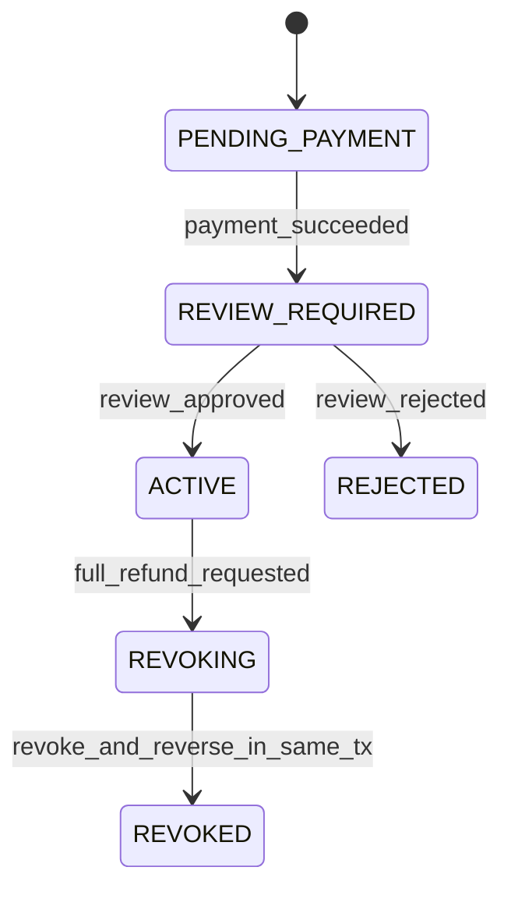
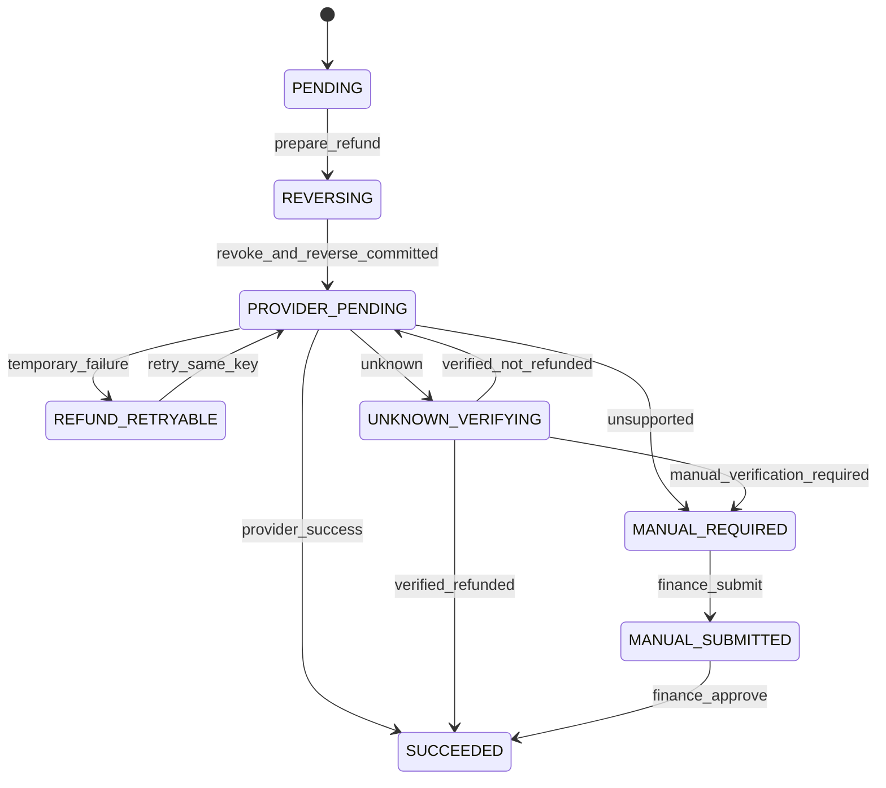

# 知启云AI渠道生态中心 V1.3.2 运营中心一期端到端设计

## 1. 文档状态

- 版本：V1.3.2
- 阶段：运营中心一期端到端设计确认稿
- 范围：技术服务费支付、审核、激活、推荐奖励、奖励释放、审核拒绝退款、激活后退款
- 当前开关：继续保持 `SHADOW`，`real_switch_enabled=false`
- 明确排除：运营中心不进入 Canary 白名单，不启用百分比放量，不切换现有真实结算

## 2. 设计结论

一期采用 Saga 分阶段退款：数据库内先原子完成状态变更、撤权、奖励与钱包冲正，再在事务外调用统一 `PaymentProvider.RefundPayment`，最后用独立事务记录渠道结果。

核心原则：

- 运营中心技术服务费支付成功只进入 `REVIEW_REQUIRED`，不得提前激活、授权或发奖。
- 审核通过必须在同一数据库事务中完成身份、用户状态、档案、RBAC、履约和推荐奖励冻结入账。
- 推荐奖励是独立营销费用，不冲减技术服务费订单的平台收入。
- 审核拒绝和激活后退款复用同一退款任务、退款调度器和 `PaymentProvider` 调用链。
- 激活后退款只支持全额退款，先撤权并冲正，再调用支付渠道。
- 渠道失败、未知或不支持时不得恢复运营中心权限。
- 所有金额、冻结周期、退款策略和角色映射均读取订单固化的已发布规则版本，业务代码不得包含默认金额。

## 3. 现有能力复用边界

复用现有能力：

- 订单、支付回调和支付幂等链路。
- `PaymentProvider.RefundPayment` 统一退款抽象。
- `xz_user_business_identities` 商业身份投影。
- `xz_user_relationships` 渠道关系及事件快照来源。
- `xz_user_roles`、`xz_user_role_context` 和角色权限表构成的本地 PostgreSQL RBAC 投影。
- V1.3.2 已发布规则版本、套餐、订单商业快照、推荐事件和推荐奖励模型。
- 正式钱包、冻结金额、可提现金额、钱包流水和负向流水能力。

需要扩展：

- 运营中心申请、审核、激活、撤销完整状态机。
- 统一退款任务、Provider 结果归一化、未知结果核验和人工退款登记。
- 推荐奖励冻结释放任务及三类奖励状态冲正。
- 状态迁移审计、资金不变量与权限不变量测试。

RBAC 事务结论：当前 RBAC 角色绑定是本地 PostgreSQL 表，可与运营中心状态、身份和档案使用同一个 `*sql.Tx` 原子更新。实现时禁止调用使用独立 `*sql.DB` 提交的授权方法；如果后续改造成外部权限服务，必须新增权限下发状态和补偿流程，不得继续声明数据库原子性。

## 4. 状态模型

### 4.1 运营中心服务状态



约束：

- `REVIEW_REQUIRED` 不具有运营中心身份和 RBAC。
- `ACTIVE` 只能由审核通过事务产生。
- `REJECTED` 不得进入 `ACTIVE`，只能走全额退款任务。
- `REVOKING` 是退款事务内的迁移状态，事务提交后的稳定状态必须为 `REVOKED`。
- 退款进入支付处理阶段后，禁止任何接口把运营中心恢复为 `ACTIVE`。

### 4.2 退款任务状态



Provider 结果只允许：

- `SUCCESS`：渠道明确受理且可确认退款成功或幂等命中既有成功结果。
- `TEMPORARY_FAILURE`：网络、限流或明确可安全重试的临时错误，进入 `REFUND_RETRYABLE`。
- `UNSUPPORTED`：渠道不支持主动退款，进入 `MANUAL_REQUIRED`。
- `UNKNOWN`：超时、断链或无法确认渠道是否已受理，进入 `UNKNOWN_VERIFYING`。

`UNKNOWN` 不允许立即再次调用退款。一期若渠道没有退款查询接口，任务进入延迟核验并告警，只有人工确认“渠道未退款”后才能使用原幂等键重试；人工确认“已退款”则登记渠道流水并完成任务。

## 5. 正向业务流程

### 5.1 支付成功

支付回调事务内完成：

1. 按支付订单加行锁并执行回调幂等检查。
2. 校验支付金额与订单固化的已发布套餐规则快照一致。
3. 更新支付订单为支付成功。
4. 创建或更新运营中心服务订单为 `REVIEW_REQUIRED`。
5. 保存商业规则版本、套餐、支付订单和推荐关系快照引用。
6. 保持运营中心身份、用户运营中心状态、档案和 RBAC 非激活。
7. 不创建推荐事件和推荐奖励。

重复支付回调只返回原结果，不重复创建服务订单或改变审核状态。

### 5.2 审核通过

审核通过必须在单个 PostgreSQL 事务内完成：

1. 锁定服务订单，校验当前状态为 `REVIEW_REQUIRED`。
2. 校验支付完成、审核通过操作和订单商业快照完整。
3. 将运营中心服务状态更新为 `ACTIVE`。
4. 将商业身份更新为 `ACTIVE`。
5. 将用户运营中心状态更新为 `ACTIVE`。
6. 将运营中心档案更新为 `ACTIVE`。
7. 使用同一 `*sql.Tx` 写入或激活运营中心 RBAC 角色绑定。
8. 将订单履约状态更新为完成。
9. 创建推荐资格事件，关系归属使用支付时快照。
10. 从订单引用的已发布规则版本读取推荐奖励规则和冻结周期。
11. 创建 `FROZEN` 推荐奖励、冻结钱包余额和正式钱包流水。
12. 写入审核、激活、授权、履约和奖励审计记录。

任一步失败必须回滚整个事务，不允许出现已激活但未授权、已授权但未履约或已发奖但未激活。

### 5.3 推荐奖励资格

推荐奖励必须同时满足：

- 技术服务费支付完成。
- 审核通过。
- 被推荐运营中心状态为 `ACTIVE`。

运营中心推荐运营中心：

- 只为推荐运营中心匹配订单规则版本中的对应奖励规则。
- 奖励金额来自已发布规则版本的初始化配置，不在代码中写金额。

代理推荐运营中心：

- 推荐代理获得代理推荐奖励。
- 支付事件快照中的所属运营中心获得运营中心奖励。
- 推荐代理的上级、上上级及其他代理不得获得奖励。
- 两笔奖励分别建模、分别入账、分别具有幂等键。

建议幂等维度：`referral_event_id + beneficiary_type + beneficiary_id + rule_version_id`。

### 5.4 冻结奖励释放

- `freeze_until` 由订单固化的已发布推荐规则版本计算。
- 到期任务按奖励记录加行锁，只处理 `FROZEN` 且未冲正记录。
- 同一事务内扣减冻结余额、增加可提现余额、写两端钱包流水并更新奖励为 `AVAILABLE`。
- 释放幂等键基于原奖励 ID，重复任务不得重复增加可提现余额。

## 6. 退款 Saga

### 6.1 统一退款任务

审核拒绝和激活后退款都创建同一种退款任务：

- 退款范围一期固定为 `FULL`，具体策略必须从订单商业快照中的已发布规则读取。
- 退款金额取原支付订单已支付金额，不接受前端金额。
- 任务唯一约束为服务订单和退款范围，避免重复任务。
- 稳定幂等键在首次创建时生成并持久化，后续重试原样复用。

稳定退款幂等键建议：

```text
sha256("operation-center-refund:v1:" + tenant_id + ":" + service_order_id + ":" + payment_order_id + ":FULL")
```

幂等键不得包含重试次数、当前时间、随机数或请求时间戳。

### 6.2 审核拒绝退款

数据库事务内完成：

1. 锁定 `REVIEW_REQUIRED` 服务订单。
2. 更新审核结果为拒绝，服务状态为 `REJECTED`。
3. 确认身份、档案和 RBAC 未激活，确认不存在推荐奖励。
4. 创建统一全额退款任务。
5. 将退款任务推进到 `PROVIDER_PENDING` 并写状态迁移审计。
6. 提交事务。

事务提交后由统一退款调度器调用 `PaymentProvider.RefundPayment`。

### 6.3 激活后全额退款

第一阶段数据库事务必须原子完成以下全部动作：

1. 锁定 `ACTIVE` 服务订单、退款任务、身份、RBAC、推荐奖励和相关钱包。
2. 校验规则快照中的退款策略为一期允许的全额退款。
3. 退款任务记录 `PENDING -> REVERSING` 状态迁移。
4. 服务状态记录 `ACTIVE -> REVOKING` 状态迁移。
5. 撤销商业身份、用户运营中心状态、运营中心档案和本地 RBAC。
6. 按原奖励逐笔完成奖励及钱包冲正。
7. 反向记录营销费用和相关资金流水，不修改原始历史记录。
8. 服务状态记录 `REVOKING -> REVOKED` 状态迁移。
9. 退款任务记录 `REVERSING -> PROVIDER_PENDING` 状态迁移。
10. 提交事务。

`REVERSING`、撤权、奖励与钱包冲正、`REVOKED` 和 `PROVIDER_PENDING` 必须位于同一事务。任何失败都回滚到事务开始前，禁止部分提交。

第二阶段事务外执行：

1. 调度器只领取 `PROVIDER_PENDING` 任务。
2. 使用任务中固化的 Provider、原支付单、全额金额和稳定幂等键调用 `PaymentProvider.RefundPayment`。
3. 不把微信虚拟支付类型泄漏到运营中心业务服务。

第三阶段使用独立事务记录 Provider 结果：

- `SUCCESS -> SUCCEEDED`
- `TEMPORARY_FAILURE -> REFUND_RETRYABLE`
- `UNSUPPORTED -> MANUAL_REQUIRED`
- `UNKNOWN -> UNKNOWN_VERIFYING`

Provider 调用失败或结果未知时，运营中心保持撤权和 `REVOKED`，不得自动恢复权限。

## 7. 推荐奖励与钱包冲正

每笔冲正必须引用：

- 原推荐奖励 ID。
- 原推荐事件 ID。
- 原规则版本 ID。
- 原钱包流水 ID。
- 退款任务 ID。
- 冲正钱包流水 ID。

不同奖励状态处理：

| 原奖励状态 | 冲正动作 | 资金处理 |
| --- | --- | --- |
| `FROZEN` | 创建负向奖励记录并标记原奖励已冲正 | 扣减冻结金额，写负向冻结流水 |
| `AVAILABLE` | 创建负向奖励记录并标记原奖励已冲正 | 扣减可提现金额；若已进入待提现，先锁定并冲减对应待提现记录 |
| `SETTLED` | 创建负向奖励记录和应收/负余额记录 | 不篡改已提现历史，后续佣金优先抵扣，保留完整负向流水 |

额外约束：

- 原奖励记录不可物理删除或覆盖金额。
- 同一原奖励只能有一笔有效冲正记录。
- 钱包余额、待提现和已提现相关行必须按固定顺序加锁，避免与提现并发产生超扣。
- `AVAILABLE` 余额不足时不得使流水消失，差额进入明确的负余额或应收科目。
- `SETTLED` 冲正不追回已完成的历史提现记录，而是形成可审计债权并抵扣后续收入。

## 8. PaymentProvider 归一化契约

运营中心领域层只依赖统一结果，不解析渠道 SDK 错误：

```go
type RefundOutcome string

const (
    RefundSuccess          RefundOutcome = "SUCCESS"
    RefundTemporaryFailure RefundOutcome = "TEMPORARY_FAILURE"
    RefundUnsupported      RefundOutcome = "UNSUPPORTED"
    RefundUnknown          RefundOutcome = "UNKNOWN"
)

type RefundResult struct {
    Outcome          RefundOutcome
    ProviderRefundID string
    ProviderCode     string
    Message          string
    CompletedAt      *time.Time
}
```

实际接入策略：

- 已支持主动退款的渠道适配器返回归一化结果。
- 微信虚拟支付作为首个真实验证渠道，但业务状态机不引用微信类型。
- Mock Provider 覆盖四种结果和稳定幂等重试。
- 未来如 Provider 支持退款查询，新增可选查询能力；不改变运营中心退款任务状态机。

## 9. 人工退款登记

不支持自动退款或未知结果需人工核验时，财务通过两阶段流程登记：

1. 提交人工退款记录，状态为 `MANUAL_SUBMITTED`。
2. 另一有审批权限的操作人审核渠道流水、金额和凭证。
3. 审核通过后将统一退款任务标记为 `SUCCEEDED`。

预留并审计字段：

- `submitted_by`
- `submitted_at`
- `approved_by`
- `approved_at`
- `provider_transaction_id`
- `provider_refund_id`
- `voucher_reference`
- `voucher_file_hash`
- `amount_cents`
- `currency`
- `remark`

人工登记不得再次执行撤权或奖励冲正，只补充渠道退款事实并完成原退款任务。

## 10. 数据库调整方向

使用新的前向迁移，不修改已执行迁移历史。

### 10.1 运营中心服务订单扩展

建议补充：

- 审核幂等键、审核版本号和审核决策时间。
- 规则版本、套餐、关系快照和退款策略快照引用的非空约束。
- 退款任务引用和状态迁移版本号。

### 10.2 统一退款任务表

建议新增 `xz_operation_center_refund_tasks`：

- 关联 tenant、服务订单、商业订单、支付订单和规则版本。
- 固化 Provider、全额退款金额、币种、退款原因和稳定幂等键。
- 保存 `refund_status`、`provider_outcome`、Provider 编码、渠道退款单号。
- 保存尝试次数、下次处理时间、未知开始时间、最后错误和锁租约。
- 对稳定幂等键、服务订单加退款范围建立唯一约束。

### 10.3 人工退款记录表

建议新增 `xz_operation_center_manual_refunds`，保存第 9 节字段，并约束一个退款任务只能存在一条有效审核通过记录。

### 10.4 状态迁移审计表

建议新增 `xz_operation_center_state_transitions`：

- 记录服务状态或退款状态的 from/to。
- 记录操作人、原因、请求 ID、幂等键和事务时间。
- 支持在一个事务中连续记录 `REVERSING`、`REVOKING`、`REVOKED`、`PROVIDER_PENDING`。

### 10.5 冲正引用

在现有推荐奖励和钱包流水模型上补足：

- `original_reward_id`
- `original_wallet_ledger_id`
- `reversal_reward_id`
- `refund_task_id`
- `commercial_rule_set_id`

字段命名统一使用 `commercial_rule_set_id`。

## 11. API 设计

后台 API：

| 方法 | 路径 | 用途 | 关键权限 |
| --- | --- | --- | --- |
| `GET` | `/api/v1/admin/channel/operation-centers/applications` | 申请与状态查询 | 渠道查看 |
| `GET` | `/api/v1/admin/channel/operation-centers/applications/:id` | 申请、规则快照、奖励和退款详情 | 渠道查看 |
| `POST` | `/api/v1/admin/channel/operation-centers/applications/:id/review` | 审核通过或拒绝 | 渠道审核 |
| `POST` | `/api/v1/admin/channel/operation-centers/:id/refunds` | 激活后发起全额退款 | 退款发起 |
| `GET` | `/api/v1/admin/channel/refunds` | 退款任务查询 | 财务查看 |
| `POST` | `/api/v1/admin/channel/refunds/:id/retry` | 临时失败任务重试 | 财务退款 |
| `POST` | `/api/v1/admin/channel/refunds/:id/verify` | UNKNOWN 人工核验结论 | 财务审核 |
| `POST` | `/api/v1/admin/channel/refunds/:id/manual-submissions` | 提交人工退款凭证 | 财务退款 |
| `POST` | `/api/v1/admin/channel/refunds/:id/manual-approval` | 审核人工退款 | 财务审核 |

API 约束：

- 审核、退款、重试、核验和人工登记必须接收稳定请求幂等键。
- 客户端不得上传奖励金额、冻结天数、退款金额或规则版本。
- 服务端从服务订单商业快照和已发布规则版本读取参数。
- `retry` 只允许 `REFUND_RETRYABLE`；`UNKNOWN_VERIFYING` 必须先核验，不允许直接重试。
- 所有状态冲突返回明确的不可重试业务错误，不以重复写入方式“纠正”。

内部任务：

- 推荐奖励到期释放任务。
- 退款任务调度器。
- 临时失败退避重试任务。
- UNKNOWN 延迟核验告警任务。

## 12. 幂等与并发控制

- 支付回调：支付事件唯一键加订单行锁。
- 审核：服务订单行锁加审核幂等键。
- 激活：服务订单状态条件更新，只有 `REVIEW_REQUIRED` 可进入 `ACTIVE`。
- 发奖：推荐事件和受益人规则维度唯一键。
- 奖励释放：原奖励 ID 维度唯一释放流水。
- 发起退款：服务订单加退款范围唯一键。
- Provider 退款：持久化稳定幂等键，所有重试复用。
- 奖励冲正：原奖励 ID 维度唯一冲正记录。
- 人工退款：退款任务维度唯一有效审核记录。
- 调度器：数据库租约或 `FOR UPDATE SKIP LOCKED` 防止多实例重复领取。

## 13. 必须成立的不变量

状态不变量：

- `REVIEW_REQUIRED` 时不存在 ACTIVE 运营中心身份、档案和 RBAC。
- 推荐奖励存在时，支付、审核和 ACTIVE 三个条件必须都成立。
- `PROVIDER_PENDING` 及后续状态下，激活后退款对象必须已经是 `REVOKED`。
- `SUCCEEDED` 退款不得对应 ACTIVE 权限。
- 退款进入 Provider 阶段后不得恢复 ACTIVE。

资金不变量：

- 每笔奖励等于对应已发布规则版本的配置值。
- 推荐奖励作为营销费用独立记账，不冲减技术服务费平台收入。
- 全额退款金额等于原支付成功金额。
- 原奖励金额加冲正金额等于零，且原流水和负向流水均保留。
- 冻结、可提现、待提现、已提现、负余额和钱包流水变动可逐笔对账。
- Provider 同一稳定幂等键最多形成一笔真实退款。

原子性不变量：

- 不得出现已撤权但部分奖励未冲正。
- 不得出现奖励已冲正但服务状态仍为 ACTIVE。
- 不得出现 Provider 已被调用但数据库仍允许恢复 ACTIVE。
- 数据库退款准备事务失败时不得调用 Provider。

## 14. 测试与验收矩阵

PostgreSQL 集成测试必须覆盖：

- 运营中心推荐运营中心完整支付、审核、激活、冻结奖励链路。
- 代理推荐运营中心的代理奖励和快照运营中心奖励，确认上级代理无奖励。
- 支付成功后只进入 `REVIEW_REQUIRED`。
- 重复支付回调、重复审核和重复激活幂等。
- 奖励冻结、到期释放和重复释放幂等。
- 审核拒绝创建统一全额退款任务且不激活、不授权、不发奖。
- 激活后退款在同一事务撤权、冲正并进入 `PROVIDER_PENDING`。
- `FROZEN`、`AVAILABLE`、`SETTLED` 三类奖励冲正。
- 待提现并发与奖励冲正锁顺序。
- Mock Provider 的 `SUCCESS`、`TEMPORARY_FAILURE`、`UNSUPPORTED`、`UNKNOWN`。
- 临时失败使用同一幂等键重试。
- UNKNOWN 不立即重复退款，核验后才允许继续。
- 人工退款提交、审批、渠道流水和凭证哈希记录。
- Provider 失败后权限不恢复。
- 任意退款准备事务失败点均整体回滚且 Provider 未调用。
- Provider 成功后重复调度不产生第二笔退款。
- 微信虚拟支付作为首个真实 Provider 的退款生命周期验证。
- HTTP 全量回归测试。

必须额外断言：

- 不存在“已退款但未撤权”。
- 不存在“已撤权但奖励未冲正”。
- 不存在“同一幂等键重复真实退款”。
- 技术服务费平台收入与营销奖励费用分账守恒。
- 退款后平台收入冲正、营销奖励冲正和钱包余额分别守恒。

## 15. 实施顺序

1. 新增前向迁移，补齐状态、退款任务、人工退款、状态审计和冲正引用。
2. 实现运营中心规则快照读取和状态机领域服务。
3. 实现支付成功到 `REVIEW_REQUIRED`，保持无身份、无 RBAC、无奖励。
4. 实现审核通过单事务激活和推荐奖励冻结入账。
5. 实现奖励到期释放及幂等。
6. 实现统一退款任务和激活后原子撤权冲正事务。
7. 实现 PaymentProvider 结果归一化、调度、重试、UNKNOWN 核验和人工登记。
8. 接入微信虚拟支付退款适配器和 Mock Provider。
9. 完成 PostgreSQL 集成、HTTP 全量回归和状态资金不变量测试。
10. 保持 Shadow 配置，不把运营中心加入 Canary，提交验收结果后等待真实切换确认。

## 16. 风险与控制

| 风险 | 控制措施 |
| --- | --- |
| Provider 超时但渠道已退款 | 归类 `UNKNOWN`，禁止立即重试，优先查询或人工核验 |
| 钱包冲正与提现并发 | 固定锁顺序、同事务冲减待提现、余额不足形成负余额/应收 |
| RBAC 独立提交导致权限漂移 | 只允许同一 `*sql.Tx` 更新本地 RBAC；外部化后另建权限下发状态 |
| 重复审核或回调重复发奖 | 状态条件更新加数据库唯一幂等约束 |
| 配置版本变化影响历史订单 | 服务订单固化已发布规则版本和商业快照，退款及奖励始终读取历史引用 |
| 手工退款缺乏证据 | 双阶段提交审批，保留渠道流水、凭证引用、文件哈希和操作人 |
| 营销奖励误冲减平台收入 | 营销费用与技术服务费平台收入分账并分别做守恒测试 |

## 17. 本阶段验收项

- Saga 事务边界与 Provider 调用边界已书面固定。
- 审核拒绝和激活后退款统一为一个退款任务模型。
- 四类 Provider 结果及 UNKNOWN 核验策略已定义。
- 稳定退款幂等键不包含重试次数和时间戳。
- 三类奖励状态冲正、原始引用和负向流水已定义。
- RBAC 本地事务要求及未来外部化边界已定义。
- 人工退款审计字段和审批流程已定义。
- 状态、资金、权限和重复退款不变量测试已列入实施范围。
- 未修改业务代码，未启用 Canary 或真实切换。
