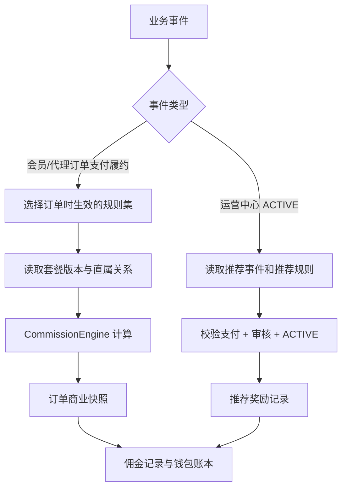
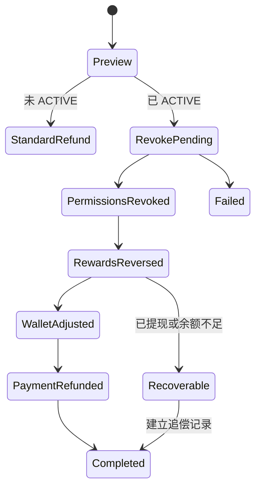

# 知启云AI渠道生态中心 V1.3.2 阶段 1 Implementation Plan

> **For agentic workers:** REQUIRED SUB-SKILL: Use `superpowers:subagent-driven-development` or `superpowers:executing-plans` to implement this plan task-by-task after business approval. This document is design-only and does not authorize code changes.

**Goal:** 在不重复建设用户、订单、支付、钱包、提现和权限体系的前提下，完成 V1.3.2 商业规则版本、渠道关系历史、推荐奖励、退款冲正和模拟器所需的数据库与 API 详细设计。

**Architecture:** 保留现有 `xz_orders`、支付履约、`CommissionEngine`、佣金记录、佣金钱包和结算中心作为权威基础。新增“商业规则集”作为套餐、权益、订单分润、推荐奖励和退款政策的原子版本边界，通过不可变订单/推荐快照保证历史可重放，通过独立推荐奖励事实和现有佣金钱包账本实现资金复用。

**Tech Stack:** Go HTTP API、PostgreSQL、Vue 3 + Pinia + Axios + Element Plus、现有 RBAC/API Client/支付与账本基础。

## Global Constraints

- 第一阶段只输出数据库详细设计、迁移方案和 API 设计，不创建 SQL，不修改 Go/Vue，不执行迁移。
- 代理关系允许无限发展，但订单收益只能计算直属代理和该代理所属运营中心。
- 禁止递归计算上级代理佣金，禁止通过配置发布二级及以上代理收益。
- 推荐奖励独立于订单分润，作为营销费用，不冲减 5000 元技术服务费订单的平台收入。
- 推荐事件发生时固化推荐代理所属运营中心，后续关系变化不改变 2000 元奖励归属。
- 推荐奖励在被推荐运营中心支付完成、审核通过、状态 ACTIVE 后触发。
- 推荐奖励默认冻结 7 天，冻结天数由已发布规则配置。
- 5000 元是技术服务费，不是保证金。
- 运营中心未激活时按普通订单退款；激活后退款必须撤销权限并生成对应冲正。
- 运营绩效奖励不进入一期，只保留扩展点。
- 测试环境与生产环境数据库完全隔离。
- 所有金额使用整数分，比例使用整数基点，所有商业金额、比例、权益和周期由后台配置。
- 历史订单和历史奖励使用原规则版本，新业务使用当前已发布规则版本。
- 新旧结算切换期间只允许影子计算，不允许对同一订单双写佣金或钱包。

---

## 1. 阶段 1 交付边界

本阶段交付以下设计，不实施：

| 交付物 | 内容 |
|---|---|
| 数据模型 | 表、字段、约束、索引、状态机、不可变和幂等设计 |
| 迁移方案 | 迁移编号、执行顺序、回填、默认草稿、兼容、切流和回滚 |
| API 契约 | 路径、权限、请求、响应、错误码、事务和幂等边界 |
| 后续实现拆分 | 计划修改文件、测试锚点和阶段验收 |

本阶段不包含：

- 运营绩效奖励实现。
- 生产规则发布。
- 旧营销规则物理删除。
- 旧钱包物理合并或删除。
- 任何真实佣金、推荐奖励或退款数据写入。

## 2. 权威模型与兼容边界

### 2.1 权威数据源

| 领域 | 权威数据源 | 兼容数据源 |
|---|---|---|
| 用户 | `xz_users` | 无新增用户表 |
| 当前代理关系 | `xz_agent_profiles` | 旧渠道代理表只读兼容 |
| 关系历史 | 新增 `xz_channel_relation_history` | 无 |
| 运营中心 | 现有运营中心档案和身份状态 | 旧身份投影只读兼容 |
| 套餐身份 | 现有套餐主记录 | Go 内置目录仅作不可交易启动兜底 |
| 套餐商业版本 | 新增 `xz_plan_config_versions` | 现有套餐 raw/entitlements 用于回填 |
| 订单 | `xz_orders` | 禁止渠道模块新增订单表 |
| 支付 | 现有支付状态机与支付事件 | 禁止新增支付回调 |
| 商业规则版本 | 新增 `xz_commercial_rule_sets` | 旧营销规则只读兼容 |
| 订单分润规则 | `xz_commission_rules` 关联规则集 | `xz_marketing_commission_rules` 不再承载新业务 |
| 订单佣金事实 | `xz_commission_records` | 旧佣金表作为查询兼容投影 |
| 推荐奖励事实 | 新增 `xz_referral_reward_records` | 不写入普通订单佣金事实 |
| Token 权益 | 现有 Token 钱包和权益账本 | 无新增 Token 钱包 |
| 现金钱包 | `xz_commission_wallet_accounts` + ledger | 旧代理/营销钱包只读投影 |
| 提现付款 | 现有结算申请、付款批次和对账 | 禁止新建推荐奖励提现体系 |

### 2.2 规则解析路径



## 3. 数据库详细设计

### 3.1 `xz_commercial_rule_sets`

用途：作为套餐、Token 权益、订单分润、推荐奖励、冻结周期和退款政策的原子发布边界。

| 字段 | 类型 | 约束/默认值 | 说明 |
|---|---|---|---|
| `id` | TEXT | PK | 稳定 ID，不使用版本号拼接作为业务判断 |
| `tenant_id` | TEXT | NOT NULL, FK `xz_tenants(id)` | 租户隔离 |
| `rule_set_code` | TEXT | NOT NULL | 固定业务编码，如 `CHANNEL_ECOSYSTEM_V132` |
| `version` | INT | NOT NULL, `version > 0` | 整套规则版本 |
| `name` | TEXT | NOT NULL | 后台显示名称 |
| `description` | TEXT | NOT NULL DEFAULT '' | 版本说明 |
| `status` | TEXT | DRAFT/PUBLISHED/RETIRED/ARCHIVED | 生命周期 |
| `effective_start_at` | TIMESTAMPTZ | NOT NULL | 新业务开始使用时间 |
| `effective_end_at` | TIMESTAMPTZ | NULL | 停止命中新业务时间 |
| `config_snapshot` | JSONB | NOT NULL DEFAULT `{}` | 发布时完整配置快照 |
| `validation_snapshot` | JSONB | NOT NULL DEFAULT `{}` | 发布校验结果和模拟摘要 |
| `created_by` | TEXT | NOT NULL | 创建人 |
| `published_by` | TEXT | NULL | 发布人 |
| `published_at` | TIMESTAMPTZ | NULL | 发布时间 |
| `created_at` | TIMESTAMPTZ | NOT NULL DEFAULT now() | 创建时间 |
| `updated_at` | TIMESTAMPTZ | NOT NULL DEFAULT now() | 更新时间 |

约束与索引：

- `UNIQUE (tenant_id, rule_set_code, version)`。
- `CHECK (effective_end_at IS NULL OR effective_end_at > effective_start_at)`。
- `CHECK` 保证 PUBLISHED 状态必须有 `published_by` 和 `published_at`。
- 查询索引：`(tenant_id, rule_set_code, status, effective_start_at, effective_end_at)`。
- 发布事务对 `(tenant_id, rule_set_code)` 获取事务级 advisory lock，并检查已发布生效窗口不重叠。
- DRAFT 可以更新；PUBLISHED、RETIRED、ARCHIVED 禁止修改业务字段和物理删除。

### 3.2 `xz_plan_config_versions`

用途：将现有会员、代理、运营中心套餐改造成可版本化商业配置，套餐主记录仍保留产品身份。

| 字段 | 类型 | 约束/默认值 | 说明 |
|---|---|---|---|
| `id` | TEXT | PK | 配置版本 ID |
| `tenant_id` | TEXT | NOT NULL, FK | 租户 |
| `rule_set_id` | TEXT | NOT NULL, FK `xz_commercial_rule_sets(id)` | 原子规则版本 |
| `plan_id` | TEXT | NOT NULL | 现有套餐 ID |
| `version` | INT | NOT NULL, `version > 0` | 套餐配置版本 |
| `price_cents` | BIGINT | NOT NULL, `>= 0` | 套餐价格 |
| `currency` | CHAR(3) | NOT NULL DEFAULT CNY | 币种 |
| `token_rights_value_cents` | BIGINT | NOT NULL, `>= 0` | Token 权益价值 |
| `token_grant_amount` | BIGINT | NOT NULL, `>= 0` | 实际 Token 发放数量 |
| `duration_days` | INT | NOT NULL, `>= 0` | 权益周期 |
| `identity_type` | TEXT | MEMBER/AGENT/OPERATION_CENTER | 开通身份 |
| `config` | JSONB | NOT NULL DEFAULT `{}` | 非金额扩展配置 |
| `created_at` | TIMESTAMPTZ | NOT NULL DEFAULT now() | 创建时间 |

约束与索引：

- `UNIQUE (tenant_id, plan_id, version)`。
- `UNIQUE (rule_set_id, plan_id)`，一套规则中一个套餐只能有一个配置版本。
- 会员默认草稿：`99600 / 40000`。
- 代理默认草稿：`99600 / 20000`。
- 运营中心默认草稿：`500000 / 0`。
- 测试环境使用独立数据库中的独立草稿/发布版本，不设置可在生产库切换的小金额开关。

### 3.3 扩展 `xz_commission_rules`

新增字段：

| 字段 | 类型 | 说明 |
|---|---|---|
| `rule_set_id` | TEXT NULL | FK `xz_commercial_rule_sets(id)`；遗留规则回填后关联 legacy 规则集 |
| `scenario_code` | TEXT NULL | MEMBER_PURCHASE 或 AGENT_JOIN |
| `beneficiary_selector` | TEXT NULL | DIRECT_AGENT、DIRECT_AGENT_OPERATION_CENTER、PLATFORM |
| `published_snapshot` | JSONB | 发布时规则快照 |

V1.3.2 新规则发布约束：

- `beneficiary_role = AGENT` 时只能使用 `DIRECT_AGENT` 且 `relationship_level = 1`。
- 禁止 `PARENT_AGENT`、`ANCESTOR_AGENT` 和 `relationship_level > 1`。
- `DIRECT_AGENT_OPERATION_CENTER` 的受益人必须从直属代理的关系快照解析。
- 每个场景必须且只能有一条 PLATFORM + REMAINDER_TO_PLATFORM。
- 代理、运营中心和平台规则金额与套餐 Token 权益共同通过金额守恒校验。

索引：

- `(rule_set_id, scenario_code, priority)`。
- 保留现有 `(tenant_id, rule_code, version)` 唯一约束。

### 3.4 `xz_channel_relation_history`

用途：保存会员/代理与直属代理、运营中心关系的生效历史。`xz_agent_profiles` 继续保存当前代理关系投影。

| 字段 | 类型 | 约束/默认值 | 说明 |
|---|---|---|---|
| `id` | TEXT | PK | 历史记录 ID |
| `tenant_id` | TEXT | NOT NULL, FK | 租户 |
| `subject_type` | TEXT | MEMBER/AGENT | 关系主体类型 |
| `subject_id` | TEXT | NOT NULL | 用户或代理档案 ID |
| `direct_agent_id` | TEXT | NULL | 直属代理 |
| `operation_center_id` | TEXT | NULL | 所属运营中心 |
| `effective_start_at` | TIMESTAMPTZ | NOT NULL | 生效时间 |
| `effective_end_at` | TIMESTAMPTZ | NULL | 失效时间 |
| `status` | TEXT | ACTIVE/ENDED/CANCELLED | 状态 |
| `source_type` | TEXT | INVITE/ADMIN/MIGRATION/SYSTEM | 来源类型 |
| `source_id` | TEXT | NOT NULL DEFAULT '' | 推荐码、邀请或调整记录 |
| `change_type` | TEXT | BIND/REBIND/UNBIND | 变更类型 |
| `change_reason` | TEXT | NOT NULL DEFAULT '' | 变更原因 |
| `approved_by` | TEXT | NULL | 审批人 |
| `created_at` | TIMESTAMPTZ | NOT NULL DEFAULT now() | 创建时间 |

约束与索引：

- `CHECK (effective_end_at IS NULL OR effective_end_at > effective_start_at)`。
- 部分唯一索引：同一 `tenant_id + subject_type + subject_id` 只能有一条 `status=ACTIVE AND effective_end_at IS NULL`。
- 查询索引：`(tenant_id, direct_agent_id, effective_start_at)`。
- 查询索引：`(tenant_id, operation_center_id, effective_start_at)`。
- 绑定代理时使用递归 CTE 只做防环校验；订单结算不得调用该递归查询。

### 3.5 `xz_order_commercial_snapshots`

用途：保存订单履约时使用的不可变商业事实，作为历史查询、退款和模拟重放的唯一依据。

| 字段 | 类型 | 约束/默认值 | 说明 |
|---|---|---|---|
| `id` | TEXT | PK | 快照 ID |
| `tenant_id` | TEXT | NOT NULL, FK | 租户 |
| `order_id` | TEXT | NOT NULL, UNIQUE, FK `xz_orders(id)` | 一单一快照 |
| `order_no` | TEXT | NOT NULL | 冗余审计字段 |
| `scenario_code` | TEXT | MEMBER_PURCHASE/AGENT_JOIN/OPERATION_CENTER_SERVICE | 场景 |
| `rule_set_id` | TEXT | NOT NULL, FK | 规则集 |
| `rule_set_version` | INT | NOT NULL | 规则集版本 |
| `plan_config_version_id` | TEXT | NOT NULL, FK | 套餐配置版本 |
| `source_user_id` | TEXT | NOT NULL | 购买用户 |
| `direct_agent_id` | TEXT | NULL | 当时直属代理 |
| `operation_center_id` | TEXT | NULL | 当时运营中心 |
| `listed_amount_cents` | BIGINT | NOT NULL, `>= 0` | 标价 |
| `paid_amount_cents` | BIGINT | NOT NULL, `>= 0` | 实付 |
| `token_rights_value_cents` | BIGINT | NOT NULL, `>= 0` | Token 权益价值 |
| `token_grant_amount` | BIGINT | NOT NULL, `>= 0` | Token 数量 |
| `direct_agent_amount_cents` | BIGINT | NOT NULL DEFAULT 0 | 直属代理收益 |
| `operation_center_amount_cents` | BIGINT | NOT NULL DEFAULT 0 | 运营中心收益 |
| `platform_amount_cents` | BIGINT | NOT NULL DEFAULT 0 | 平台剩余 |
| `rule_snapshot` | JSONB | NOT NULL | 完整规则快照 |
| `relation_snapshot` | JSONB | NOT NULL | 完整关系快照 |
| `calculation_snapshot` | JSONB | NOT NULL | 计算明细、舍入和校验 |
| `engine_version` | TEXT | NOT NULL | 计算引擎版本 |
| `idempotency_key` | TEXT | NOT NULL, UNIQUE | 履约幂等键 |
| `created_at` | TIMESTAMPTZ | NOT NULL DEFAULT now() | 创建时间 |

不可变要求：

- 禁止 DELETE。
- 除审计状态外禁止 UPDATE 业务字段。
- 退款只能追加调整记录，不能修改原快照金额。

### 3.6 `xz_referral_reward_rules`

用途：独立配置运营中心推荐奖励，不混入订单佣金规则。

| 字段 | 类型 | 约束/默认值 | 说明 |
|---|---|---|---|
| `id` | TEXT | PK | 规则 ID |
| `tenant_id` | TEXT | NOT NULL, FK | 租户 |
| `rule_set_id` | TEXT | NOT NULL, FK | 所属商业规则集 |
| `rule_code` | TEXT | NOT NULL | 稳定编码 |
| `version` | INT | NOT NULL, `> 0` | 规则版本 |
| `scenario_code` | TEXT | OC_REFERS_OC/AGENT_REFERS_OC | 推荐场景 |
| `trigger_event` | TEXT | OPERATION_CENTER_ACTIVE | 固定触发事件类型 |
| `beneficiary_selector` | TEXT | REFERRER/REFERRER_OPERATION_CENTER | 受益人解析 |
| `beneficiary_role` | TEXT | AGENT/OPERATION_CENTER | 受益角色 |
| `calculation_type` | TEXT | FIXED_AMOUNT/PERCENTAGE | 计算类型 |
| `amount_cents` | BIGINT | NOT NULL DEFAULT 0 | 固定金额 |
| `percentage_bps` | BIGINT | NOT NULL DEFAULT 0 | 比例基点 |
| `freeze_days` | INT | NOT NULL DEFAULT 7, `>= 0` | 默认冻结 7 天 |
| `refund_policy` | TEXT | FULL_REVERSE/PRO_RATA/NO_REVERSE | 退款政策 |
| `priority` | INT | NOT NULL DEFAULT 100 | 规则顺序 |
| `created_at` | TIMESTAMPTZ | NOT NULL DEFAULT now() | 创建时间 |

默认草稿：

| 场景 | 受益人 | 金额 |
|---|---|---:|
| OC_REFERS_OC | REFERRER OPERATION_CENTER | 300000 分 |
| AGENT_REFERS_OC | REFERRER AGENT | 100000 分 |
| AGENT_REFERS_OC | REFERRER_OPERATION_CENTER | 200000 分 |

约束：

- `UNIQUE (tenant_id, rule_code, version)`。
- `UNIQUE (rule_set_id, scenario_code, beneficiary_selector)`。
- AGENT_REFERS_OC 不允许出现任何 PARENT/ANCESTOR selector。
- 固定金额规则要求 `amount_cents > 0`；比例规则要求 `percentage_bps BETWEEN 1 AND 10000`。

### 3.7 `xz_referral_events`

用途：保存推荐事实及“推荐事件发生时”的归属快照。

| 字段 | 类型 | 约束/默认值 | 说明 |
|---|---|---|---|
| `id` | TEXT | PK | 推荐事件 ID |
| `tenant_id` | TEXT | NOT NULL, FK | 租户 |
| `referred_operation_center_id` | TEXT | NOT NULL | 被推荐运营中心 |
| `referrer_type` | TEXT | AGENT/OPERATION_CENTER | 推荐人类型 |
| `referrer_id` | TEXT | NOT NULL | 推荐代理或运营中心 |
| `referrer_operation_center_id` | TEXT | NULL | 推荐事件发生时代理所属运营中心快照 |
| `source_type` | TEXT | INVITE_CODE/ADMIN/MIGRATION | 推荐来源 |
| `source_id` | TEXT | NOT NULL | 推荐码或邀请记录 |
| `activation_order_id` | TEXT | NULL, FK `xz_orders(id)` | 技术服务费订单 |
| `payment_status` | TEXT | NOT_PAID/PAID/REFUNDED | 支付资格投影 |
| `review_status` | TEXT | PENDING/APPROVED/REJECTED | 审核资格投影 |
| `operation_center_status` | TEXT | PENDING/ACTIVE/INACTIVE/REVOKED | 身份资格投影 |
| `status` | TEXT | PENDING/QUALIFIED/REWARDED/REVOKED | 推荐事件状态 |
| `occurred_at` | TIMESTAMPTZ | NOT NULL | 推荐事件发生时间 |
| `qualified_at` | TIMESTAMPTZ | NULL | 三项条件同时满足时间 |
| `revoked_at` | TIMESTAMPTZ | NULL | 资格撤销时间 |
| `relation_snapshot` | JSONB | NOT NULL | 推荐时完整关系快照 |
| `idempotency_key` | TEXT | NOT NULL, UNIQUE | 推荐事实幂等键 |
| `created_at` | TIMESTAMPTZ | NOT NULL DEFAULT now() | 创建时间 |
| `updated_at` | TIMESTAMPTZ | NOT NULL DEFAULT now() | 更新时间 |

约束：

- `UNIQUE (tenant_id, referred_operation_center_id)`，一期一个运营中心只能归属一个推荐事件。
- `referrer_type=AGENT` 时 `referrer_operation_center_id` 必须在事件创建时写入，后续不得修改。
- `referrer_type=OPERATION_CENTER` 时 `referrer_operation_center_id` 必须为空。
- QUALIFIED 必须同时满足 payment=PAID、review=APPROVED、operation_center=ACTIVE。

### 3.8 `xz_referral_reward_records`

用途：保存独立推荐奖励事实，钱包入账只引用该记录。

| 字段 | 类型 | 约束/默认值 | 说明 |
|---|---|---|---|
| `id` | TEXT | PK | 奖励记录 ID |
| `tenant_id` | TEXT | NOT NULL, FK | 租户 |
| `referral_event_id` | TEXT | NOT NULL, FK | 推荐事件 |
| `rule_id` | TEXT | NOT NULL, FK | 奖励规则 |
| `rule_version` | INT | NOT NULL | 原规则版本 |
| `beneficiary_type` | TEXT | AGENT/OPERATION_CENTER | 受益人类型 |
| `beneficiary_id` | TEXT | NOT NULL | 受益人 |
| `amount_cents` | BIGINT | NOT NULL, `<> 0` | 正向或负向金额 |
| `record_type` | TEXT | REWARD/REVERSAL/ADJUSTMENT | 记录类型 |
| `status` | TEXT | EXPECTED/FROZEN/AVAILABLE/SETTLING/SETTLED/REVERSED/CANCELLED | 资金状态 |
| `freeze_until` | TIMESTAMPTZ | NULL | 默认 `qualified_at + 7 days` |
| `available_at` | TIMESTAMPTZ | NULL | 可提现时间 |
| `reversal_of_id` | TEXT | NULL, FK self | 冲正关联 |
| `idempotency_key` | TEXT | NOT NULL, UNIQUE | 入账幂等键 |
| `rule_snapshot` | JSONB | NOT NULL | 原规则快照 |
| `relation_snapshot` | JSONB | NOT NULL | 原推荐关系快照 |
| `metadata` | JSONB | NOT NULL DEFAULT `{}` | 扩展审计 |
| `created_at` | TIMESTAMPTZ | NOT NULL DEFAULT now() | 创建时间 |

约束与索引：

- REWARD 要求 `amount_cents > 0 AND reversal_of_id IS NULL`。
- REVERSAL 要求 `amount_cents < 0 AND reversal_of_id IS NOT NULL`。
- 唯一正向奖励索引：`(referral_event_id, rule_id, beneficiary_type, beneficiary_id)` WHERE record_type=REWARD。
- 唯一冲正索引：`reversal_of_id` WHERE record_type=REVERSAL。
- 受益人查询索引：`(tenant_id, beneficiary_type, beneficiary_id, status, created_at DESC)`。
- 禁止物理删除和修改金额、受益人、规则版本、记录类型。

### 3.9 `xz_commercial_adjustments`

用途：统一编排订单退款、推荐奖励冲正、Token 回收、钱包冲减和平台收入调整。

| 字段 | 类型 | 约束/默认值 | 说明 |
|---|---|---|---|
| `id` | TEXT | PK | 调整 ID |
| `tenant_id` | TEXT | NOT NULL, FK | 租户 |
| `source_type` | TEXT | ORDER/REFERRAL_REWARD | 原业务类型 |
| `source_id` | TEXT | NOT NULL | 原业务 ID |
| `refund_reference` | TEXT | NOT NULL DEFAULT '' | 支付退款或后台退款编号 |
| `adjustment_type` | TEXT | FULL_REFUND/PARTIAL_REFUND/MANUAL_REVERSAL | 调整类型 |
| `requested_amount_cents` | BIGINT | NOT NULL, `> 0` | 请求调整金额 |
| `rule_set_id` | TEXT | NOT NULL | 原规则集 |
| `rule_set_version` | INT | NOT NULL | 原规则版本 |
| `status` | TEXT | PENDING/PROCESSING/COMPLETED/FAILED/RECOVERABLE | 编排状态 |
| `current_step` | TEXT | NOT NULL DEFAULT '' | 当前处理步骤 |
| `idempotency_key` | TEXT | NOT NULL, UNIQUE | 调整幂等键 |
| `source_snapshot` | JSONB | NOT NULL | 原业务快照 |
| `result_snapshot` | JSONB | NOT NULL DEFAULT `{}` | 冲正结果 |
| `error_code` | TEXT | NOT NULL DEFAULT '' | 失败码 |
| `error_message` | TEXT | NOT NULL DEFAULT '' | 内部错误摘要 |
| `created_by` | TEXT | NOT NULL | 操作者/系统 |
| `created_at` | TIMESTAMPTZ | NOT NULL DEFAULT now() | 创建时间 |
| `updated_at` | TIMESTAMPTZ | NOT NULL DEFAULT now() | 更新时间 |
| `completed_at` | TIMESTAMPTZ | NULL | 完成时间 |

一期退款策略：

- 运营中心未 ACTIVE：普通全额订单退款，不产生推荐奖励冲正。
- 运营中心 ACTIVE：一期只支持全额撤销式退款；先冻结/撤销运营中心权限，再冲正推荐奖励和钱包，最后执行或确认支付退款。
- 激活后的部分退款默认拒绝，错误码 `OPERATION_CENTER_PARTIAL_REFUND_UNSUPPORTED`。后续如需支持，必须新增明确的权限和奖励比例规则版本。
- 普通会员/代理订单的部分退款策略由规则配置 `PRO_RATA` 或 `FULL_ONLY`，按照原订单快照计算累计冲正上限。

### 3.10 权限扩展

建议新增：

| 权限 | 用途 |
|---|---|
| `channel:rule-set:view` | 查看规则集和版本 |
| `channel:rule-set:edit` | 创建和编辑草稿 |
| `channel:rule-set:publish` | 发布和停用规则 |
| `channel:simulator:execute` | 执行模拟 |
| `channel:relation:view` | 查看关系和历史 |
| `channel:relation:adjust` | 调整渠道关系 |
| `channel:referral:view` | 查看推荐事件和奖励 |
| `channel:referral:manage` | 管理推荐奖励草稿 |
| `channel:referral:reverse` | 人工冲正推荐奖励 |
| `channel:operation-center:review` | 审核运营中心 |
| `channel:operation-center:revoke` | 撤销运营中心权限 |
| `channel:refund:preview` | 查看退款影响 |
| `channel:refund:execute` | 执行渠道冲正 |

SUPER_ADMIN 拥有全部权限；FINANCE 默认拥有查看、模拟、奖励查看、退款预览和财务相关权限；正式发布、关系调整、运营中心撤销和退款执行需单独授权。

## 4. 事务、幂等和状态机

### 4.1 规则发布事务

1. 校验操作者拥有 `channel:rule-set:publish`。
2. 对 `tenant_id + rule_set_code` 获取事务 advisory lock。
3. `SELECT ... FOR UPDATE` 读取草稿规则集和全部组件。
4. 校验套餐、Token、佣金、推荐奖励、冻结期、退款政策和生效窗口。
5. 对会员和代理默认场景执行内存模拟并校验金额守恒。
6. 写入 `config_snapshot` 和 `validation_snapshot`。
7. 将规则集状态改为 PUBLISHED，并写发布人和时间。
8. 同事务写财务审计日志。

发布接口重复提交同一幂等键必须返回第一次发布结果，不得生成第二版本。

### 4.2 订单履约事务

1. 锁定已支付订单并检查履约幂等状态。
2. 按支付/订单时间选择唯一已发布规则集。
3. 读取套餐配置版本。
4. 读取当时有效直属代理和其运营中心，不递归查询祖先。
5. 调用 CommissionEngine 计算。
6. 写订单商业快照。
7. 写 Token 权益、佣金记录和钱包账本。
8. 写平台剩余和审计记录。
9. 标记履约完成。

订单快照、权益、佣金和钱包必须在现有统一履约事务中完成，或使用现有可恢复机制保证最终一致；禁止页面直接修改余额。

### 4.3 推荐奖励资格与入账事务

推荐事件发生时：

1. 校验推荐人身份。
2. 若推荐人为代理，读取并固化当时 `operation_center_id`。
3. 写 `xz_referral_events`，状态 PENDING。
4. 使用 `tenant + referred_operation_center_id` 唯一约束阻止二次绑定。

被推荐运营中心 ACTIVE 时：

1. 锁定推荐事件。
2. 验证技术服务费订单 PAID。
3. 验证审核 APPROVED。
4. 验证运营中心状态 ACTIVE。
5. 按 `qualified_at` 选择已发布规则版本。
6. 读取推荐时关系快照，不读取代理当前运营中心。
7. 创建推荐奖励记录，`freeze_until = qualified_at + configured freeze_days`。
8. 写佣金钱包账户和账本，业务类型 REFERRAL_REWARD。
9. 将推荐事件标记 REWARDED。

奖励幂等键格式：`referral_reward:{event_id}:{rule_id}:{beneficiary_type}:{beneficiary_id}`。

### 4.4 运营中心退款状态机



已激活退款必须保证权限撤销不可遗漏。若支付退款先成功而权限撤销失败，会产生高风险免费运营中心，因此 API 编排顺序固定为：预览、冻结操作权限、撤销业务权限、资金冲正、支付退款、完成。

## 5. 迁移方案

当前仓库最新迁移编号为 `078`。阶段 1 实施时使用以下连续迁移；开始编码前再次确认编号未被其他任务占用。

### 5.1 迁移文件规划

| 迁移 | 内容 | 业务影响 |
|---|---|---|
| `079-channel-commercial-rule-sets.sql` | 规则集、套餐配置版本、扩展 commission rules | 仅建表/加列，不切换运行逻辑 |
| `080-channel-relation-order-snapshots.sql` | 关系历史、订单商业快照、不可变保护 | 仅建表和当前关系回填 |
| `081-channel-referral-rewards.sql` | 推荐规则、推荐事件、推荐奖励记录、索引和不可变保护 | 仅建表，不自动发奖 |
| `082-channel-commercial-adjustments-rbac.sql` | 商业调整、权限、角色默认授权、审计资源类型 | 仅结构和权限 |
| `083-channel-v132-default-draft.sql` | V1.3.2 默认套餐/分润/推荐奖励草稿和 legacy 规则集回填 | 默认状态 DRAFT，不影响现有订单 |

### 5.2 回填方案

#### Legacy 规则集

- 创建 `CHANNEL_LEGACY_COMPAT` version 1。
- 状态设置为 PUBLISHED，仅用于标记现有 `xz_commission_rules` 的来源。
- 将 migration 052/054 已存在的会员、代理和运营中心规则关联到该规则集。
- 不修改现有规则金额、状态、生效时间或运行查询。
- 旧 `xz_marketing_commission_rules` 不强行映射到新订单规则，只保留兼容读取。

#### 当前关系历史

- 从 `xz_agent_profiles` 回填 AGENT 当前关系。
- 从现有客户归属结构回填 MEMBER 当前关系。
- `source_type=MIGRATION`。
- `effective_start_at` 优先使用原记录 `created_at`，缺失时使用迁移时间。
- 每个主体只回填一条当前 ACTIVE 关系。
- 发现重复当前关系时迁移失败，不自动选择第一条。

#### V1.3.2 默认草稿

- 创建 `CHANNEL_ECOSYSTEM_V132` version 1，状态 DRAFT。
- 写会员套餐 99600、Token 权益 40000。
- 写代理套餐 99600、Token 权益 20000。
- 写运营中心技术服务费 500000。
- 写会员/代理直属代理 30000、运营中心 20000、平台剩余规则。
- 写推荐奖励 300000、100000、200000。
- 写推荐奖励冻结 7 天。
- 不自动 PUBLISH，不影响现有订单。

### 5.3 执行顺序

1. 在测试环境备份数据库并记录当前迁移版本。
2. 使用 `psql -v ON_ERROR_STOP=1` 顺序执行 079 至 083。
3. 校验表、列、约束、索引、权限和默认草稿。
4. 校验 legacy 规则关联数量与迁移前一致。
5. 校验当前关系回填数量和重复异常。
6. 部署只读 API，保持所有新功能开关关闭。
7. 开启模拟器和规则草稿管理，不开启真实结算。
8. 在测试数据库发布 V1.3.2 测试小金额版本并执行影子计算。
9. 对现有订单只做影子结果比对，不写新佣金或钱包。
10. 影子差异归零并经确认后，另行进入业务代码切流阶段。

### 5.4 迁移后结构校验

必须验证：

- 五个迁移全部记录为已执行。
- V1.3.2 规则集状态为 DRAFT。
- 没有新推荐奖励记录、钱包流水或商业调整记录。
- 现有订单、佣金、钱包和提现行数未因迁移减少。
- legacy 佣金规则金额和状态未改变。
- 同一主体没有两条 ACTIVE 当前关系。
- PUBLISHED 规则不可修改的触发器有效。
- 推荐奖励正向记录和冲正记录唯一约束有效。

### 5.5 回滚方案

迁移执行失败：

- 每个迁移使用事务，任一步失败整份迁移回滚。
- 不通过脚本批量删除文件或目录。
- 不使用破坏性数据清理恢复迁移。

迁移成功但新功能未切流：

- 关闭技术功能开关。
- 保留新增表和回填数据，不执行 DROP。
- API 返回功能未启用，不影响旧订单结算。

新功能已切流后业务回滚：

- 停止发布新规则并将当前 V1.3.2 规则 RETIRED，只阻止新订单命中。
- 技术开关切回 legacy 订单结算路径。
- 已按 V1.3.2 生成的订单和奖励继续按其历史快照查询、退款和结算。
- 禁止把已生成的新佣金或奖励迁回旧表后重新入账。

该方案采用“逻辑回滚而非删表回滚”，防止财务历史丢失。

## 6. API 详细设计

### 6.1 通用协议

基础路径：`/api/v1/admin`。

请求约束：

- 写接口使用 `Idempotency-Key` 请求头。
- 租户从认证上下文解析，不接受请求体传入 `tenantId` 覆盖。
- 金额使用整数 `amountCents`，比例使用 `percentageBps`。
- 时间使用 RFC3339 UTC 字符串。
- 列表使用 `page`、`pageSize`、`status`、`keyword` 和业务筛选字段。
- 发布、关系调整、奖励冲正、运营中心撤销和退款执行必须提交 `reason`。

统一错误结构：

```json
{
  "code": "CHANNEL_RULE_VALIDATION_FAILED",
  "message": "规则校验未通过",
  "details": {
    "violations": [
      {
        "field": "commissionRules[0].beneficiarySelector",
        "reason": "V1.3.2 不允许上级代理参与收益"
      }
    ]
  },
  "requestId": "req_xxx"
}
```

### 6.2 规则集 API

#### `GET /api/v1/admin/channel-rule-sets`

权限：`channel:rule-set:view`。

响应项：规则集 ID、编码、版本、状态、生效窗口、创建人、发布人、发布时间和验证摘要。

#### `POST /api/v1/admin/channel-rule-sets`

权限：`channel:rule-set:edit`。

请求：

```json
{
  "ruleSetCode": "CHANNEL_ECOSYSTEM_V132",
  "name": "渠道生态中心 V1.3.2",
  "description": "首次正式规则草稿",
  "effectiveStartAt": "2026-08-01T00:00:00Z",
  "cloneFromRuleSetId": "rule_set_optional"
}
```

规则：未提供 clone 时创建空草稿；提供 clone 时复制全部组件并分配下一版本号。

#### `GET /api/v1/admin/channel-rule-sets/:id`

权限：`channel:rule-set:view`。

响应包含套餐版本、订单分润规则、推荐奖励规则、退款策略和验证状态。

#### `PUT /api/v1/admin/channel-rule-sets/:id`

权限：`channel:rule-set:edit`。

仅 DRAFT 可编辑。请求必须带 `expectedUpdatedAt` 或版本字段用于乐观锁。

#### `POST /api/v1/admin/channel-rule-sets/:id/validate`

权限：`channel:rule-set:edit` 或 `channel:rule-set:publish`。

响应：

```json
{
  "valid": true,
  "ruleSetId": "rule_set_v132_1",
  "version": 1,
  "checks": {
    "effectiveWindow": "PASS",
    "noAncestorCommission": "PASS",
    "memberAmountConservation": "PASS",
    "agentAmountConservation": "PASS",
    "referralBeneficiaries": "PASS"
  },
  "scenarios": [
    {
      "scenarioCode": "MEMBER_PURCHASE",
      "paidAmountCents": 99600,
      "tokenRightsValueCents": 40000,
      "directAgentAmountCents": 30000,
      "operationCenterAmountCents": 20000,
      "platformAmountCents": 9600
    }
  ]
}
```

#### `POST /api/v1/admin/channel-rule-sets/:id/publish`

权限：`channel:rule-set:publish`。

请求：

```json
{
  "reason": "V1.3.2 业务规则审批通过",
  "expectedVersion": 1
}
```

发布要求：规则集必须是 DRAFT，最新验证通过且草稿内容未在验证后变化。

#### `POST /api/v1/admin/channel-rule-sets/:id/retire`

权限：`channel:rule-set:publish`。

只影响未来业务，不修改历史订单和奖励。

#### `GET /api/v1/admin/channel-rule-sets/:id/diff?compareTo=:otherId`

权限：`channel:rule-set:view`。

响应按套餐、权益、订单分润、推荐奖励、冻结和退款政策分类返回变更。

### 6.3 套餐配置 API

#### `PUT /api/v1/admin/channel-rule-sets/:id/plans/:planId`

权限：`channel:rule-set:edit`。

请求：

```json
{
  "priceCents": 99600,
  "currency": "CNY",
  "tokenRightsValueCents": 40000,
  "tokenGrantAmount": 40000,
  "durationDays": 365,
  "identityType": "MEMBER"
}
```

服务端不接受 PUBLISHED 规则集更新。

### 6.4 订单分润规则 API

#### `PUT /api/v1/admin/channel-rule-sets/:id/commission-rules/:ruleId`

权限：`channel:rule-set:edit`。

请求示例：

```json
{
  "scenarioCode": "MEMBER_PURCHASE",
  "beneficiaryRole": "AGENT",
  "beneficiarySelector": "DIRECT_AGENT",
  "relationshipLevel": 1,
  "calculationType": "FIXED_AMOUNT",
  "fixedAmountCents": 30000,
  "priority": 10,
  "freezeDays": 7,
  "refundPolicy": "PRO_RATA"
}
```

如果 selector 不是 DIRECT_AGENT 或 relationshipLevel 大于 1，返回 `CHANNEL_ANCESTOR_COMMISSION_FORBIDDEN`。

### 6.5 推荐奖励规则 API

#### `PUT /api/v1/admin/channel-rule-sets/:id/referral-reward-rules/:ruleId`

权限：`channel:referral:manage`。

请求示例：

```json
{
  "scenarioCode": "AGENT_REFERS_OC",
  "triggerEvent": "OPERATION_CENTER_ACTIVE",
  "beneficiarySelector": "REFERRER_OPERATION_CENTER",
  "beneficiaryRole": "OPERATION_CENTER",
  "calculationType": "FIXED_AMOUNT",
  "amountCents": 200000,
  "freezeDays": 7,
  "refundPolicy": "FULL_REVERSE"
}
```

### 6.6 模拟器 API

#### `POST /api/v1/admin/channel-rule-simulator/calculate`

权限：`channel:simulator:execute`。

订单模拟请求：

```json
{
  "ruleSetId": "rule_set_v132_1",
  "scenarioCode": "MEMBER_PURCHASE",
  "paidAmountCents": 99600,
  "relation": {
    "mode": "MOCK",
    "sourceUserId": "mock_member",
    "directAgentId": "mock_agent",
    "operationCenterId": "mock_oc"
  }
}
```

推荐模拟请求：

```json
{
  "ruleSetId": "rule_set_v132_1",
  "scenarioCode": "AGENT_REFERS_OC",
  "referral": {
    "referrerType": "AGENT",
    "referrerId": "mock_agent",
    "referrerOperationCenterId": "mock_oc",
    "paymentStatus": "PAID",
    "reviewStatus": "APPROVED",
    "operationCenterStatus": "ACTIVE"
  }
}
```

响应：

```json
{
  "simulationId": "sim_transient_hash",
  "ruleSet": {
    "id": "rule_set_v132_1",
    "version": 1,
    "status": "DRAFT"
  },
  "qualified": true,
  "allocations": [
    {
      "businessType": "REFERRAL_REWARD",
      "beneficiaryType": "AGENT",
      "beneficiaryId": "mock_agent",
      "amountCents": 100000,
      "freezeDays": 7
    },
    {
      "businessType": "REFERRAL_REWARD",
      "beneficiaryType": "OPERATION_CENTER",
      "beneficiaryId": "mock_oc",
      "amountCents": 200000,
      "freezeDays": 7
    }
  ],
  "writesPerformed": false,
  "validation": {
    "noAncestorCommission": true,
    "errors": []
  }
}
```

模拟器只生成响应和普通审计日志，不创建订单、佣金、奖励、钱包、提现或退款记录。

### 6.7 渠道关系 API

#### `GET /api/v1/admin/channel-relations`

权限：`channel:relation:view`。

支持当前树、直属代理、所属运营中心、状态和异常筛选。树展示可以递归，结算接口不能复用树查询。

#### `GET /api/v1/admin/channel-relations/:subjectType/:subjectId/history`

权限：`channel:relation:view`。

返回完整有效区间和调整审计。

#### `POST /api/v1/admin/channel-relations/adjustments`

权限：`channel:relation:adjust`。

请求：

```json
{
  "subjectType": "AGENT",
  "subjectId": "agent_123",
  "directAgentId": "agent_parent_new",
  "operationCenterId": "oc_new",
  "effectiveAt": "2026-08-01T00:00:00Z",
  "reason": "渠道归属审批调整"
}
```

服务端执行防环、租户一致性和未来订单影响预览；历史订单不变。

### 6.8 推荐事件与奖励 API

#### `GET /api/v1/admin/referral-events`

权限：`channel:referral:view`。

筛选：推荐人类型、推荐人、被推荐运营中心、支付/审核/ACTIVE 条件、事件状态和时间范围。

#### `GET /api/v1/admin/referral-events/:id`

权限：`channel:referral:view`。

返回推荐时关系快照、技术服务费订单、资格三条件和奖励记录。

#### `POST /api/v1/admin/referral-events/:id/re-evaluate`

权限：`channel:referral:manage`。

仅重新读取支付、审核和 ACTIVE 状态，受益人仍使用推荐事件快照。重复调用不得重复发奖。

#### `GET /api/v1/admin/referral-reward-records`

权限：`channel:referral:view`。

返回业务记录状态、受益人、规则版本、冻结时间、钱包状态、冲正和提现关联。

#### `POST /api/v1/admin/referral-reward-records/:id/reverse`

权限：`channel:referral:reverse`。

请求：

```json
{
  "reason": "运营中心资格人工撤销",
  "adjustmentReference": "manual_case_123"
}
```

人工冲正不能修改原记录，必须创建 REVERSAL 和钱包负向流水。

### 6.9 运营中心退款 API

#### `POST /api/v1/admin/operation-centers/:id/refund-preview`

权限：`channel:refund:preview`。

响应：

```json
{
  "operationCenterId": "oc_123",
  "active": true,
  "refundMode": "ACTIVE_FULL_REVOCATION",
  "serviceFeeRefundCents": 500000,
  "permissionsToRevoke": ["OPERATION_CENTER"],
  "rewardReversals": [
    {
      "rewardRecordId": "reward_1",
      "beneficiaryType": "AGENT",
      "beneficiaryId": "agent_1",
      "amountCents": -100000,
      "walletImpact": "RECOVERABLE_OR_DEBIT"
    }
  ],
  "partialRefundSupported": false,
  "warnings": []
}
```

#### `POST /api/v1/admin/operation-centers/:id/refund`

权限：同时需要 `channel:refund:execute` 和 `channel:operation-center:revoke`。

请求：

```json
{
  "refundType": "FULL_REFUND",
  "reason": "运营中心申请终止服务",
  "previewToken": "signed_preview_token"
}
```

执行前必须验证 previewToken 对应的订单、权限、奖励和钱包状态未变化。

### 6.10 历史快照 API

#### `GET /api/v1/admin/orders/:id/commercial-snapshot`

权限：沿用订单查看权限并增加 `channel:rule-set:view`。

返回订单原套餐版本、规则集、直属代理、运营中心、分润结果和退款累计影响。

#### `POST /api/v1/admin/channel-rule-simulator/replay-order`

权限：`channel:simulator:execute`。

只使用历史快照重算并比较，不读取当前规则和关系，不产生写入。

## 7. 错误码

| 错误码 | HTTP | 含义 |
|---|---:|---|
| `CHANNEL_RULE_SET_NOT_FOUND` | 404 | 规则集不存在 |
| `CHANNEL_RULE_SET_NOT_DRAFT` | 409 | 非草稿不可编辑 |
| `CHANNEL_RULE_VALIDATION_FAILED` | 422 | 发布校验失败 |
| `CHANNEL_RULE_WINDOW_CONFLICT` | 409 | 已发布生效窗口冲突 |
| `CHANNEL_RULE_STALE_VALIDATION` | 409 | 验证后草稿发生变化 |
| `CHANNEL_ANCESTOR_COMMISSION_FORBIDDEN` | 422 | 配置了上级代理收益 |
| `CHANNEL_RELATION_CYCLE` | 422 | 代理关系形成循环 |
| `CHANNEL_RELATION_CONFLICT` | 409 | 同一主体存在冲突当前关系 |
| `CHANNEL_REFERRAL_ALREADY_BOUND` | 409 | 被推荐运营中心已有推荐事件 |
| `CHANNEL_REFERRAL_NOT_QUALIFIED` | 422 | 支付/审核/ACTIVE 条件未全部满足 |
| `CHANNEL_REWARD_ALREADY_GRANTED` | 409 | 推荐奖励已经生成 |
| `CHANNEL_REWARD_ALREADY_REVERSED` | 409 | 推荐奖励已经冲正 |
| `OPERATION_CENTER_PARTIAL_REFUND_UNSUPPORTED` | 422 | 一期不支持激活后部分退款 |
| `OPERATION_CENTER_REVOKE_REQUIRED` | 409 | 激活后退款尚未撤销权限 |
| `CHANNEL_REFUND_PREVIEW_STALE` | 409 | 退款预览已失效 |
| `CHANNEL_ADJUSTMENT_IN_PROGRESS` | 409 | 同一业务存在处理中调整 |
| `CHANNEL_WALLET_RECOVERABLE_CREATED` | 202 | 已建立追偿并接受退款编排 |

## 8. 后续实现文件规划

以下文件规划供下一阶段使用，本阶段不创建或修改。

### Task 1: 数据库规则集与套餐版本

**Files:**

- Create: `database/migrations/079-channel-commercial-rule-sets.sql`
- Test: `backend-go/internal/httpserver/channel_rules_postgres_test.go`

**Produces:** `xz_commercial_rule_sets`、`xz_plan_config_versions`、扩展后的 `xz_commission_rules`。

**Acceptance:** 迁移事务成功；V1.3.2 默认规则尚未写入；遗留结算行为无变化。

### Task 2: 关系历史与订单快照

**Files:**

- Create: `database/migrations/080-channel-relation-order-snapshots.sql`
- Create: `backend-go/internal/app/channelrules/types.go`
- Create: `backend-go/internal/httpserver/channel_relation_store.go`
- Test: `backend-go/internal/httpserver/channel_relation_postgres_test.go`

**Produces:** 当前关系查询、历史有效期、防环校验接口和订单商业快照类型。

**Acceptance:** 无限层级可保存；循环绑定被拒绝；订单解析只返回直属代理和运营中心。

### Task 3: 推荐奖励与商业调整表

**Files:**

- Create: `database/migrations/081-channel-referral-rewards.sql`
- Create: `database/migrations/082-channel-commercial-adjustments-rbac.sql`
- Create: `backend-go/internal/app/referralreward/types.go`
- Test: `backend-go/internal/httpserver/referral_reward_postgres_test.go`

**Produces:** 推荐事件、奖励规则、奖励记录、调整编排和权限基础。

**Acceptance:** 推荐事件快照不可变；正向奖励和冲正唯一；默认冻结字段为 7 天。

### Task 4: 默认草稿和迁移回填

**Files:**

- Create: `database/migrations/083-channel-v132-default-draft.sql`
- Test: `backend-go/internal/httpserver/channel_v132_migration_postgres_test.go`

**Produces:** legacy 规则集关联、当前关系回填、V1.3.2 DRAFT 默认配置。

**Acceptance:** 迁移不发布规则、不生成佣金、不生成奖励、不改变钱包余额。

### Task 5: 商业规则服务与 API

**Files:**

- Create: `backend-go/internal/app/channelrules/service.go`
- Create: `backend-go/internal/httpserver/channel_rules_api.go`
- Create: `backend-go/internal/httpserver/channel_rules_store.go`
- Modify: `backend-go/internal/httpserver/server.go`
- Modify: `backend-go/internal/httpserver/governance.go`
- Test: `backend-go/internal/httpserver/channel_rules_api_test.go`
- Test: `backend-go/internal/httpserver/channel_rules_postgres_test.go`

**Interfaces:**

- Produces: `ValidateRuleSet(ctx, tenantID, ruleSetID)`。
- Produces: `PublishRuleSet(ctx, command)`。
- Produces: `ResolveOrderRuleSnapshot(ctx, orderContext)`。

**Acceptance:** 发布原子化；禁止上级代理；历史版本不可修改；权限完整。

### Task 6: 模拟器

**Files:**

- Create: `backend-go/internal/app/channelrules/simulator.go`
- Create: `backend-go/internal/httpserver/channel_rule_simulator_api.go`
- Test: `backend-go/internal/app/channelrules/simulator_test.go`
- Test: `backend-go/internal/httpserver/channel_rule_simulator_api_test.go`

**Interfaces:**

- Consumes: `ValidateRuleSet` 和现有 `CommissionEngine.Calculate`。
- Produces: `SimulateOrder`、`SimulateReferral`、`ReplayOrderSnapshot`。

**Acceptance:** 四个默认场景金额准确；不写业务表；返回规则解释和守恒结果。

### Task 7: 推荐资格与奖励服务

**Files:**

- Create: `backend-go/internal/app/referralreward/service.go`
- Create: `backend-go/internal/httpserver/referral_reward_api.go`
- Create: `backend-go/internal/httpserver/referral_reward_store.go`
- Modify: 现有运营中心审核/激活编排文件，在 ACTIVE 成功后提交幂等资格评估
- Test: `backend-go/internal/app/referralreward/service_test.go`
- Test: `backend-go/internal/httpserver/referral_reward_postgres_test.go`

**Interfaces:**

- Produces: `CreateReferralEvent`、`EvaluateOperationCenterActive`、`ReverseReferralRewards`。
- Consumes: 现有运营中心状态、订单支付状态、佣金钱包账本事务。

**Acceptance:** 支付、审核、ACTIVE 缺一不可；推荐时运营中心快照生效；重复事件不重复发奖。

### Task 8: 运营中心退款编排

**Files:**

- Create: `backend-go/internal/app/channelrefund/service.go`
- Create: `backend-go/internal/httpserver/channel_refund_api.go`
- Modify: 现有退款/支付服务接入统一调整命令
- Test: `backend-go/internal/app/channelrefund/service_test.go`
- Test: `backend-go/internal/httpserver/channel_refund_postgres_test.go`

**Interfaces:**

- Produces: `PreviewOperationCenterRefund`、`ExecuteOperationCenterRefund`、`RetryCommercialAdjustment`。
- Consumes: 运营中心权限撤销、推荐奖励冲正、Token 权益服务、钱包账本和支付退款服务。

**Acceptance:** 未激活普通退款；激活后先撤权再冲正；一期拒绝部分退款；重复请求幂等。

## 9. 阶段 1 设计验收清单

- [ ] 业务方确认激活后技术服务费一期只支持全额撤销式退款。
- [ ] 业务方确认推荐奖励全额随运营中心激活后全额退款冲正。
- [ ] 产品、财务和技术共同确认规则集、套餐版本、推荐奖励和钱包权威边界。
- [ ] 数据库负责人确认 079 至 083 的拆分、约束和回填策略。
- [ ] 后端负责人确认发布、履约、奖励和退款四个事务边界。
- [ ] 前端负责人确认 API 字段命名和权限代码。
- [ ] 安全负责人确认 tenant scope、幂等、审计和高风险权限。
- [ ] 确认测试库与生产库隔离，测试小金额不进入生产规则。
- [ ] 本设计经确认后，才允许创建 migration 079 和对应失败测试。
