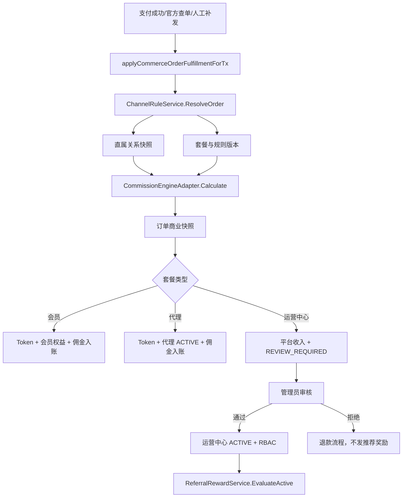
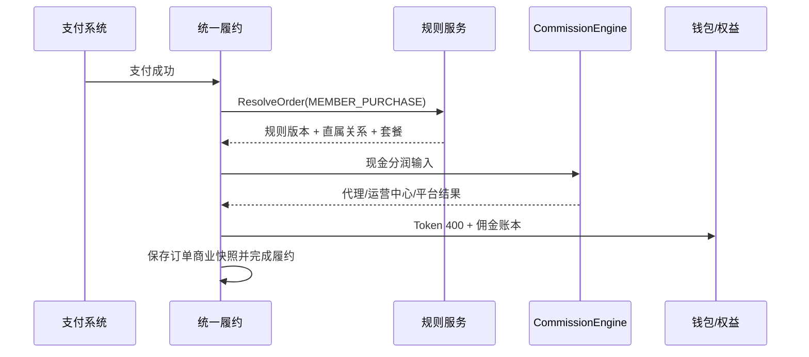
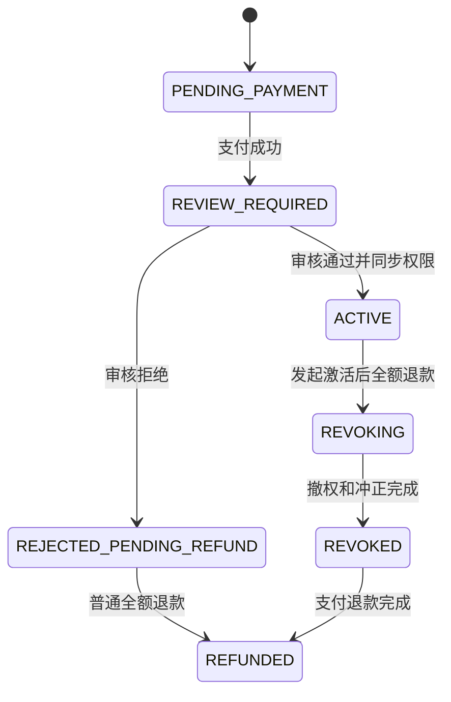
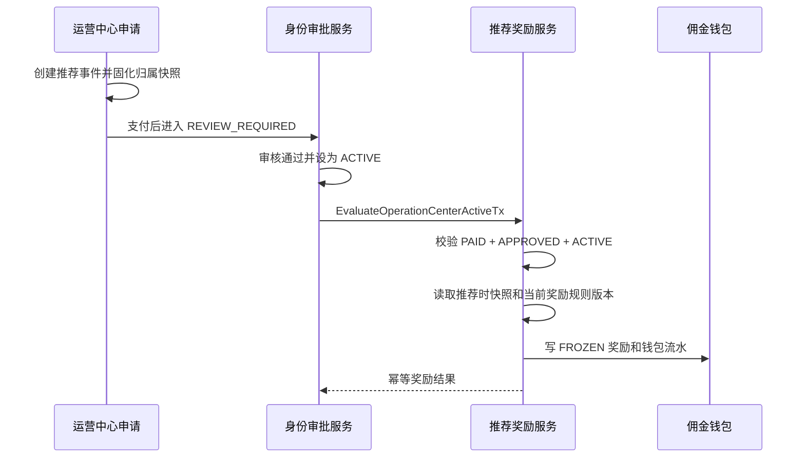
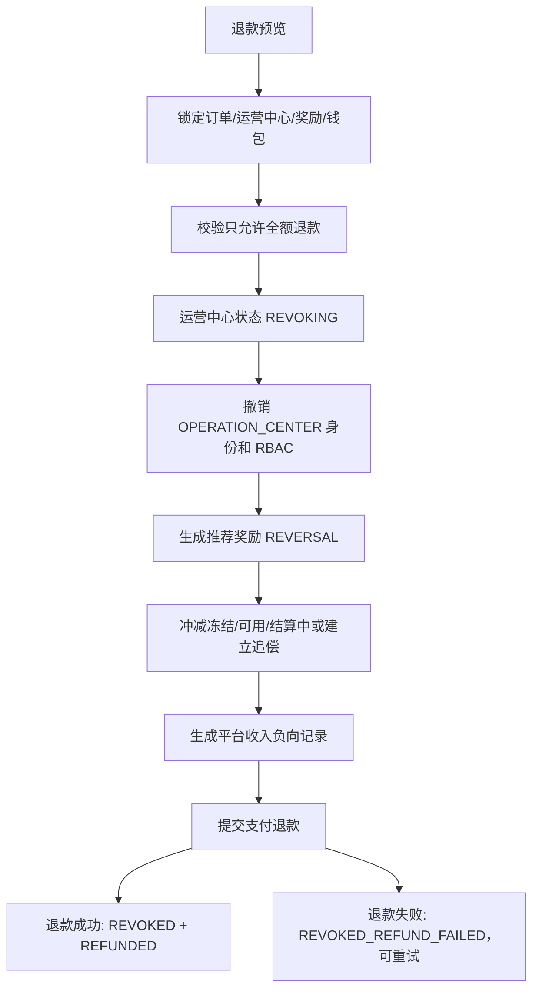

# 知启云AI渠道生态中心 V1.3.2 阶段 2 Implementation Plan

> **For agentic workers:** REQUIRED SUB-SKILL: Use `superpowers:subagent-driven-development` or `superpowers:executing-plans` to implement this plan task-by-task after this design is approved. Steps use checkbox syntax for tracking.

**Goal:** 设计统一商业规则服务、CommissionEngine 适配层，以及会员订单、代理订单、运营中心审核、推荐奖励、冻结释放和退款冲正的完整业务流程。

**Architecture:** 保持 CommissionEngine 为无数据库依赖的确定性现金分润计算内核，在其外层新增 ChannelRuleService 负责规则版本选择、套餐配置、直属关系解析、业务校验和快照生成。所有真实支付继续进入现有 `applyCommerceOrderFulfillmentForTx`，但运营中心支付不再直接激活身份，而是进入现有身份变更审批工作流，审核通过并 ACTIVE 后再触发独立推荐奖励服务。

**Tech Stack:** Go、PostgreSQL、现有 HTTP server/store、CommissionEngine、支付履约、身份变更审批、佣金钱包与结算中心。

## Global Constraints

- 本阶段只输出规则服务实现方案、CommissionEngine 接入方案和业务流程设计，不修改业务代码。
- 订单收益只计算直属代理和该直属代理所属运营中心。
- CommissionEngine、规则服务和业务流程均不得递归计算上级代理佣金。
- 推荐奖励独立作为营销费用，不冲减运营中心技术服务费平台收入。
- 推荐事件发生时固化代理所属运营中心。
- 推荐奖励在支付完成、审核通过、运营中心 ACTIVE 后触发。
- 推荐奖励默认冻结 7 天，使用奖励规则版本中的配置。
- 运营中心未激活可退款；激活后只允许全额退款，并先撤销权限再执行冲正。
- 5000 元统一为技术服务费，不使用保证金字段。
- 运营绩效奖励不进入一期。
- 测试环境和生产环境数据库隔离。
- 同一业务事件只能有一个资金写入路径；影子计算不得写佣金、奖励或钱包。

---

## 1. 当前调用链结论

### 1.1 已有可复用入口

| 当前能力 | 位置 | 复用方式 |
|---|---|---|
| 统一商业订单履约 | `applyCommerceOrderFulfillmentForTx` | 保留为支付后的唯一商业履约入口 |
| 商业身份命令 | `fulfillCommercialIdentityForOrderTx` | 拆分代理即时激活和运营中心待审核分支 |
| CommissionEngine | `internal/app/commission` | 保持纯计算，规则服务负责组装输入 |
| 身份变更预览/审批/执行 | migration 067 和 identity change 服务 | 复用为运营中心付费后审核流程 |
| 微信虚拟支付履约 | `wechat_virtual_entitlements.go` | 继续调用统一商业履约，不增加支付专属分润逻辑 |
| 佣金记录与钱包 | commission records/accounts/ledger | 订单佣金和推荐奖励共用资金账户与账本 |

### 1.2 当前 P0 差异

当前 `fulfillCommercialIdentityForOrderTx` 对 OPERATION_CENTER 会在订单支付履约时直接：

- 插入 ACTIVE 商业身份。
- 将 `user.OperationCenterStatus` 设置为 ACTIVE。
- 创建/更新运营中心档案。
- 同步商业 RBAC。

这与确认后的“支付完成后待审核，审核通过才 ACTIVE”冲突。阶段 2 实施必须先拆开该流程，否则推荐奖励会在未审核状态提前触发。

### 1.3 目标调用链



## 2. 规则服务职责与边界

### 2.1 新增包结构

计划新增 `backend-go/internal/app/channelrules`：

| 文件 | 单一职责 |
|---|---|
| `types.go` | 规则集、套餐配置、关系快照、解析结果和模拟结果类型 |
| `repository.go` | 规则、套餐、关系和订单快照存储接口 |
| `validator.go` | 发布校验、禁止上级代理、金额守恒和窗口校验 |
| `resolver.go` | 根据业务时间选择规则版本、套餐和直属关系 |
| `commission_adapter.go` | 将统一规则输入映射到现有 CommissionEngine |
| `service.go` | 规则集发布、订单解析和业务编排入口 |
| `simulator.go` | 无写入模拟和历史快照重放 |

推荐奖励继续使用独立包 `backend-go/internal/app/referralreward`，退款使用 `backend-go/internal/app/channelrefund`。三个包不直接依赖 HTTP 类型。

### 2.2 核心领域类型

```go
package channelrules

type ScenarioCode string

const (
    ScenarioMemberPurchase ScenarioCode = "MEMBER_PURCHASE"
    ScenarioAgentJoin      ScenarioCode = "AGENT_JOIN"
    ScenarioOCService     ScenarioCode = "OPERATION_CENTER_SERVICE"
)

type ResolveOrderRequest struct {
    TenantID       string
    OrderID        string
    OrderNo        string
    PlanID         string
    SourceUserID   string
    PaidAmountCents int64
    BusinessTime   time.Time
}

type RelationshipSnapshot struct {
    SourceUserID      string
    DirectAgentID     string
    OperationCenterID string
    EffectiveAt       time.Time
    SourceType        string
    SourceID          string
}

type ResolvedOrderRules struct {
    RuleSet          CommercialRuleSet
    Plan             PlanConfigVersion
    Scenario         ScenarioCode
    Relationship     RelationshipSnapshot
    CommissionRules  []commission.CommissionRule
}

type Allocation struct {
    BusinessType   string
    BeneficiaryType string
    BeneficiaryID  string
    AmountCents    int64
    RuleID         string
    RuleVersion    int
}

type OrderCalculation struct {
    RuleSetID                 string
    RuleSetVersion            int
    Scenario                  ScenarioCode
    TokenRightsValueCents     int64
    TokenGrantAmount          int64
    Allocations               []Allocation
    DirectAgentAmountCents    int64
    OperationCenterAmountCents int64
    PlatformAmountCents       int64
}
```

金额类型在 CommissionEngine 内继续使用其现有 `AmountCents`，规则服务 API/存储边界使用 `int64`，转换时必须检查溢出。

### 2.3 Repository 接口

```go
type Repository interface {
    LoadPublishedRuleSetAt(ctx context.Context, tenantID, ruleSetCode string, at time.Time) (CommercialRuleSet, error)
    LoadRuleSetByID(ctx context.Context, tenantID, ruleSetID string) (CommercialRuleSet, error)
    LoadPlanConfig(ctx context.Context, tenantID, ruleSetID, planID string) (PlanConfigVersion, error)
    LoadCommissionRules(ctx context.Context, tenantID, ruleSetID string, scenario ScenarioCode) ([]commission.CommissionRule, error)
    ResolveDirectRelationship(ctx context.Context, tenantID, sourceUserID string, at time.Time) (RelationshipSnapshot, error)
    InsertOrderSnapshotTx(ctx context.Context, tx *sql.Tx, snapshot OrderCommercialSnapshot) error
}
```

Repository 只返回一条当前规则集。发现零条返回 `CHANNEL_RULE_SET_NOT_FOUND`；发现多条返回 `CHANNEL_RULE_WINDOW_CONFLICT`，禁止“选择第一条”继续结算。

### 2.4 ChannelRuleService 接口

```go
type Service interface {
    ValidateRuleSet(ctx context.Context, tenantID, ruleSetID string) (ValidationResult, error)
    PublishRuleSet(ctx context.Context, command PublishRuleSetCommand) (CommercialRuleSet, error)
    ResolveOrder(ctx context.Context, request ResolveOrderRequest) (ResolvedOrderRules, error)
    CalculateOrder(ctx context.Context, resolved ResolvedOrderRules, request ResolveOrderRequest) (OrderCalculation, error)
    Simulate(ctx context.Context, request SimulationRequest) (SimulationResult, error)
    ReplayOrder(ctx context.Context, tenantID, orderID string) (ReplayResult, error)
}
```

规则服务不负责：

- 创建支付订单。
- 调用支付提供商。
- 直接修改用户身份或 RBAC。
- 直接增加钱包余额。
- 递归构建渠道树。

## 3. CommissionEngine 接入方案

### 3.1 保持 Engine 纯计算

CommissionEngine 继续只处理：

- 固定金额。
- 订单金额比例。
- 实付金额比例。
- 数量、阶梯规则。
- 平台剩余。
- 金额守恒和确定性输出。

Engine 不读取数据库、不选择规则版本、不解析用户关系、不发 Token、不写佣金和钱包。

### 3.2 适配层输入

```go
func (a CommissionEngineAdapter) Calculate(
    ctx context.Context,
    request ResolveOrderRequest,
    resolved ResolvedOrderRules,
) (OrderCalculation, error) {
    relationships := commission.RelationshipSnapshot{
        AgentIDsByLevel: map[int]string{},
        OperationCenterID: resolved.Relationship.OperationCenterID,
        PlatformID: "platform:" + request.TenantID,
    }
    if resolved.Relationship.DirectAgentID != "" {
        relationships.AgentIDsByLevel[1] = resolved.Relationship.DirectAgentID
    }

    // 调用前必须拒绝 relationship_level > 1 或祖先 selector。
    result, err := a.engine.Calculate(commission.CalculationInput{
        TenantID: request.TenantID,
        OrderID: request.OrderID,
        OrderNo: request.OrderNo,
        ProductType: string(resolved.Scenario),
        ProductID: request.PlanID,
        SourceUserID: request.SourceUserID,
        OrderAmountCents: commission.AmountCents(request.PaidAmountCents),
        PaidAmountCents: commission.AmountCents(request.PaidAmountCents),
        Quantity: 1,
        PaidAt: request.BusinessTime,
        Rules: resolved.CommissionRules,
        Relationships: relationships,
    })
    // 将 result 映射为 OrderCalculation，并执行最终金额守恒。
    return mapCalculation(result, resolved), err
}
```

关键限制：`AgentIDsByLevel` 只允许写入 key=1。即使数据库中存在无限父代理关系，也不得传入 level 2 或更高层级。

### 3.3 Token 与平台收入

Token 权益来自 `PlanConfigVersion`，不作为现金佣金记录：

```text
平台剩余 = 实付金额 - Token权益价值 - 直属代理现金收益 - 运营中心现金收益
```

CommissionEngine 的 PLATFORM_REMAINDER 当前只看到现金规则时，适配层必须将 Token 权益价值作为预占成本参与最终守恒校验。推荐实现方式：

- Engine 计算直属代理、运营中心和平台现金分配。
- 规则服务在调用 Engine 前将可分配现金基数设为 `paid - tokenRightsValue`，或提供明确的 preallocated cost 输入。
- 不允许先按 996 全额计算平台剩余，再在页面层减 Token。
- 最终 `OrderCalculation` 必须再次校验 `paid = token + agent + operationCenter + platform`。

若现有 Engine 输入不能表达 Token 预占成本，优先在适配层使用净可分配金额调用，而不是把 Token 伪装成佣金受益人。

### 3.4 规则映射

| V1.3.2 规则 | CommissionEngine 映射 |
|---|---|
| 直属代理 300 元 | AGENT、relationshipLevel=1、FIXED_AMOUNT=30000 |
| 运营中心 200 元 | OPERATION_CENTER、relationshipLevel=1、FIXED_AMOUNT=20000 |
| 平台剩余 | PLATFORM、REMAINDER_TO_PLATFORM |
| Token 权益 | 不进入 commission rule；来自套餐配置版本 |
| 推荐奖励 | 不进入 CommissionEngine 订单分润；由 ReferralRewardService 计算 |

### 3.5 接入现有履约入口

`applyCommerceOrderFulfillmentForTx` 仍是唯一真实写入入口，内部顺序调整为：

1. 锁定订单并检查幂等履约状态。
2. 构造 `ResolveOrderRequest`。
3. 调用 `ChannelRuleService.ResolveOrder`。
4. 调用 `CommissionEngineAdapter.Calculate`。
5. 写 `xz_order_commercial_snapshots`。
6. 发放 Token/会员权益。
7. 写佣金记录和佣金钱包账本。
8. 按套餐类型执行身份命令。
9. 写平台收入和履约状态。

禁止新增第二个支付回调入口直接调用规则服务。

### 3.6 Legacy 切换

新增技术开关，不属于商业配置：

| 开关 | 作用 |
|---|---|
| `channel_rule_engine_mode=legacy` | 只运行现有结算 |
| `channel_rule_engine_mode=shadow` | 现有结算真实写入，新规则只计算并记录差异 |
| `channel_rule_engine_mode=v132` | V1.3.2 规则真实写入，legacy 不写入 |

shadow 模式记录：订单、legacy 结果、V1.3.2 结果、差异字段、规则版本和 request ID。不得创建新佣金、奖励或钱包流水。

## 4. 运营中心身份审核改造

### 4.1 复用身份变更工作流

migration 067 已提供：

- `xz_identity_change_previews`。
- `xz_identity_change_approvals`。
- `xz_identity_change_executions`。
- REVIEW_REQUIRED、APPROVED、REJECTED、CONSUMED 状态。
- append-only 审批历史。

不再新建通用审批系统。阶段 1 迁移设计增加以下兼容扩展：

| 调整 | 说明 |
|---|---|
| `change_method` 增加 `PAID_ORDER` | 表示真实线上/线下已支付订单触发的身份申请 |
| `source_order_id` | FK `xz_orders(id)`，替代误用 membership order 字段 |
| 唯一索引 | 同一 source_order_id + target_identity 只能有一个未终止流程 |

### 4.2 订单支付后状态

运营中心支付成功后：

- 订单支付状态为 PAID。
- 商业规则快照已写入。
- 5000 元全部计入平台收入，不生成推荐奖励。
- 创建 target_identity=OPERATION_CENTER、change_method=PAID_ORDER、status=REVIEW_REQUIRED 的身份变更预览。
- 不插入 ACTIVE 运营中心商业身份。
- 不把 user.operation_center_status 设为 ACTIVE。
- 不同步运营中心 RBAC。
- 不触发推荐奖励。
- 订单 `fulfillment_status` 设置为 `AWAITING_REVIEW`。

微信虚拟支付处理必须把 `AWAITING_REVIEW` 视为支付处理成功，而不是 entitlement failure。

### 4.3 审核通过命令

```go
type ApproveOperationCenterCommand struct {
    TenantID  string
    PreviewID string
    ReviewerID string
    Reason    string
    IdempotencyKey string
}

func (s *IdentityService) ApprovePaidOperationCenter(
    ctx context.Context,
    cmd ApproveOperationCenterCommand,
) (OperationCenterActivationResult, error)
```

同一数据库事务内：

1. 锁定身份变更预览、来源订单和用户。
2. 验证 preview=REVIEW_REQUIRED、订单=PAID、target=OPERATION_CENTER。
3. 写 append-only APPROVED 审批记录。
4. 插入/激活 OPERATION_CENTER 商业身份。
5. 更新用户 operation_center_status=ACTIVE。
6. 创建/更新运营中心档案 status=ACTIVE、approved_at。
7. 同步运营中心 RBAC。
8. 将身份执行记录标记 SUCCEEDED、预览标记 CONSUMED。
9. 将订单 fulfillment_status 更新为 FULFILLED。
10. 调用 `ReferralRewardService.EvaluateOperationCenterActiveTx`。
11. 写审计日志。

如果推荐奖励入账失败，整个激活事务回滚，不允许出现 ACTIVE 但奖励资格未处理的中间状态。幂等重试可以安全重复执行。

### 4.4 审核拒绝

同一事务内：

- 写 REJECTED 审批记录。
- 身份预览标记 REJECTED。
- 运营中心身份保持未激活。
- 订单 fulfillment_status 标记 `REJECTED_PENDING_REFUND`。
- 推荐事件保持 PENDING 或标记 REJECTED，不生成奖励。
- 创建普通全额退款待办，支付退款通过现有提供商流程执行。

## 5. 推荐奖励服务设计

### 5.1 包结构

| 文件 | 职责 |
|---|---|
| `referralreward/types.go` | 推荐事件、资格、奖励和冲正类型 |
| `referralreward/repository.go` | 推荐事件、规则、奖励和钱包事务接口 |
| `referralreward/service.go` | 创建事件、ACTIVE 资格评估和奖励入账 |
| `referralreward/release.go` | 冻结到期释放 |
| `referralreward/reversal.go` | 退款/撤权后的负向奖励 |

### 5.2 服务接口

```go
type Service interface {
    CreateReferralEventTx(ctx context.Context, tx *sql.Tx, command CreateReferralEventCommand) (ReferralEvent, error)
    EvaluateOperationCenterActiveTx(ctx context.Context, tx *sql.Tx, command EvaluateActiveCommand) ([]RewardRecord, error)
    ReleaseMaturedRewards(ctx context.Context, now time.Time, limit int) (ReleaseSummary, error)
    ReverseRewardsTx(ctx context.Context, tx *sql.Tx, command ReverseRewardsCommand) ([]RewardRecord, error)
}
```

### 5.3 推荐事件创建

推荐事件在运营中心申请使用推荐码/推荐链接时创建，而不是在 ACTIVE 时临时推断。

代理推荐运营中心：

1. 验证推荐代理 ACTIVE。
2. 查询推荐代理当前所属运营中心。
3. 将该运营中心写入 `referrer_operation_center_id` 和 relation_snapshot。
4. 后续代理调整运营中心时不得修改该快照。

运营中心推荐运营中心：

1. 验证推荐运营中心 ACTIVE。
2. `referrer_operation_center_id` 留空。
3. 实际奖励受益人为 referrer_id。

一期每个被推荐运营中心只能有一个推荐事件，冲突返回 `CHANNEL_REFERRAL_ALREADY_BOUND`。

### 5.4 ACTIVE 资格评估

```go
type EvaluateActiveCommand struct {
    TenantID          string
    OperationCenterID string
    ActivationOrderID string
    QualifiedAt       time.Time
}
```

资格条件：

- activation order PAID。
- identity approval APPROVED。
- operation center ACTIVE。
- referral event 存在且未 REWARDED/REVOKED。

规则版本使用 `QualifiedAt` 选择。受益人使用推荐事件快照选择。

默认结果：

| 场景 | 受益人 | 金额 | 冻结 |
|---|---|---:|---:|
| OC_REFERS_OC | 推荐运营中心 | 300000 分 | 7 天 |
| AGENT_REFERS_OC | 推荐代理 | 100000 分 | 7 天 |
| AGENT_REFERS_OC | 推荐时所属运营中心 | 200000 分 | 7 天 |

奖励入账：

- 创建 `xz_referral_reward_records` status=FROZEN。
- `freeze_until = qualified_at + rule.freeze_days`。
- 写 `xz_commission_wallet_ledger`，business_type=REFERRAL_REWARD，frozen_delta_cents 为正。
- 不写 `xz_commission_records`。
- 不冲减技术服务费订单平台收入。

### 5.5 冻结释放

`ReleaseMaturedRewards` 使用批处理：

- 查询 `status=FROZEN AND freeze_until <= now()`。
- 使用 `FOR UPDATE SKIP LOCKED` 支持并发 worker。
- 逐条把 frozen 转为 available。
- 写钱包 TRANSFER 流水，frozen_delta 为负，available_delta 为正。
- 更新奖励状态 AVAILABLE 和 available_at。
- 幂等键 `referral_release:{reward_id}`。

## 6. 业务流程设计

### 6.1 会员购买



验收：默认 99600 = 40000 + 30000 + 20000 + 9600。

### 6.2 代理发展代理

流程与会员订单相同，差异为：

- Token 权益默认 20000。
- 代理身份支付后直接 ACTIVE，无人工审核。
- 建立新代理与直属代理/运营中心关系历史。
- 默认 99600 = 20000 + 30000 + 20000 + 29600。
- 直属代理以上任何代理不进入 Engine 输入。

### 6.3 运营中心申请与激活



技术服务费订单不产生订单佣金，平台收入为实付金额。推荐奖励是另一个营销费用业务事实。

### 6.4 推荐奖励



### 6.5 未激活退款

适用状态：PENDING_PAYMENT 以外的已支付未 ACTIVE 状态，包括 REVIEW_REQUIRED 和 REJECTED_PENDING_REFUND。

流程：

1. 锁定订单和身份预览。
2. 确认不存在 ACTIVE 身份和正向推荐奖励。
3. 创建普通全额退款记录。
4. 调用现有支付退款。
5. 回调确认后订单 REFUNDED，身份预览 REJECTED/CONSUMED。
6. 不执行 RBAC 撤销和推荐奖励冲正。

### 6.6 激活后全额退款



如果支付退款失败，不自动恢复运营中心权限。保留 REVOKED_REFUND_FAILED 并允许幂等重试，避免已经冲正营销费用后重新开放业务权限。

奖励冲正按资金状态处理：

| 原状态 | 冲正方式 |
|---|---|
| FROZEN | frozen 减少，创建 REVERSAL |
| AVAILABLE | available 减少，创建 REVERSAL |
| SETTLING | 锁定/移出提现申请，无法移出时转 recoverable |
| SETTLED | recoverable 增加，建立追偿记录 |

## 7. API 与内部命令衔接

### 7.1 外部管理 API

沿用阶段 1 设计：

- 规则集 validate/publish/diff。
- simulator calculate/replay。
- referral events/reward records/reverse。
- operation center refund-preview/refund。

### 7.2 内部命令

```go
type FulfillPaidOrderCommand struct {
    TenantID      string
    OrderID       string
    PaymentEventID string
    PaidAt        time.Time
}

type CreatePaidOperationCenterReviewCommand struct {
    TenantID string
    OrderID  string
    UserID   string
    ActorID  string
}

type ApprovePaidOperationCenterCommand struct {
    TenantID      string
    PreviewID     string
    ReviewerID    string
    Reason        string
    IdempotencyKey string
}

type ExecuteOperationCenterRefundCommand struct {
    TenantID       string
    OperationCenterID string
    OrderID        string
    Reason         string
    PreviewToken   string
    IdempotencyKey string
}
```

HTTP 层只负责认证、解码和返回响应；事务和业务状态转换位于服务层/store transaction callback 中。

## 8. 错误恢复与可观测性

### 8.1 幂等键

| 业务 | 幂等键 |
|---|---|
| 订单规则快照 | `order-commercial-snapshot:{order_id}` |
| 订单佣金 | 继续使用现有 order/rule/beneficiary 组合 |
| 运营中心付费审核预览 | `oc-paid-review:{order_id}` |
| 运营中心激活 | `oc-activation:{preview_id}` |
| 推荐奖励 | `referral_reward:{event_id}:{rule_id}:{beneficiary}` |
| 冻结释放 | `referral_release:{reward_id}` |
| 奖励冲正 | `referral_reversal:{reward_id}:{refund_reference}` |
| 激活后退款 | `oc-refund:{order_id}:{refund_reference}` |

### 8.2 关键指标

- `channel_rule_resolve_total{scenario,version,result}`。
- `channel_rule_shadow_diff_total{field}`。
- `channel_ancestor_commission_rejected_total`。
- `operation_center_review_total{decision}`。
- `referral_qualification_total{result,reason}`。
- `referral_reward_amount_cents{beneficiary_type}`。
- `referral_reward_duplicate_total`。
- `channel_refund_total{state,result}`。
- `channel_recoverable_amount_cents`。

日志必须包含 tenant ID、order ID、rule set version、referral event ID、adjustment ID 和 request ID，不记录支付密钥或敏感身份信息。

## 9. 后续实现拆分

### Task 1: ChannelRuleService 领域类型和验证器

**Files:**

- Create: `backend-go/internal/app/channelrules/types.go`
- Create: `backend-go/internal/app/channelrules/validator.go`
- Test: `backend-go/internal/app/channelrules/validator_test.go`

**Interfaces:** 产生 `ValidateRuleSet`、`ValidationResult`、`ResolvedOrderRules`。

- [ ] 编写失败测试：relationship level 2 返回 `CHANNEL_ANCESTOR_COMMISSION_FORBIDDEN`。
- [ ] 编写失败测试：会员默认金额不守恒时验证失败。
- [ ] 实现最小验证器，只接受 DIRECT_AGENT、DIRECT_AGENT_OPERATION_CENTER 和 PLATFORM。
- [ ] 运行 `go test ./internal/app/channelrules`，预期通过。

### Task 2: Rule Repository 和版本解析

**Files:**

- Create: `backend-go/internal/app/channelrules/repository.go`
- Create: `backend-go/internal/app/channelrules/resolver.go`
- Create: `backend-go/internal/httpserver/channel_rules_store.go`
- Test: `backend-go/internal/httpserver/channel_rules_postgres_test.go`

**Interfaces:** 产生 `LoadPublishedRuleSetAt`、`LoadPlanConfig`、`ResolveDirectRelationship`。

- [ ] 编写同一时间两套 PUBLISHED 规则冲突测试。
- [ ] 编写三级代理关系只解析直属代理和运营中心测试。
- [ ] 实现规则时间窗和直属关系解析。
- [ ] 运行目标 PostgreSQL 测试，预期通过。

### Task 3: CommissionEngineAdapter

**Files:**

- Create: `backend-go/internal/app/channelrules/commission_adapter.go`
- Test: `backend-go/internal/app/channelrules/commission_adapter_test.go`
- Reuse: `backend-go/internal/app/commission/engine.go`

**Interfaces:** 产生 `CalculateOrder`，消费现有 `CommissionEngine.Calculate`。

- [ ] 编写会员 996/400/300/200/96 测试。
- [ ] 编写代理 996/200/300/200/296 测试。
- [ ] 编写 AgentIDsByLevel 不得包含 level 2 的断言。
- [ ] 实现 Token 预占成本和结果守恒映射。
- [ ] 运行 channelrules 与 commission 目标测试，预期通过。

### Task 4: 统一履约接入与 shadow 模式

**Files:**

- Modify: `backend-go/internal/httpserver/commerce_service.go`
- Modify: `backend-go/internal/httpserver/postgres_store.go`
- Modify: `backend-go/internal/httpserver/wechat_virtual_entitlements.go`
- Test: `backend-go/internal/httpserver/commerce_service_test.go`
- Test: `backend-go/internal/httpserver/wechat_virtual_payment_postgres_test.go`

**Interfaces:** 支付入口仍只调用 `applyCommerceOrderFulfillmentForTx`。

- [ ] 编写 shadow 模式不写新佣金/钱包测试。
- [ ] 编写 V1.3.2 模式只写一套佣金测试。
- [ ] 接入规则解析、计算和订单快照。
- [ ] 保留 legacy 技术开关并禁止双写。
- [ ] 运行目标履约和虚拟支付测试。

### Task 5: 运营中心支付后待审核

**Files:**

- Modify: `backend-go/internal/httpserver/identity_order_command_postgres.go`
- Modify: `backend-go/internal/httpserver/identity_change_preview_postgres.go`
- Create: `backend-go/internal/httpserver/operation_center_review_postgres.go`
- Test: `backend-go/internal/httpserver/identity_phase2_postgres_test.go`
- Test: `backend-go/internal/httpserver/operation_center_review_postgres_test.go`

**Interfaces:** 产生 `CreatePaidOperationCenterReviewTx`、`ApprovePaidOperationCenterTx`、`RejectPaidOperationCenterTx`。

- [ ] 编写支付后 status=REVIEW_REQUIRED 且用户非 ACTIVE 测试。
- [ ] 编写审核通过才授予身份和 RBAC 测试。
- [ ] 编写拒绝不发推荐奖励测试。
- [ ] 拆分代理即时激活和运营中心审核分支。
- [ ] 运行身份与运营中心目标测试。

### Task 6: ReferralRewardService

**Files:**

- Create: `backend-go/internal/app/referralreward/types.go`
- Create: `backend-go/internal/app/referralreward/service.go`
- Create: `backend-go/internal/app/referralreward/release.go`
- Create: `backend-go/internal/httpserver/referral_reward_store.go`
- Test: `backend-go/internal/app/referralreward/service_test.go`
- Test: `backend-go/internal/httpserver/referral_reward_postgres_test.go`

**Interfaces:** 产生 `CreateReferralEventTx`、`EvaluateOperationCenterActiveTx`、`ReleaseMaturedRewards`。

- [ ] 编写推荐时所属运营中心快照不随后续关系变化测试。
- [ ] 编写 PAID/APPROVED/ACTIVE 缺一不发奖测试。
- [ ] 编写 3000 和 1000+2000 默认奖励测试。
- [ ] 编写重复激活不重复发奖测试。
- [ ] 编写冻结 7 天后转 available 测试。
- [ ] 实现奖励和钱包事务。

### Task 7: 激活后退款与冲正

**Files:**

- Create: `backend-go/internal/app/channelrefund/types.go`
- Create: `backend-go/internal/app/channelrefund/service.go`
- Create: `backend-go/internal/httpserver/channel_refund_api.go`
- Create: `backend-go/internal/httpserver/channel_refund_store.go`
- Modify: 现有支付退款通知处理，接入 adjustment 完成步骤
- Test: `backend-go/internal/app/channelrefund/service_test.go`
- Test: `backend-go/internal/httpserver/channel_refund_postgres_test.go`

**Interfaces:** 产生 `PreviewOperationCenterRefund`、`ExecuteOperationCenterRefund`、`CompleteProviderRefund`。

- [ ] 编写未激活普通退款测试。
- [ ] 编写激活后部分退款被拒绝测试。
- [ ] 编写激活后先撤权再冲正测试。
- [ ] 编写 FROZEN/AVAILABLE/SETTLING/SETTLED 四种钱包状态测试。
- [ ] 编写支付退款失败后权限不自动恢复测试。
- [ ] 实现可重试调整状态机。

## 10. 阶段 2 验收清单

- [ ] 确认 CommissionEngine 保持纯计算，不查询数据库和关系树。
- [ ] 确认 Token 权益不伪装成佣金受益人，但参与最终金额守恒。
- [ ] 确认真实支付仍只有 `applyCommerceOrderFulfillmentForTx` 一个商业履约入口。
- [ ] 确认运营中心支付后为 REVIEW_REQUIRED，不再自动 ACTIVE。
- [ ] 确认复用 identity change 审批表，并扩展 PAID_ORDER 和 source_order_id。
- [ ] 确认审核通过事务同时完成 ACTIVE、RBAC、推荐资格评估和冻结奖励。
- [ ] 确认推荐代理的 2000 元运营中心归属读取推荐事件快照。
- [ ] 确认默认冻结 7 天并由批处理幂等释放。
- [ ] 确认激活后退款失败不自动恢复权限，只允许重试退款。
- [ ] 确认 shadow 模式只比较不写资金。
- [ ] 本设计确认后，才允许进入 migration 079 和规则服务失败测试的编码阶段。
