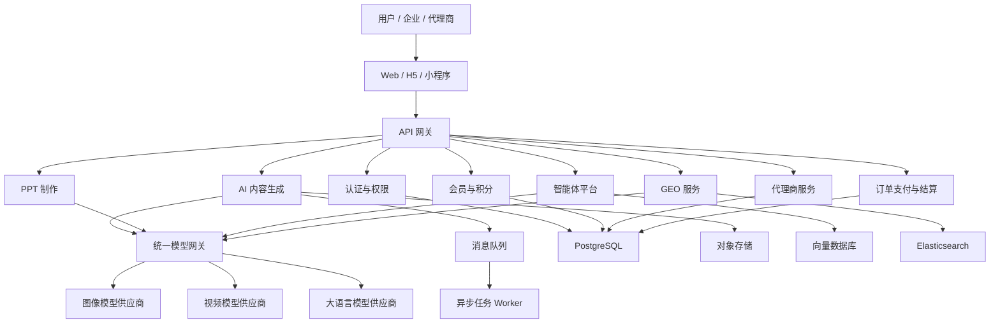
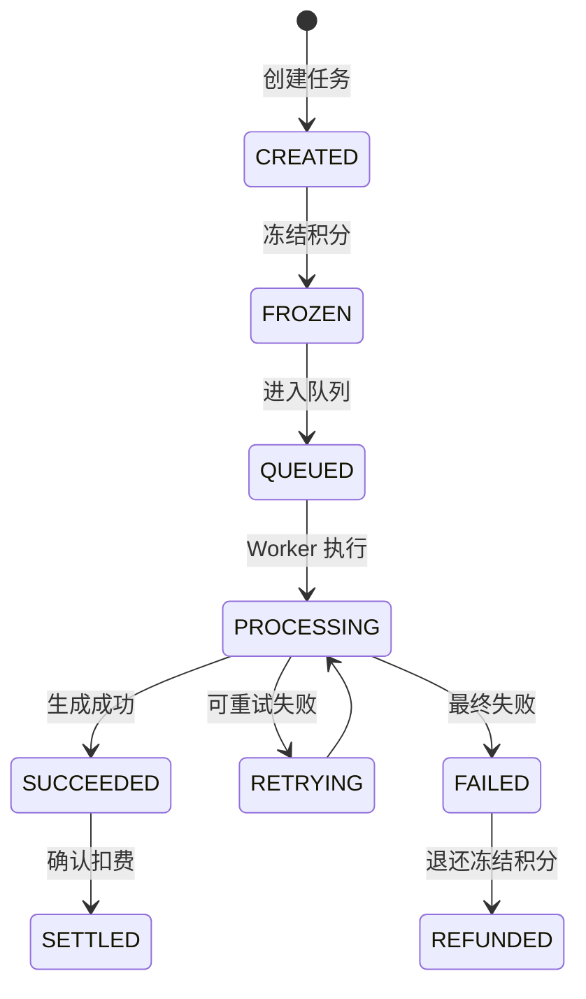
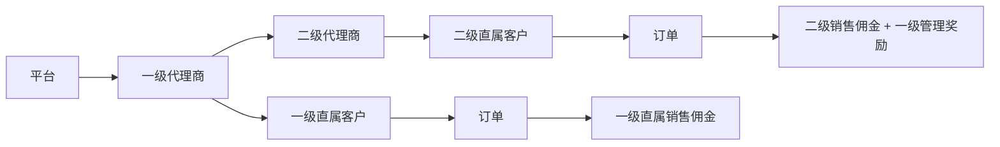

# 先知 AI 平台开发文档

## 1. 文档信息

| 项目 | 内容 |
|---|---|
| 项目名称 | 先知 AI 一站式内容生产与代理商运营平台 |
| 文档版本 | V1.0 |
| 编制日期 | 2026-06-14 |
| 文档状态 | 研发启动基线 |
| 适用对象 | 产品、设计、前端、后端、AI、测试、运维及项目管理人员 |

## 2. 项目概述

### 2.1 项目背景

先知 AI 是面向企业客户、内容创作者和代理商的一站式 AI 内容生产与商业运营平台。平台统一接入图像、视频、大语言模型和 PPT 生成能力，并通过会员、积分、订单、代理商和佣金体系完成商业化闭环。

### 2.2 建设目标

1. 为用户提供文生图、参考图生图、文生视频、参考图生视频等 AI 创作工具。
2. 提供 AI PPT 制作、智能体搭建和 GEO 优化能力。
3. 建立会员套餐、积分计费、订单支付和作品管理体系。
4. 建立一级代理商、二级代理商、终端客户的渠道运营体系。
5. 实现模型调用、成本、积分、佣金和结算的完整追踪与对账。
6. 支持后续扩展更多模型供应商、终端形态和企业服务能力。

### 2.3 GEO 定义

本项目中的 GEO 指生成式引擎优化，即针对 ChatGPT、DeepSeek、豆包、百度 AI 搜索等生成式搜索平台，进行品牌曝光监测、竞品分析、内容生产和优化效果跟踪。

## 3. 用户与角色

| 角色 | 主要能力 |
|---|---|
| 游客 | 浏览产品能力、套餐和案例 |
| 普通会员 | 使用授权的 AI 创作功能，管理个人作品和订单 |
| 企业成员 | 使用企业套餐、共享资产和企业智能体 |
| 企业管理员 | 管理企业成员、额度、品牌模板和数据权限 |
| 一级代理商 | 管理二级代理商和直属客户，查看业绩、佣金及结算 |
| 二级代理商 | 管理直属客户，销售套餐并查看佣金 |
| 平台运营 | 管理用户、内容、套餐、模型、营销活动和代理商 |
| 财务人员 | 管理订单、退款、佣金、结算和提现审核 |
| 超级管理员 | 管理系统配置、角色、权限和审计数据 |

## 4. 项目范围

### 4.1 用户端

- 用户注册、登录、认证和个人中心
- 文生图、参考图生图
- 文生视频、参考图生视频
- AI PPT 制作
- 智能体搭建、调试、发布和调用
- GEO 品牌监测与内容优化
- 会员套餐、积分、订单、支付和发票
- 作品、文件和生成任务管理

### 4.2 代理商端

- 一级、二级代理商资料和关系管理
- 客户管理、推广链接和邀请码
- 商品价格、销售订单和团队业绩
- 佣金明细、结算单和提现申请
- 会员、积分和兑换码分配

### 4.3 平台管理端

- 用户、企业、角色和权限管理
- 模型供应商、模型能力和计费规则管理
- 会员套餐、商品、订单和支付管理
- 代理商、佣金、结算和提现管理
- 内容审核、运营活动和数据看板
- 系统配置、日志、告警和审计

### 4.4 首期不包含

- 自研基础图像、视频或语言大模型
- 无官方接口平台的大规模自动化采集
- 复杂多级代理体系，首期仅支持一级和二级代理
- 原生移动 App，首期以 Web 为主，可补充 H5 或小程序

## 5. 总体架构

### 5.1 架构原则

- 初期采用模块化单体后端，降低开发、部署和运维复杂度。
- AI 生成任务使用独立异步任务服务，避免阻塞业务接口。
- 业务模块通过统一模型网关调用模型供应商。
- 所有支付、积分、余额和佣金变化必须记录不可变流水。
- 所有核心操作必须支持幂等、审计和异常补偿。

### 5.2 系统架构图



## 6. 推荐技术栈

| 层级 | 推荐技术 |
|---|---|
| Web 前端 | Vue 3、TypeScript、Vite、Element Plus、Pinia |
| 移动端 | UniApp |
| 后端 | Java 21、Spring Boot 3、MyBatis Plus |
| 数据库 | PostgreSQL |
| 缓存 | Redis |
| 消息队列 | RabbitMQ |
| 对象存储 | 阿里云 OSS、腾讯云 COS 或 MinIO |
| 搜索服务 | Elasticsearch |
| 向量数据库 | PostgreSQL pgvector，规模扩大后可迁移至 Milvus 或 Qdrant |
| 智能体编排 | LangGraph、Dify 二次开发或自研节点引擎 |
| PPT 生成 | PptxGenJS 或独立 PPT 渲染服务 |
| 部署 | Docker，后续按业务规模升级 Kubernetes |
| 监控 | Prometheus、Grafana、Loki |
| CI/CD | GitHub Actions、GitLab CI 或 Jenkins |

## 7. 核心业务流程

### 7.1 AI 生成任务流程



要求：

- 任务创建、积分冻结和队列投递必须具备事务一致性。
- 每个任务拥有唯一业务幂等键。
- 失败任务按照模型配置进行有限次数重试。
- 最终失败后自动退还积分，并保存失败原因。
- 用户可查看排队、生成、成功、失败和退款状态。

### 7.2 订单支付流程

1. 用户选择商品或会员套餐。
2. 系统生成待支付订单并锁定价格快照。
3. 用户通过微信支付或支付宝付款。
4. 支付平台回调，系统验证签名并幂等处理。
5. 系统开通会员、发放积分或权益。
6. 若订单来自代理商渠道，创建佣金冻结记录。
7. 订单完成冻结期后，佣金进入可结算状态。

### 7.3 代理商分佣流程



要求：

- 代理关系绑定后必须防止循环关系。
- 分佣比例、商品价格和代理关系必须保存订单快照。
- 历史订单不受后续规则修改影响。
- 退款后必须按原佣金明细执行佣金回退。
- 提现必须经过实名认证、财务审核和风控检查。

## 8. 功能需求

### 8.1 文生图

**功能说明：** 用户输入提示词，选择模型和参数生成图片。

**功能项：**

- 提示词输入、示例和 AI 优化
- 负面提示词
- 模型、风格、尺寸、比例和生成数量选择
- 任务进度、失败原因和重试
- 图片预览、下载、收藏、删除和再次生成
- 生成历史和消费记录
- 文本与图片内容安全审核

**验收要点：**

- 用户不能使用未授权模型。
- 创建任务前显示预计积分消耗。
- 成功后确认扣费，失败后自动退还积分。
- 每张结果图可追溯至生成参数和模型调用记录。

### 8.2 参考图生图

**功能项：**

- 上传一张或多张参考图片
- 图片裁剪、压缩和格式转换
- 风格参考、人物参考、姿势参考
- 参考强度设置
- 局部重绘、扩图和背景替换
- 生成结果相似度和人物一致性控制

### 8.3 文生视频

**功能项：**

- 视频提示词和 AI 分镜脚本生成
- 模型、比例、时长、清晰度和镜头运动设置
- 首尾帧设置
- 配音、字幕和背景音乐
- 异步进度查询、失败重试和超时处理
- 视频预览、下载和作品管理

### 8.4 参考图生视频

**功能项：**

- 单图生视频
- 首尾帧生视频
- 人物、商品和场景参考
- 动作幅度和镜头运动配置
- 人物一致性控制
- 数字人口播、声音和口型同步

### 8.5 AI PPT 制作

**业务流程：**

```text
输入主题/文档/网页
→ 生成大纲
→ 用户调整大纲
→ 生成页面内容
→ 自动配图和图表
→ 套用模板
→ 在线编辑
→ 导出 PPTX/PDF
```

**功能项：**

- 根据主题、文档或网页生成 PPT
- 大纲生成、编辑和重新生成
- 页面内容、图片、图表和演讲备注生成
- 模板、主题色、字体和品牌规范管理
- 页面级在线编辑和排序
- 导出可编辑 PPTX 和 PDF

### 8.6 智能体搭建

**核心节点：**

- 开始、结束节点
- 大模型和提示词节点
- 知识库检索节点
- 条件判断和变量处理节点
- HTTP API 和数据库查询节点
- 人工确认节点
- 图片、视频和 PPT 生成节点

**功能项：**

- 可视化工作流编排
- 节点配置、连接校验和运行调试
- 智能体版本管理、发布和回滚
- 私有知识库上传、切片、向量化和检索
- 网页嵌入、API 调用和分享链接
- 调用次数、响应时间、Token、成本和用户反馈统计

### 8.7 GEO 模块

**功能项：**

- 品牌、产品、竞品和目标关键词管理
- GEO 测试问题管理
- 多平台监测任务和定时执行
- 品牌提及率、引用率、排名和情感倾向统计
- 竞品表现及引用来源分析
- GEO 优化建议、文章和问答内容生成
- 内容发布记录和效果跟踪
- 周报、月报和趋势报告

**合规要求：**

- 优先使用目标平台官方 API。
- 无官方接口的平台必须经过合规评估。
- 监测结果必须保存平台、时间、问题和原始响应摘要。

### 8.8 会员管理

**用户端：**

- 免费会员、月度会员、年度会员和企业会员
- 套餐购买、续费和升级
- 积分余额、冻结积分和消费流水
- 优惠券、兑换码和邀请奖励
- 订单、退款、发票和订阅记录

**平台端：**

- 配置套餐价格、权益和有效期
- 配置模型使用权限、并发数和存储空间
- 配置赠送积分、每日额度和超额价格
- 管理会员开通、冻结、退款和补偿

### 8.9 一级和二级代理商

**一级代理商：**

- 创建和管理二级代理商
- 创建和管理直属客户
- 查看团队订单、业绩和佣金
- 设置授权范围内的销售价格
- 分配会员、积分和兑换码
- 申请结算和提现

**二级代理商：**

- 创建和管理直属客户
- 销售平台商品和套餐
- 查看订单、业绩和佣金
- 发放兑换码
- 申请结算和提现

**平台后台：**

- 代理商申请、审核、冻结和解约
- 代理等级、价格和分佣规则配置
- 业绩统计和排行榜
- 佣金核算、结算单和提现审核
- 退款后的佣金回退

## 9. 权限与数据隔离

平台采用 RBAC 权限模型，并增加数据范围控制。

### 9.1 权限维度

- 菜单权限
- 页面操作权限
- API 接口权限
- 数据范围权限
- 模型使用权限
- 商品和价格权限

### 9.2 数据范围示例

| 角色 | 数据范围 |
|---|---|
| 超级管理员 | 全平台 |
| 平台运营 | 授权业务域 |
| 一级代理商 | 自身、下属二级代理商及对应客户 |
| 二级代理商 | 自身及直属客户 |
| 企业管理员 | 所属企业 |
| 企业成员 | 本人或被授权的企业数据 |
| 普通会员 | 本人数据 |

## 10. 核心数据模型

### 10.1 用户与权限域

| 表名 | 说明 |
|---|---|
| `users` | 用户基本信息 |
| `enterprises` | 企业信息 |
| `enterprise_members` | 企业成员关系 |
| `roles` | 角色 |
| `permissions` | 权限 |
| `user_roles` | 用户角色关系 |
| `role_permissions` | 角色权限关系 |

### 10.2 会员与积分域

| 表名 | 说明 |
|---|---|
| `membership_plans` | 会员套餐 |
| `plan_entitlements` | 套餐权益 |
| `subscriptions` | 用户订阅 |
| `point_accounts` | 积分账户 |
| `point_transactions` | 积分流水 |
| `coupons` | 优惠券 |
| `redemption_codes` | 兑换码 |

### 10.3 AI 生成域

| 表名 | 说明 |
|---|---|
| `model_providers` | 模型供应商 |
| `model_definitions` | 模型定义和能力 |
| `model_pricing_rules` | 模型计费规则 |
| `generation_tasks` | 生成任务 |
| `generation_task_attempts` | 任务执行和重试记录 |
| `generation_results` | 生成结果 |
| `assets` | 文件和作品资产 |
| `model_call_logs` | 模型调用及成本日志 |

### 10.4 智能体与知识库域

| 表名 | 说明 |
|---|---|
| `agents` | 智能体 |
| `agent_versions` | 智能体版本 |
| `agent_workflows` | 工作流 |
| `workflow_nodes` | 工作流节点 |
| `knowledge_bases` | 知识库 |
| `knowledge_documents` | 知识库文档 |
| `agent_call_logs` | 智能体调用记录 |

### 10.5 GEO 域

| 表名 | 说明 |
|---|---|
| `geo_brands` | 品牌 |
| `geo_competitors` | 竞品 |
| `geo_questions` | 监测问题 |
| `geo_monitor_tasks` | 监测任务 |
| `geo_monitor_results` | 监测结果 |
| `geo_contents` | 优化内容 |
| `geo_reports` | GEO 报告 |

### 10.6 代理商与交易域

| 表名 | 说明 |
|---|---|
| `agents_channel` | 代理商资料 |
| `agent_relations` | 代理层级关系 |
| `agent_price_rules` | 代理销售价格 |
| `products` | 商品 |
| `orders` | 订单 |
| `order_items` | 订单明细 |
| `payments` | 支付记录 |
| `refunds` | 退款记录 |
| `commissions` | 佣金明细 |
| `settlement_statements` | 结算单 |
| `withdrawal_requests` | 提现申请 |

### 10.7 数据设计约束

- 金额统一使用最小货币单位整数存储。
- 积分、余额和佣金禁止通过直接覆盖字段完成变更。
- 订单、支付、退款和回调必须保存唯一幂等键。
- 计费、价格、代理关系和分佣规则必须保存业务快照。
- 关键业务表包含创建人、更新时间、状态和逻辑删除标记。
- 审计日志不得记录明文密码、支付密钥和模型 API Key。

## 11. API 设计规范

### 11.1 基础规范

- API 前缀：`/api/v1`
- 数据格式：JSON
- 鉴权方式：Access Token + Refresh Token
- 请求追踪：每个请求携带 `X-Request-Id`
- 时间格式：ISO 8601
- 分页参数：`page`、`pageSize`
- 接口必须校验用户权限和数据范围

### 11.2 标准响应

```json
{
  "code": "0",
  "message": "success",
  "data": {},
  "requestId": "req_xxx"
}
```

### 11.3 核心接口示例

| 方法 | 路径 | 说明 |
|---|---|---|
| `POST` | `/api/v1/auth/login` | 用户登录 |
| `GET` | `/api/v1/memberships/current` | 查询当前会员 |
| `GET` | `/api/v1/points/account` | 查询积分账户 |
| `POST` | `/api/v1/generations/images/text-to-image` | 创建文生图任务 |
| `POST` | `/api/v1/generations/images/image-to-image` | 创建参考图生图任务 |
| `POST` | `/api/v1/generations/videos/text-to-video` | 创建文生视频任务 |
| `POST` | `/api/v1/generations/videos/image-to-video` | 创建参考图生视频任务 |
| `GET` | `/api/v1/generation-tasks/{id}` | 查询生成任务 |
| `POST` | `/api/v1/presentations` | 创建 PPT 项目 |
| `POST` | `/api/v1/agents` | 创建智能体 |
| `POST` | `/api/v1/geo/monitor-tasks` | 创建 GEO 监测任务 |
| `POST` | `/api/v1/orders` | 创建订单 |
| `POST` | `/api/v1/payments/callback/{channel}` | 支付回调 |
| `GET` | `/api/v1/channel-agents/performance` | 查询代理商业绩 |
| `POST` | `/api/v1/withdrawals` | 创建提现申请 |

## 12. 统一模型网关

模型网关负责屏蔽不同模型供应商之间的协议差异。

### 12.1 核心能力

- 模型供应商协议转换
- API Key 加密管理
- 模型路由、权重和故障降级
- 请求限流、并发控制和熔断
- 任务重试、超时和取消
- 输入输出内容安全审核
- 成本核算、积分换算和日志追踪
- 供应商调用质量统计

### 12.2 模型路由策略

支持按以下条件路由：

- 用户指定模型
- 套餐允许的模型范围
- 任务类型和质量要求
- 当前供应商健康状态
- 价格和预计成本
- 并发和队列长度

## 13. 安全与合规

- 密码使用强哈希算法存储。
- 模型 API Key、支付密钥和敏感配置加密存储。
- 支付回调必须验证签名、金额、订单和幂等状态。
- 上传文件必须校验类型、大小、扩展名和恶意内容。
- 文本、图片和视频必须经过内容安全审核。
- 用户、企业和代理商数据必须严格隔离。
- 登录、提现、退款和权限变更必须记录审计日志。
- 对登录、注册、生成任务和支付接口进行限流和防刷。
- 提现需要实名认证、人工审核和风险检查。
- 平台需要提供用户协议、隐私政策和 AI 内容标识。

## 14. 非功能需求

### 14.1 性能

- 普通业务接口 P95 响应时间小于 500ms。
- 生成任务创建接口 P95 响应时间小于 1s。
- 任务进度查询支持高频轮询或 WebSocket 推送。
- 首期支持至少 1,000 名同时在线用户，可水平扩展。

### 14.2 可用性

- 核心业务月度可用性目标不低于 99.9%。
- 模型供应商故障时支持自动降级或明确失败提示。
- 支付、积分和佣金异常支持自动补偿和人工修复。

### 14.3 可观测性

- 记录请求日志、业务日志、模型调用日志和审计日志。
- 监控接口错误率、队列长度、任务成功率和供应商可用性。
- 对支付失败、积分异常、佣金异常和任务积压设置告警。

### 14.4 备份与恢复

- PostgreSQL 每日全量备份，并执行增量或日志归档。
- 对象存储开启版本控制或生命周期策略。
- 定期执行数据恢复演练。

## 15. 测试方案

### 15.1 测试类型

- 单元测试
- API 集成测试
- 前后端联调测试
- 支付和退款专项测试
- 积分、佣金和结算对账测试
- 权限与数据隔离测试
- AI 模型异常和降级测试
- 性能、压力和稳定性测试
- 安全和内容合规测试

### 15.2 重点测试场景

- 支付回调重复到达时不能重复开通会员或分佣。
- AI 任务失败后积分必须自动退还。
- 订单退款后佣金必须正确回退。
- 一级代理商不能查看其他一级代理商的数据。
- 二级代理商不能查看上级的其他客户。
- 套餐到期后用户不能继续使用受限模型。
- 模型供应商超时、限流和返回异常时任务状态正确。
- PPT 导出文件可以在 PowerPoint 中继续编辑。

## 16. 部署与环境

### 16.1 环境划分

| 环境 | 用途 |
|---|---|
| Development | 本地开发和功能调试 |
| Testing | 测试和前后端联调 |
| Staging | 预发布和验收 |
| Production | 正式生产 |

### 16.2 部署组件

- Web 前端静态资源
- API 服务
- AI 任务 Worker
- 定时任务服务
- PostgreSQL
- Redis
- RabbitMQ
- Elasticsearch
- 对象存储
- 监控与日志服务

## 17. 实施计划

### 17.1 第一阶段：基础平台与 MVP，6 至 8 周

交付范围：

- 用户、登录、权限和会员体系
- 文生图、参考图生图
- 文生视频、参考图生视频
- 统一模型网关
- 积分、订单和支付
- 作品管理
- 基础运营后台

### 17.2 第二阶段：商业化能力，5 至 7 周

交付范围：

- 一级和二级代理商
- 分佣、结算和提现
- 优惠券和兑换码
- 企业会员和成员管理
- AI PPT 制作
- 数据统计看板

### 17.3 第三阶段：差异化能力，6 至 8 周

交付范围：

- 可视化智能体搭建
- 知识库和智能体发布
- GEO 品牌监测与优化
- 企业品牌模板
- 模型成本分析和智能路由

完整项目预计需要 4 至 6 个月。实际排期应根据模型供应商接入数量、GEO 数据来源、PPT 编辑器复杂度和团队规模调整。

## 18. 团队配置

| 岗位 | 建议人数 |
|---|---:|
| 产品经理 | 1 |
| UI/UX 设计师 | 1 |
| 前端工程师 | 2 |
| 后端工程师 | 2 至 3 |
| AI 应用工程师 | 1 至 2 |
| 测试工程师 | 1 |
| DevOps / 运维 | 0.5 至 1 |
| 项目经理 | 1 |

建议核心团队规模为 8 至 11 人。

## 19. 项目验收标准

- 用户能够完成注册、登录、购买套餐和使用会员权益。
- 四种图片和视频生成能力均可创建任务、查询进度和获取结果。
- 生成失败时系统自动退还积分。
- 订单、支付、积分、退款和佣金可完整对账。
- 一级和二级代理商的数据范围符合权限规则。
- 重复支付回调不会造成重复充值、开通权益或分佣。
- PPT 可以导出为可编辑的 PPTX 文件。
- 智能体支持搭建、调试、发布和调用追踪。
- GEO 报告能够展示品牌、竞品和趋势数据。
- 核心操作具备日志、监控、告警和审计记录。

## 20. 研发启动前待确认事项

以下事项应在详细设计和正式研发前确认：

1. 首期接入的图像、视频和语言模型供应商。
2. 各模型的成本、积分换算和用户售价。
3. 会员等级、套餐权益、并发和存储限制。
4. 一级和二级代理商的准入、价格和分佣规则。
5. 订单冻结期、退款和佣金回退规则。
6. GEO 首期监测平台、数据来源和合规方案。
7. PPT 在线编辑器首期支持的编辑能力。
8. 企业用户的数据隔离和品牌模板需求。
9. 支付、发票、实名认证和提现服务商。
10. 项目正式部署环境、域名、备案和安全要求。

## 21. 风险与应对

| 风险 | 影响 | 应对措施 |
|---|---|---|
| 模型供应商接口变化或不稳定 | 生成任务失败 | 使用统一模型网关、健康检查和故障降级 |
| 视频生成成本高、耗时长 | 用户体验和利润受影响 | 显示预计耗时、采用异步任务、设置并发和价格保护 |
| 支付、积分、佣金账目不一致 | 财务和用户投诉风险 | 使用不可变流水、幂等处理、对账任务和人工修复入口 |
| GEO 数据来源不稳定 | 报告质量下降 | 优先官方 API，保留来源和时间，明确数据置信度 |
| 首期范围过大 | 延期和质量下降 | 先上线 MVP，按三阶段逐步交付 |
| 内容违规或侵权 | 合规风险 | 输入输出审核、版权提示、举报和处置流程 |

