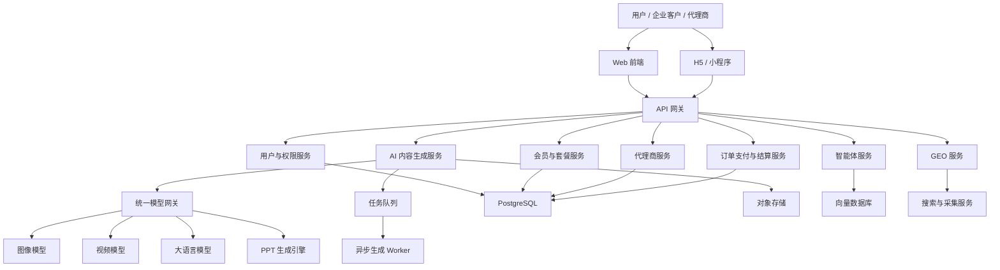
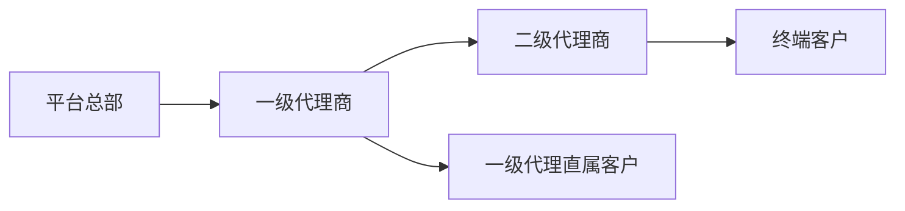

# 先知 AI 一站式内容生产与代理商运营平台实现方案

## 一、项目定位

建设一个面向企业、创作者和代理商的 AI 内容生产 SaaS 平台，统一提供：

- 文生图、参考图生图
- 文生视频、参考图生视频
- AI PPT 制作
- 智能体搭建与发布
- GEO 内容优化
- 会员、套餐与算力管理
- 一级、二级代理商管理
- 订单、佣金、结算与数据统计

> 以下方案中的 GEO 默认指“生成式引擎优化”，即针对豆包、DeepSeek、ChatGPT、百度 AI 搜索等生成式搜索平台进行内容生产、品牌曝光监测和优化。

---

## 二、总体系统架构



## 三、推荐技术选型

| 层级 | 推荐技术 |
|---|---|
| Web 前端 | Vue 3 + TypeScript + Vite + Element Plus |
| 移动端 | UniApp，后续支持微信小程序 |
| 后端 | Java Spring Boot 3 或 NestJS |
| 数据库 | PostgreSQL |
| 缓存 | Redis |
| 消息队列 | RabbitMQ，业务量较大时使用 Kafka |
| 对象存储 | 阿里云 OSS、腾讯云 COS 或 MinIO |
| 向量数据库 | Milvus、Qdrant 或 PostgreSQL pgvector |
| 搜索服务 | Elasticsearch |
| 工作流引擎 | LangGraph、Dify 二次开发或自研节点引擎 |
| 部署 | Docker + Kubernetes |
| 监控 | Prometheus + Grafana + Loki |
| 支付 | 微信支付、支付宝 |
| 模型接入 | OpenAI、通义千问、豆包、智谱、DeepSeek、可灵、即梦等 |

建议后端采用“模块化单体 + 独立 AI 任务服务”起步，避免项目初期直接使用复杂微服务。业务增长后，再拆分会员、代理商、支付、生成任务等服务。

---

## 四、前端功能方案

### 1. 文生图

用户输入提示词并选择风格、尺寸、模型和生成数量。

核心功能：

- 提示词输入与 AI 提示词优化
- 模型、风格、分辨率、比例选择
- 批量生成与任务进度展示
- 历史作品、收藏、下载、再次生成
- 敏感词审核和生成内容审核
- 按模型、尺寸和数量扣除积分

### 2. 参考图生图

支持上传一张或多张参考图片，根据参考图生成新图片。

核心功能：

- 图片上传、裁剪和压缩
- 风格参考、人物参考、姿势参考
- 参考强度设置
- 局部重绘、扩图、背景替换
- 图片相似度与人物一致性控制

### 3. 文生视频

用户通过文字描述生成短视频。

核心功能：

- 视频提示词和分镜脚本生成
- 视频比例、时长、清晰度选择
- 首尾帧控制
- 背景音乐、字幕和配音
- 异步生成进度与失败重试
- 视频预览、下载和作品管理

### 4. 参考图生视频

上传人物、商品或场景图片生成动态视频。

核心功能：

- 单图生视频、首尾帧生视频
- 商品展示和人物口播模板
- 动作幅度、镜头运动设置
- 人物一致性控制
- 数字人声音和口型同步

### 5. AI PPT 制作

采用“大纲生成 + 内容生成 + 模板渲染 + 文件导出”流程。

核心功能：

- 根据主题、文档或网页生成 PPT
- 自动生成大纲和章节内容
- 自动配图、图表和演讲备注
- 模板、主题色和字体切换
- 页面级在线编辑
- 导出 PPTX、PDF
- 企业品牌模板管理

PPTX 文件建议使用 `PptxGenJS` 或专用渲染服务生成，避免仅生成不可编辑的图片型 PPT。

### 6. 智能体搭建

提供可视化低代码智能体搭建平台。

核心节点：

- 大模型节点
- 提示词节点
- 知识库检索节点
- 条件判断节点
- HTTP API 节点
- 数据库查询节点
- 人工确认节点
- 图片、视频生成节点

支持能力：

- 智能体调试、版本管理和发布
- 网页嵌入、API 调用和分享链接
- 私有知识库上传与向量检索
- 调用量、成本和用户反馈统计
- 企业成员协作与权限控制

### 7. GEO 模块

围绕品牌在生成式搜索中的可见度进行监测和优化。

核心功能：

- 品牌、产品、竞品和目标问题管理
- 定期向多个 AI 搜索平台发起问题测试
- 统计品牌提及率、引用率、排名和情感倾向
- 分析竞品被引用的内容来源
- 自动生成 GEO 优化文章、问答和内容计划
- 内容发布记录与优化效果跟踪
- 周报、月报与趋势分析

需要注意：不同 AI 平台开放能力不同，优先通过官方 API 实现；没有开放 API 的平台应谨慎评估自动化采集的合规性。

### 8. 会员管理

用户端功能：

- 免费会员、月度会员、年度会员
- 积分余额与消费记录
- 套餐购买、续费和升级
- 优惠券、兑换码和邀请奖励
- 订单、发票和退款记录
- 生成任务并发数与存储空间限制

---

## 五、后端业务功能方案

### 1. 代理商体系

采用平台、一级代理商、二级代理商、终端客户四级关系。



#### 一级代理商功能

- 创建和管理二级代理商
- 创建直属客户
- 查看团队订单和业绩
- 设置允许范围内的销售价格
- 查看佣金和申请提现
- 分配会员、积分、兑换码
- 使用独立推广链接和邀请码

#### 二级代理商功能

- 创建和管理直属客户
- 销售平台套餐
- 查看个人订单与佣金
- 发放兑换码
- 申请结算与提现

#### 平台后台功能

- 设置代理等级与准入条件
- 设置不同产品的分佣规则
- 代理商审核、冻结和解约
- 业绩统计与排行榜
- 佣金核算、提现审核和结算
- 防止代理关系循环绑定
- 处理退款后的佣金回退

### 2. 佣金与结算规则

建议订单完成后进入冻结期，冻结期结束后才允许结算。

示例：

| 角色 | 分佣比例 |
|---|---:|
| 一级代理商直属销售 | 30% |
| 二级代理商直属销售 | 20% |
| 对应一级代理商管理奖励 | 10% |
| 平台收入 | 70% |

必须保存佣金计算快照。后续即使修改分佣比例，也不能影响历史订单。

### 3. 权限系统

采用 RBAC 权限模型，并增加数据范围权限。

主要角色：

- 超级管理员
- 平台运营
- 财务人员
- 一级代理商
- 二级代理商
- 企业管理员
- 企业成员
- 普通会员

权限维度包括：

- 菜单权限
- 接口权限
- 数据范围权限
- 模型使用权限
- 套餐和价格权限

---

## 六、核心数据模型

主要数据表建议包括：

| 业务域 | 核心数据表 |
|---|---|
| 用户权限 | 用户、角色、权限、企业、企业成员 |
| 会员体系 | 会员套餐、套餐权益、会员订阅、积分账户、积分流水 |
| AI 生成 | 模型配置、生成任务、任务结果、作品、文件资产 |
| 智能体 | 智能体、工作流、节点、版本、知识库、调用记录 |
| GEO | 品牌、竞品、监测问题、监测任务、监测结果、优化内容 |
| 代理商 | 代理商、代理关系、邀请码、代理价格、代理业绩 |
| 交易结算 | 商品、订单、支付记录、退款、佣金、结算单、提现 |
| 系统运营 | 优惠券、兑换码、公告、操作日志、风险记录 |

所有积分、余额、佣金变更必须通过流水表记录，禁止直接覆盖账户余额。

---

## 七、统一 AI 模型网关

建议搭建统一模型网关，业务模块不直接调用各家模型 API。

网关负责：

- 不同供应商协议转换
- 模型路由和降级切换
- API Key 管理
- 请求限流和并发控制
- 成本核算和积分扣除
- 失败重试与超时处理
- 内容安全审核
- 调用日志和质量统计

生成任务采用异步状态机：

```text
待支付/待扣费 → 排队中 → 生成中 → 成功
                         → 失败 → 自动重试 → 最终失败并退还积分
```

扣费建议采用“预冻结、成功确认、失败退还”机制，避免生成失败后产生用户投诉。

---

## 八、安全与合规设计

必须落地的安全措施：

- API Key 加密存储，禁止前端暴露
- 支付回调签名验证和幂等处理
- 订单、佣金和积分操作使用数据库事务
- 文件上传类型、大小和病毒检测
- 图片、视频、文本内容安全审核
- 敏感操作审计日志
- 用户数据隔离和企业数据权限控制
- 限流、防刷、防重复提交
- 代理商提现实名认证和财务审核
- 用户协议、隐私政策和 AI 内容标识

---

## 九、实施阶段

### 第一阶段：基础平台与 MVP，约 6～8 周

交付内容：

- 用户、登录、权限与会员体系
- 文生图、参考图生图
- 文生视频、参考图生视频
- 统一模型网关
- 积分、订单和支付
- 作品管理
- 基础运营后台

### 第二阶段：商业化能力，约 5～7 周

交付内容：

- 一级、二级代理商
- 分佣、结算与提现
- 优惠券、兑换码
- 企业会员与成员管理
- AI PPT 制作
- 数据统计看板

### 第三阶段：平台差异化能力，约 6～8 周

交付内容：

- 可视化智能体搭建
- 知识库和智能体发布
- GEO 品牌监测与优化
- 企业品牌模板
- 模型成本分析和智能路由

完整项目预计需要 **4～6 个月**。建议先上线 MVP 验证付费和代理商模式，再逐步建设智能体与 GEO，避免首期范围过大。

---

## 十、团队配置建议

| 岗位 | 人数 |
|---|---:|
| 产品经理 | 1 |
| UI/UX 设计师 | 1 |
| 前端工程师 | 2 |
| 后端工程师 | 2～3 |
| AI 应用工程师 | 1～2 |
| 测试工程师 | 1 |
| DevOps / 运维 | 0.5～1 |
| 项目经理 | 1 |

建议核心团队为 **8～11 人**。

---

## 十一、关键验收指标

- 普通接口平均响应时间小于 500ms
- 所有生成任务拥有可追踪状态
- AI 生成失败能够自动退还积分
- 支付、积分和佣金账目可完整对账
- 代理商只能访问自身权限范围内的数据
- 订单重复回调不会重复充值或分佣
- 智能体每次调用可追踪模型成本
- PPT 可以导出为可编辑的 PPTX 文件
- GEO 报告能够展示品牌和竞品趋势变化
- 核心业务具备自动化测试和审计日志

项目落地时，建议优先确认商业规则，包括会员套餐、模型成本、积分定价、代理商分佣比例和退款规则。这些规则会直接决定数据库设计、支付流程以及项目最终能否稳定运营。